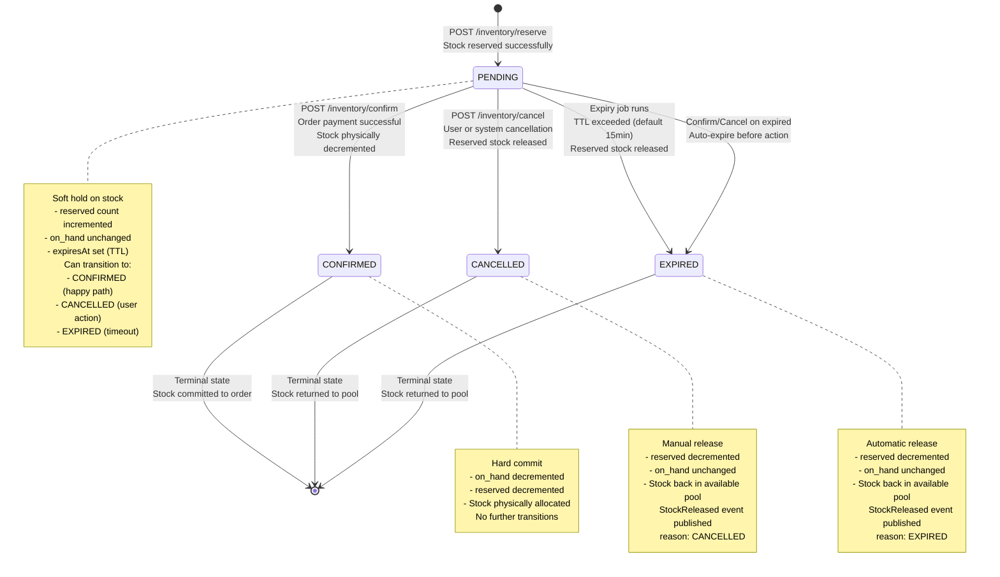
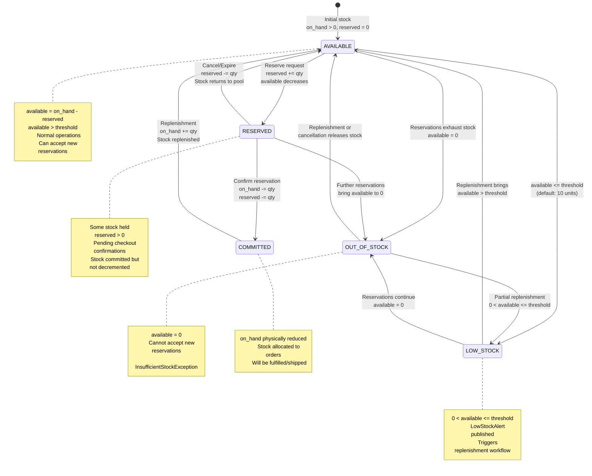
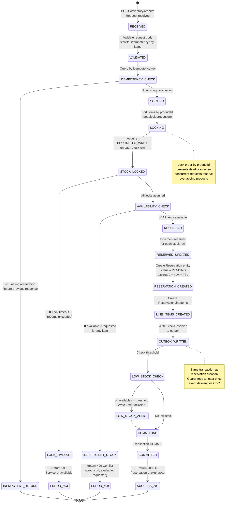
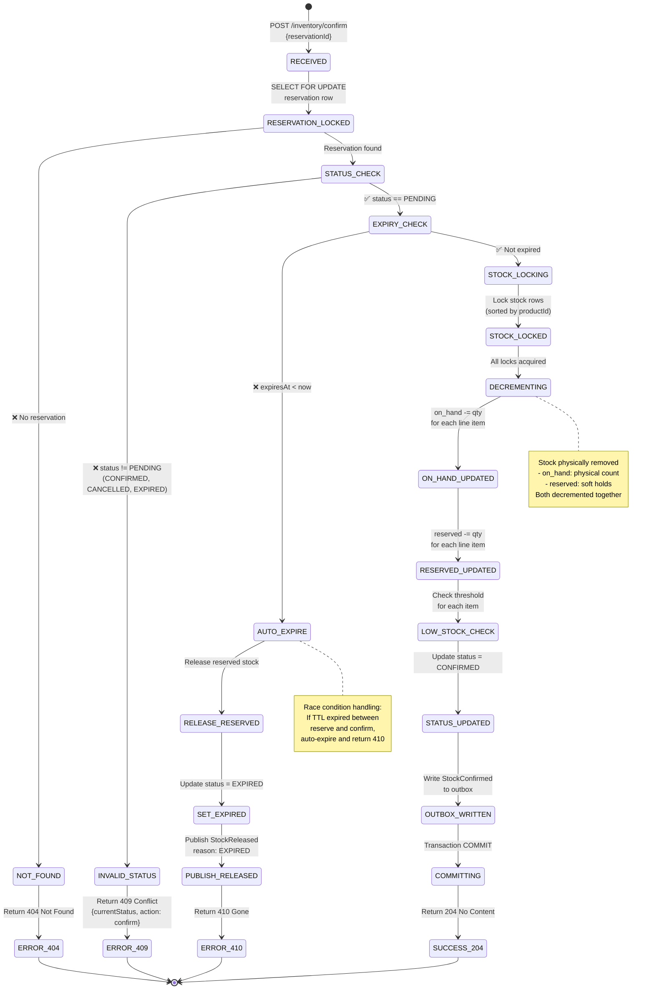
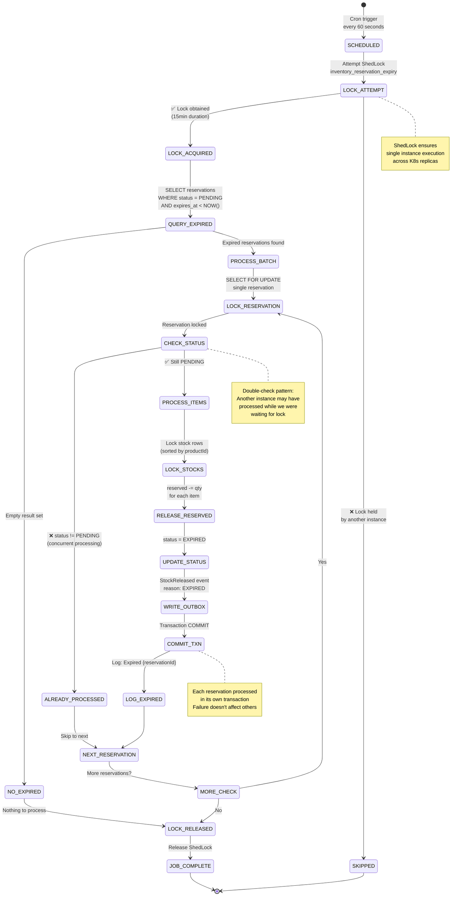
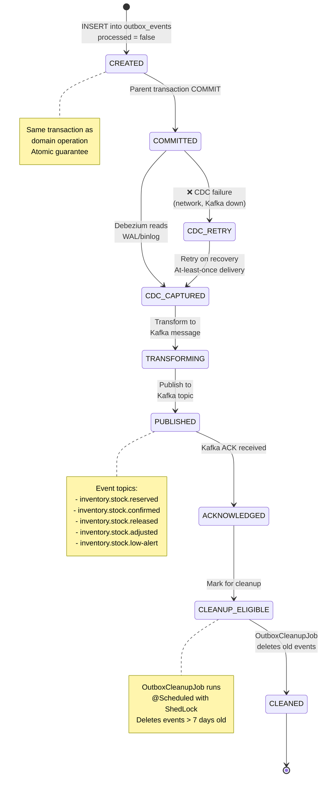
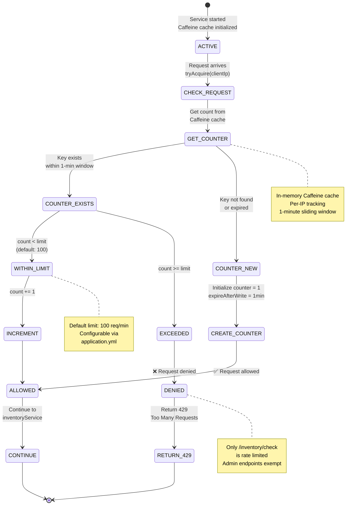

# Inventory Service - State Machine Diagrams

## Reservation Status State Machine (Complete Lifecycle)

## Stock Level State Machine

## Reservation Request Processing State Machine

## Confirmation Processing State Machine

## Expiry Job Processing State Machine

## Outbox Event State Machine

## Rate Limiter State Machine

