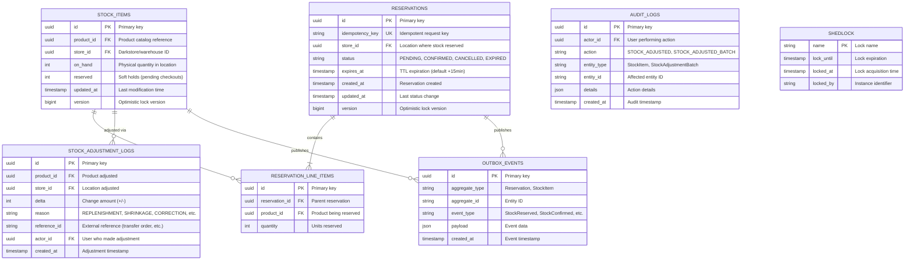
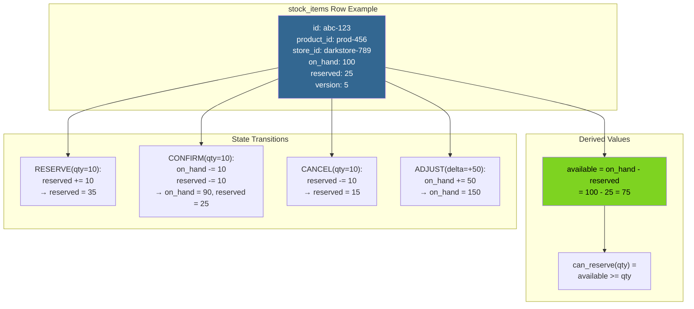
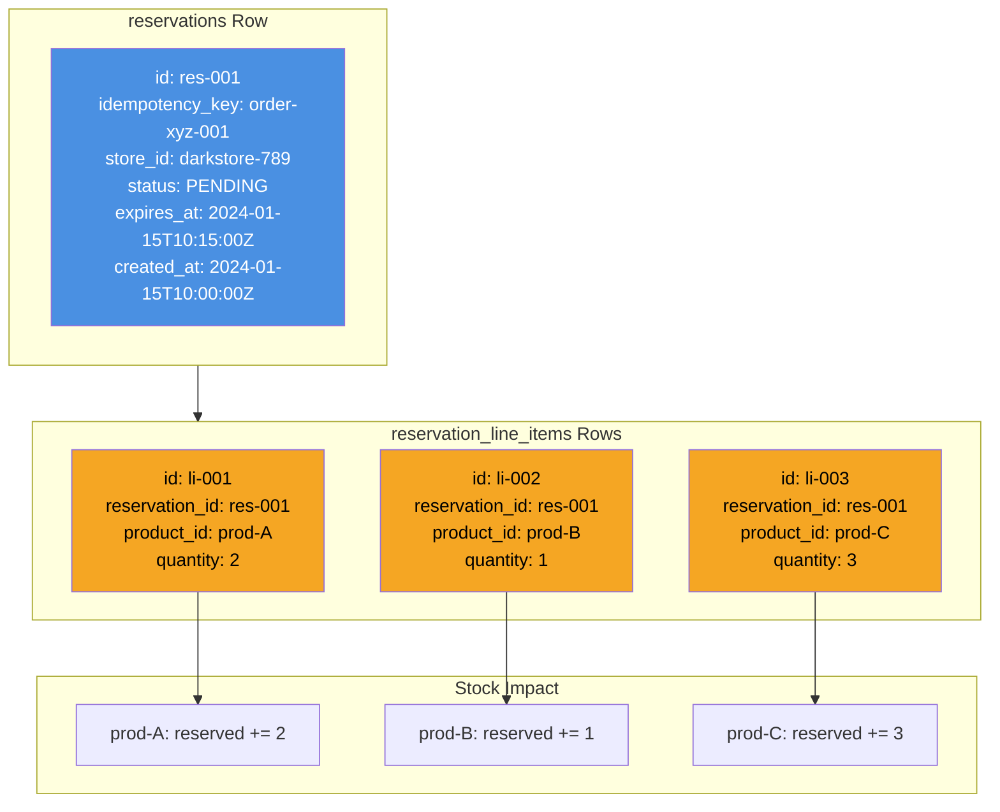
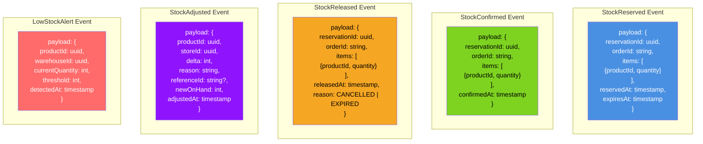
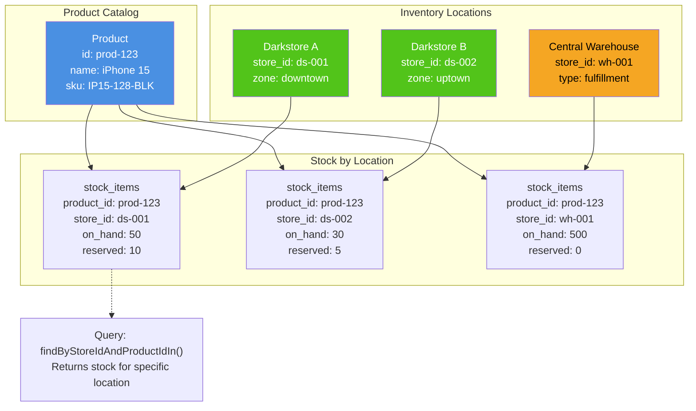
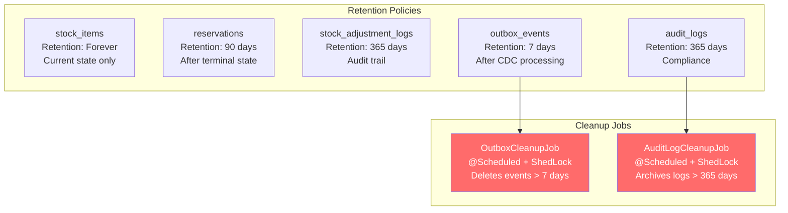

# Inventory Service - ER Diagram & Storage Schema

## Core Domain Tables



## Indexes & Constraints

```sql
-- stock_items indexes
CREATE UNIQUE INDEX idx_stock_items_product_store 
    ON stock_items(product_id, store_id);
CREATE INDEX idx_stock_items_store 
    ON stock_items(store_id);
CREATE INDEX idx_stock_items_updated 
    ON stock_items(updated_at);

-- reservations indexes
CREATE UNIQUE INDEX idx_reservations_idempotency 
    ON reservations(idempotency_key);
CREATE INDEX idx_reservations_status_expires 
    ON reservations(status, expires_at) 
    WHERE status = 'PENDING';
CREATE INDEX idx_reservations_store 
    ON reservations(store_id);

-- reservation_line_items indexes
CREATE INDEX idx_line_items_reservation 
    ON reservation_line_items(reservation_id);
CREATE INDEX idx_line_items_product 
    ON reservation_line_items(product_id);

-- stock_adjustment_logs indexes
CREATE INDEX idx_adjustment_logs_product_store 
    ON stock_adjustment_logs(product_id, store_id);
CREATE INDEX idx_adjustment_logs_created 
    ON stock_adjustment_logs(created_at);
CREATE INDEX idx_adjustment_logs_actor 
    ON stock_adjustment_logs(actor_id);

-- outbox_events indexes
CREATE INDEX idx_outbox_aggregate 
    ON outbox_events(aggregate_type, aggregate_id);
CREATE INDEX idx_outbox_created 
    ON outbox_events(created_at);

-- audit_logs indexes
CREATE INDEX idx_audit_entity 
    ON audit_logs(entity_type, entity_id);
CREATE INDEX idx_audit_actor 
    ON audit_logs(actor_id);
CREATE INDEX idx_audit_created 
    ON audit_logs(created_at);
```

## Stock Item State Representation



## Reservation Entity Structure



## Outbox Event Payload Schemas



## Prometheus Metrics Schema

```
Inventory Service Metrics
├─ http_server_requests_seconds{endpoint, method, status}
│  └ Histogram: Request latency distribution
│     - p50: 20ms, p99: <100ms (reserve)
│
├─ inventory_reservations_total{status, store_id}
│  └ Counter: Total reservations by outcome
│     - status: created, confirmed, cancelled, expired
│
├─ inventory_reservation_duration_seconds{operation}
│  └ Histogram: Operation latency
│     - operation: reserve, confirm, cancel
│
├─ inventory_stock_available{store_id, product_id}
│  └ Gauge: Current available stock
│     - available = on_hand - reserved
│
├─ inventory_stock_reserved{store_id, product_id}
│  └ Gauge: Current reserved stock
│
├─ inventory_low_stock_alerts_total{store_id}
│  └ Counter: Low stock alerts triggered
│
├─ inventory_lock_acquisition_duration_ms
│  └ Histogram: Time to acquire PESSIMISTIC_WRITE lock
│     - p99: <15ms typical
│
├─ inventory_lock_timeouts_total
│  └ Counter: Lock timeout exceptions
│
├─ inventory_rate_limit_rejections_total{endpoint}
│  └ Counter: Rate limit hits
│
├─ inventory_outbox_events_total{event_type}
│  └ Counter: Events published to outbox
│     - event_type: StockReserved, StockConfirmed, etc.
│
├─ inventory_expiry_job_runs_total{status}
│  └ Counter: Expiry job executions
│     - status: success, skipped, error
│
└─ inventory_expired_reservations_total
   └ Counter: Reservations expired by job
```

## Multi-Location Data Model



## Data Retention & Cleanup



## PostgreSQL Configuration

```yaml
# Key PostgreSQL settings for Inventory Service

# Connection pool (HikariCP defaults)
spring.datasource.hikari:
  maximum-pool-size: 20
  minimum-idle: 5
  connection-timeout: 30000
  idle-timeout: 600000

# Lock timeout for PESSIMISTIC_WRITE
inventory.lock-timeout-ms: 5000

# Indexes for query performance
# - (product_id, store_id) for stock lookups
# - (status, expires_at) for expiry job
# - (idempotency_key) for reservation dedup

# Vacuum settings (recommended)
# - autovacuum_vacuum_scale_factor: 0.1
# - autovacuum_analyze_scale_factor: 0.05
```
