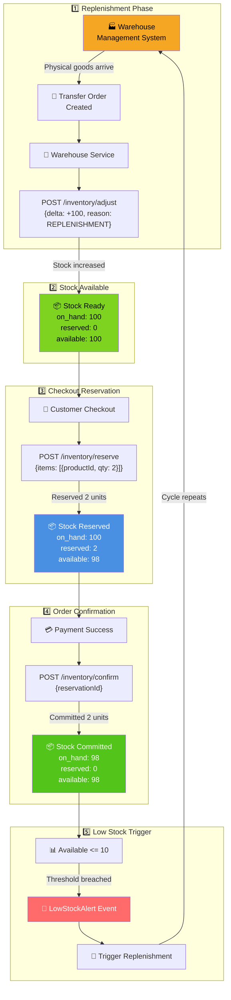
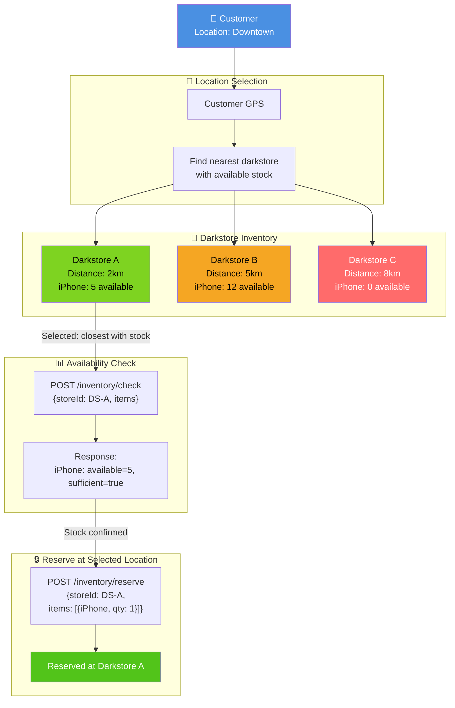
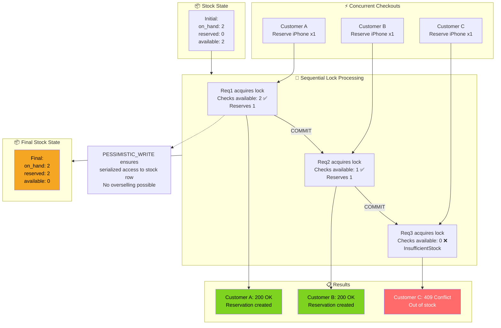
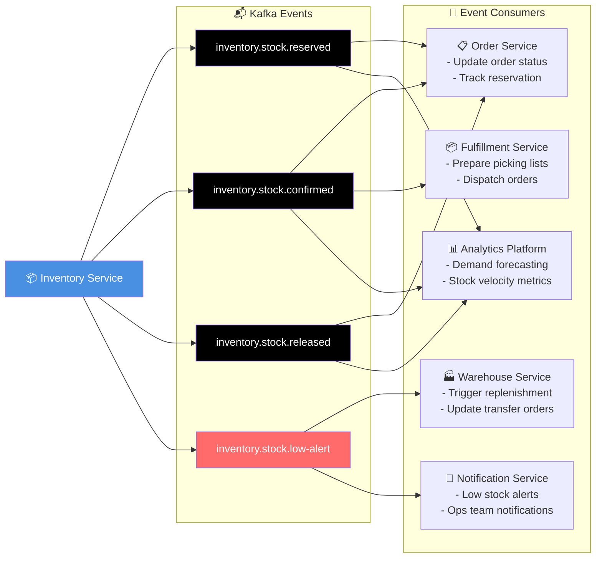
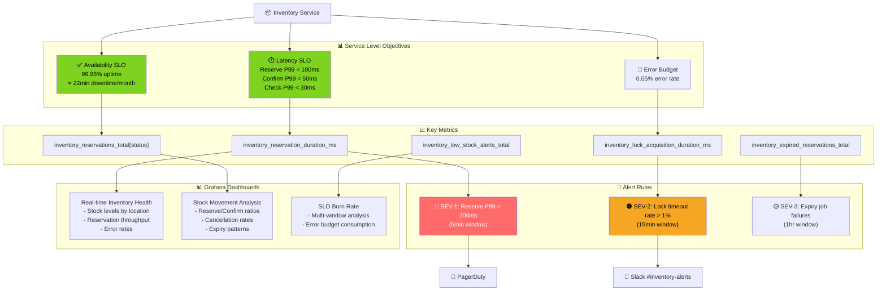
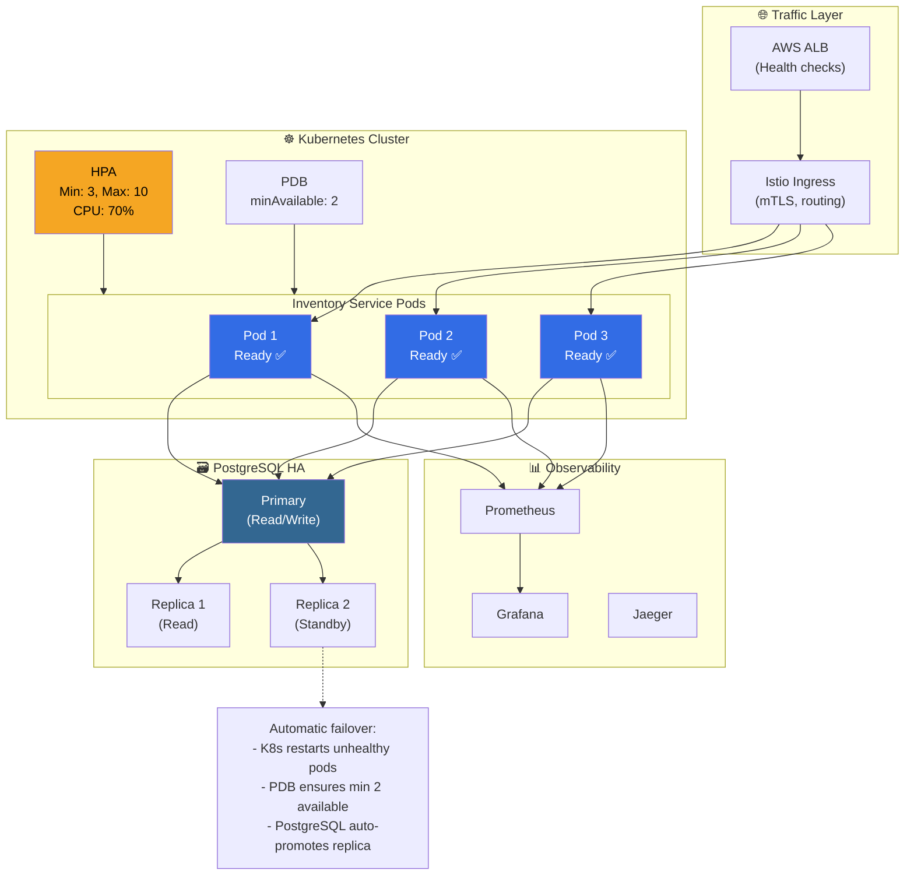

# Inventory Service - End-to-End Flows

## Complete Checkout Reservation Flow (E2E)

```mermaid
graph TB
    Customer["👤 Customer<br/>(Mobile App)"]
    MobileBFF["📱 Mobile BFF"]
    CartService["🛒 Cart Service"]
    CheckoutOrch["🔄 Checkout Orchestrator<br/>(Temporal Saga)"]

    ALB["⚖️ AWS ALB"]
    InventoryService["📦 Inventory Service"]
    PostgreSQL["🗃️ PostgreSQL"]
    Redis["⚡ Redis"]

    Outbox["📤 Outbox Table"]
    Debezium["🔗 Debezium CDC"]
    Kafka["📬 Kafka"]

    OrderService["📋 Order Service"]
    PaymentService["💳 Payment Service"]

    Customer -->|1. Tap Checkout| MobileBFF
    MobileBFF -->|2. Get cart items| CartService
    CartService -->|3. Cart with items| MobileBFF
    MobileBFF -->|4. Start checkout saga| CheckoutOrch

    CheckoutOrch -->|5. POST /inventory/reserve<br/>{storeId, idempotencyKey, items}| ALB
    ALB -->|6. Forward| InventoryService

    InventoryService -->|7. Rate limit check| Redis
    InventoryService -->|8. Check idempotency key| PostgreSQL
    InventoryService -->|9. Lock stock rows<br/>FOR UPDATE| PostgreSQL
    InventoryService -->|10. Update reserved counts| PostgreSQL
    InventoryService -->|11. Create reservation| PostgreSQL
    InventoryService -->|12. Write to outbox| Outbox

    PostgreSQL -->|13. Transaction COMMIT| InventoryService
    InventoryService -->|14. 200 OK<br/>{reservationId, expiresAt}| CheckoutOrch

    Outbox -->|15. CDC capture| Debezium
    Debezium -->|16. Publish| Kafka

    CheckoutOrch -->|17. Create order<br/>(reservation reference)| OrderService
    CheckoutOrch -->|18. Process payment| PaymentService

    PaymentService -->|19. Payment success| CheckoutOrch

    CheckoutOrch -->|20. POST /inventory/confirm<br/>{reservationId}| InventoryService
    InventoryService -->|21. Decrement on_hand<br/>Release reserved| PostgreSQL
    InventoryService -->|22. 204 No Content| CheckoutOrch

    CheckoutOrch -->|23. Checkout complete| MobileBFF
    MobileBFF -->|24. Order confirmation| Customer

    style Customer fill:#4A90E2,color:#fff
    style CheckoutOrch fill:#7ED321,color:#000
    style InventoryService fill:#4A90E2,color:#fff
    style PostgreSQL fill:#336791,color:#fff
    style Kafka fill:#000000,color:#fff
```

## Replenishment to Checkout Flow (Complete Stock Lifecycle)



## Failure Handling & Compensation Flow

```mermaid
graph TB
    subgraph HappyPath["✅ Happy Path"]
        HP1["Reserve Stock"]
        HP2["Create Order"]
        HP3["Process Payment"]
        HP4["Confirm Stock"]
        HP5["Complete Checkout"]
    end

    subgraph PaymentFailure["❌ Payment Failure Path"]
        PF1["Reserve Stock ✅"]
        PF2["Create Order ✅"]
        PF3["Process Payment ❌"]
        PF4["Cancel Stock<br/>(Compensation)"]
        PF5["Cancel Order<br/>(Compensation)"]
        PF6["Return Error"]
    end

    subgraph ReserveFailure["❌ Reserve Failure Path"]
        RF1["Reserve Stock ❌<br/>(Insufficient)"]
        RF2["Return 409 Conflict"]
        RF3["Show Out of Stock"]
    end

    subgraph Timeout["⏰ Reservation Timeout"]
        TO1["Reserve Stock ✅"]
        TO2["User abandons cart"]
        TO3["15 min TTL expires"]
        TO4["Expiry Job runs"]
        TO5["Stock Released<br/>(Auto-compensation)"]
    end

    HP1 --> HP2 --> HP3 --> HP4 --> HP5

    PF1 --> PF2 --> PF3
    PF3 -->|Saga compensation| PF4
    PF4 --> PF5 --> PF6

    RF1 --> RF2 --> RF3

    TO1 --> TO2 --> TO3 --> TO4 --> TO5

    style HP5 fill:#7ED321,color:#000
    style PF3 fill:#FF6B6B,color:#fff
    style PF4 fill:#F5A623,color:#000
    style RF1 fill:#FF6B6B,color:#fff
    style TO5 fill:#F5A623,color:#000
```



## Multi-Location Fulfillment Decision



## Concurrent Request Handling



## Event-Driven Cross-Service Communication



## SLO & Monitoring Dashboard



## High-Availability Architecture


