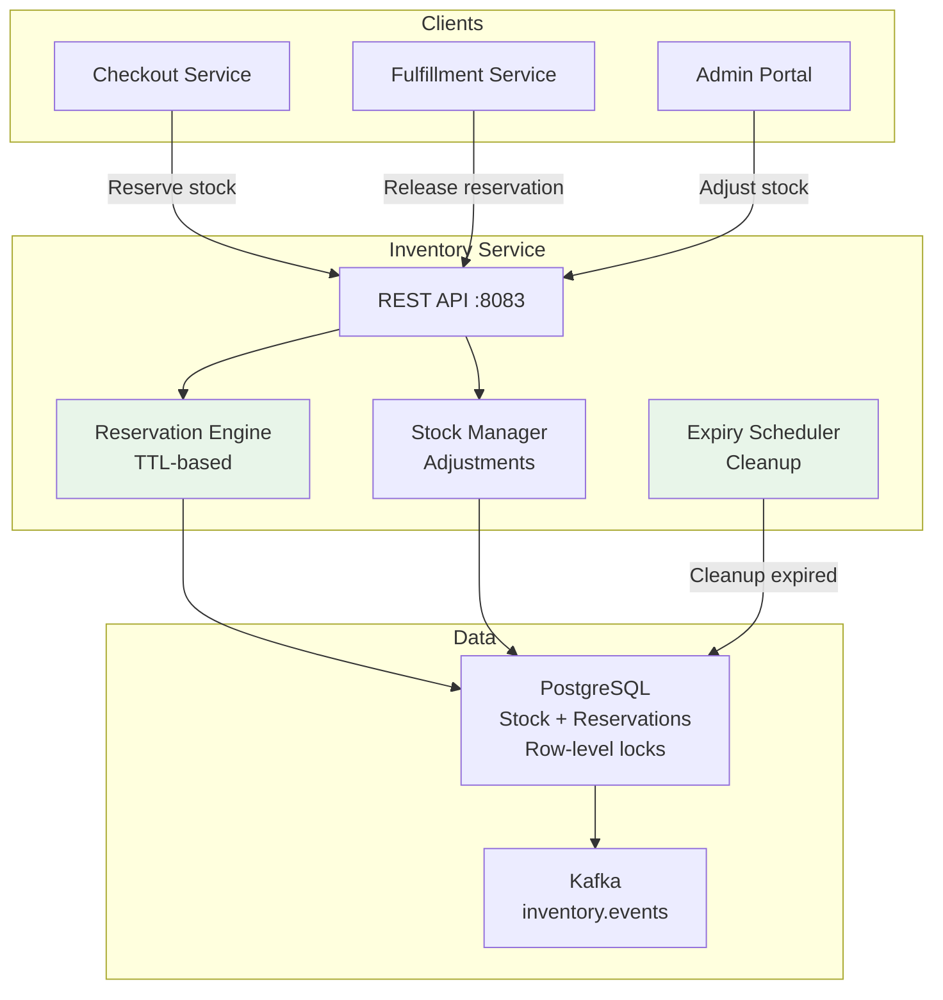

# Inventory Service - High-Level Design (HLD)

## Overview

Inventory Service manages stock levels, reservations, and stock adjustments with row-level locking for concurrent access.

## Key Features

- Row-level locking (SELECT...FOR UPDATE)
- TTL-based reservations (5 min auto-expire)
- Low-stock alerts
- Store-based stock tracking
- Concurrent reservation support (60 DB connections)
- SLO: 99.95% availability, <800ms P99

