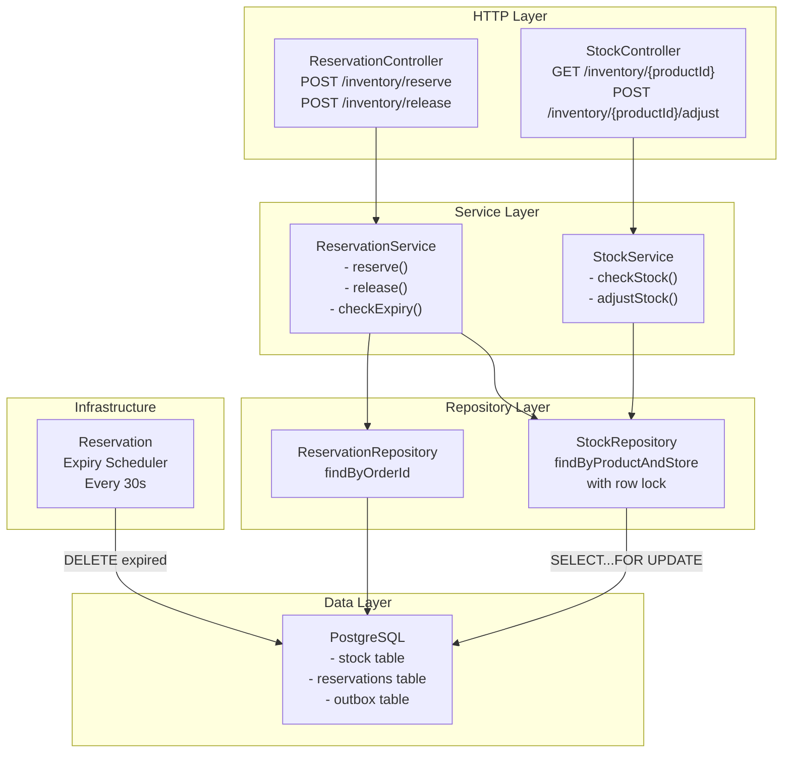
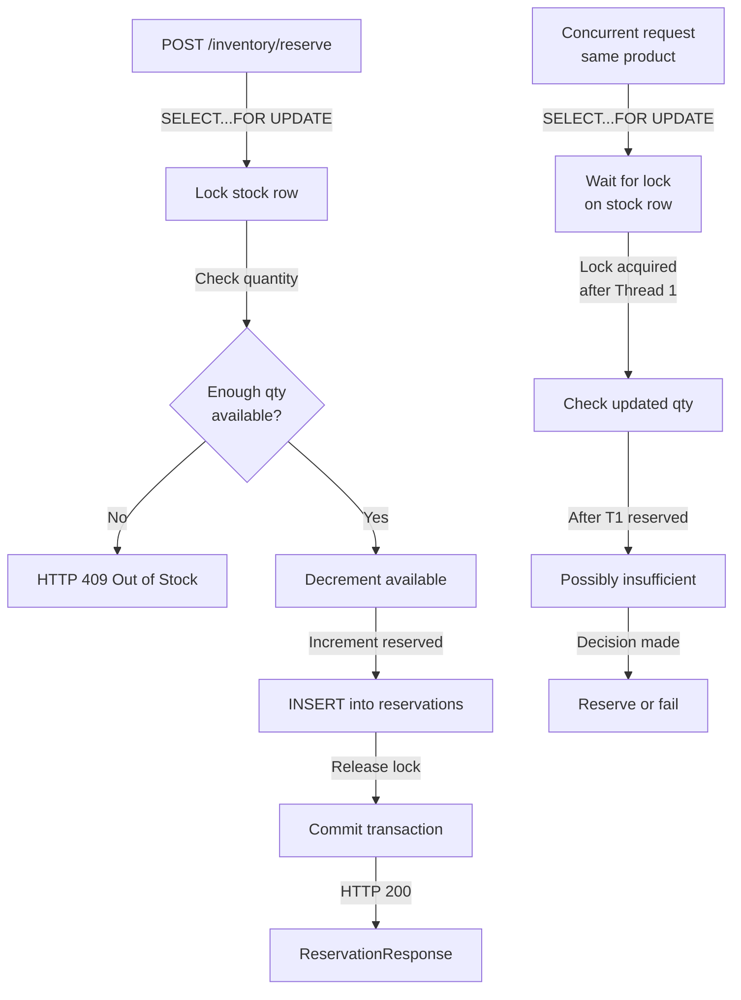

# Inventory Service - Low-Level Design (LLD)



## Reservation Lifecycle

```sql
create table stock (
    id uuid primary key,
    product_id uuid not null,
    store_id uuid not null,
    quantity_available bigint,
    quantity_reserved bigint,
    low_stock_threshold int,
    created_at timestamp,
    version bigint,
    unique(product_id, store_id)
);

create table reservations (
    id uuid primary key,
    order_id uuid not null,
    product_id uuid not null,
    store_id uuid not null,
    quantity int,
    reserved_at timestamp,
    expires_at timestamp,  -- 5 min TTL
    released boolean default false,
    created_at timestamp
);

create index idx_reservations_order_id on reservations(order_id);
create index idx_reservations_expires_at on reservations(expires_at);
create index idx_stock_product_store on stock(product_id, store_id);
```

## Concurrency Control


