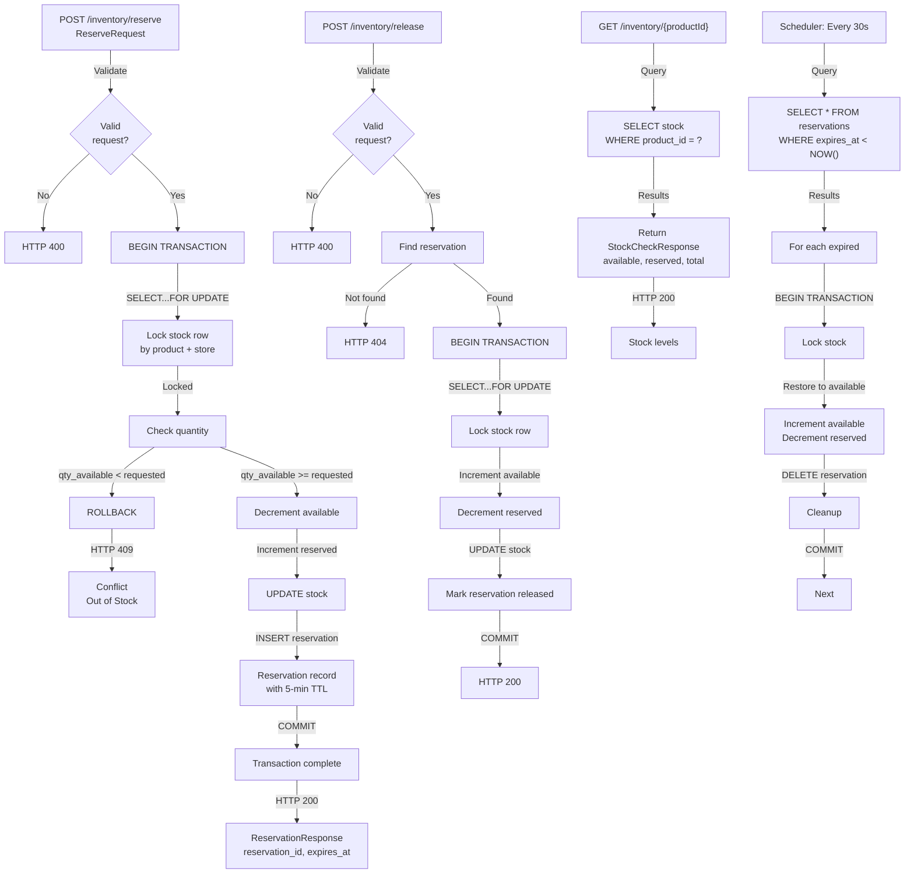
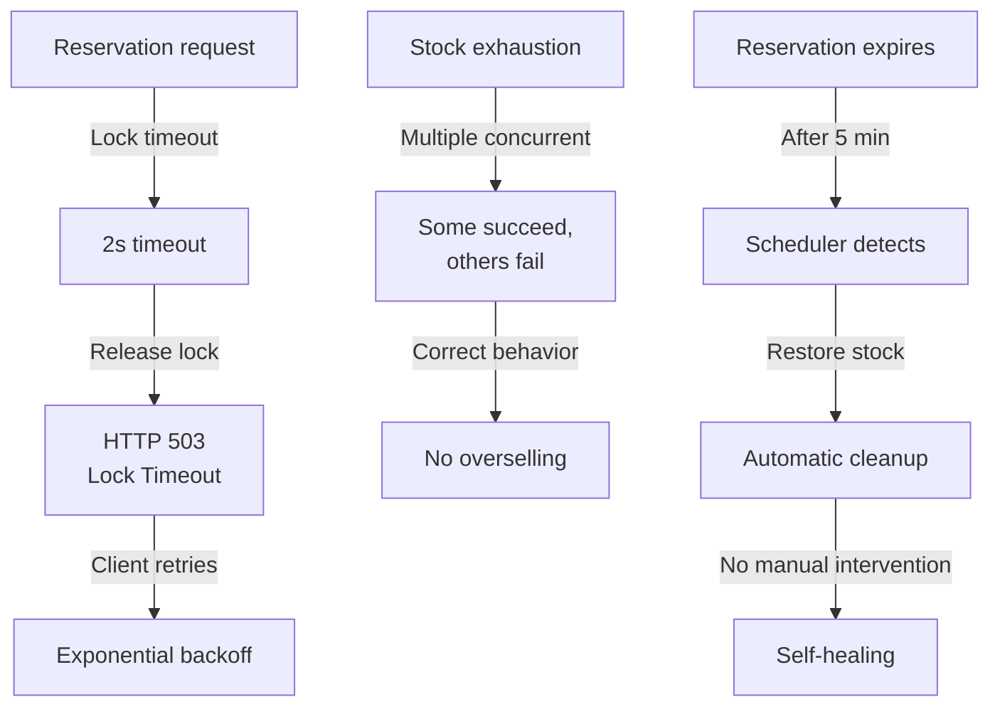

# Inventory Service - Flowchart

```mermaid
flowchart TD
    A["POST /inventory/reserve<br/>ReserveRequest"] -->|Validate| B{Valid<br/>request?}
    B -->|No| C["HTTP 400"]
    B -->|Yes| D["BEGIN TRANSACTION"]
    D -->|SELECT...FOR UPDATE| E["Lock stock row<br/>by product + store"]
    E -->|Locked| F["Check quantity"]
    F -->|qty_available < requested| G["ROLLBACK"]
    G -->|HTTP 409| H["Conflict<br/>Out of Stock"]
    F -->|qty_available >= requested| I["Decrement available"]
    I -->|Increment reserved| J["UPDATE stock"]
    J -->|INSERT reservation| K["Reservation record<br/>with 5-min TTL"]
    K -->|COMMIT| L["Transaction complete"]
    L -->|HTTP 200| M["ReservationResponse<br/>reservation_id, expires_at"]

    N["POST /inventory/release"] -->|Validate| O{Valid<br/>request?}
    O -->|No| P["HTTP 400"]
    O -->|Yes| Q["Find reservation"]
    Q -->|Not found| R["HTTP 404"]
    Q -->|Found| S["BEGIN TRANSACTION"]
    S -->|SELECT...FOR UPDATE| T["Lock stock row"]
    T -->|Increment available| U["Decrement reserved"]
    U -->|UPDATE stock| V["Mark reservation released"]
    V -->|COMMIT| W["HTTP 200"]

    X["GET /inventory/{productId}"] -->|Query| Y["SELECT stock<br/>WHERE product_id = ?"]
    Y -->|Results| Z["Return StockCheckResponse<br/>available, reserved, total"]
    Z -->|HTTP 200| AA["Stock levels"]

    AB["Scheduler: Every 30s"] -->|Query| AC["SELECT * FROM reservations<br/>WHERE expires_at < NOW()"]
    AC -->|Results| AD["For each expired"]
    AD -->|BEGIN TRANSACTION| AE["Lock stock"]
    AE -->|Restore to available| AF["Increment available<br/>Decrement reserved"]
    AF -->|DELETE reservation| AG["Cleanup"]
    AG -->|COMMIT| AH["Next"]
```

## Error Handling Flows

```mermaid
graph TD
    A["Reservation request"] -->|Lock timeout| B["2s timeout"]
    B -->|Release lock| C["HTTP 503<br/>Lock Timeout"]
    C -->|Client retries| D["Exponential backoff"]

    E["Stock exhaustion"] -->|Multiple concurrent| F["Some succeed,<br/>others fail"]
    F -->|Correct behavior| G["No overselling"]

    H["Reservation expires"] -->|After 5 min| I["Scheduler detects"]
    I -->|Restore stock| J["Automatic cleanup"]
    J -->|No manual intervention| K["Self-healing"]
```
