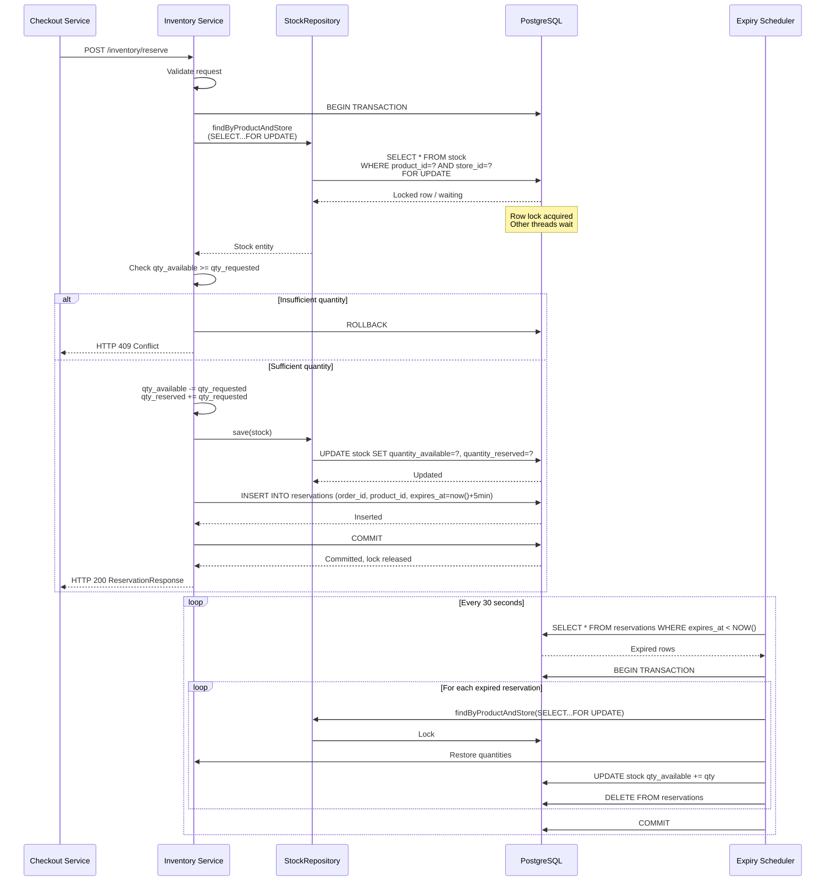
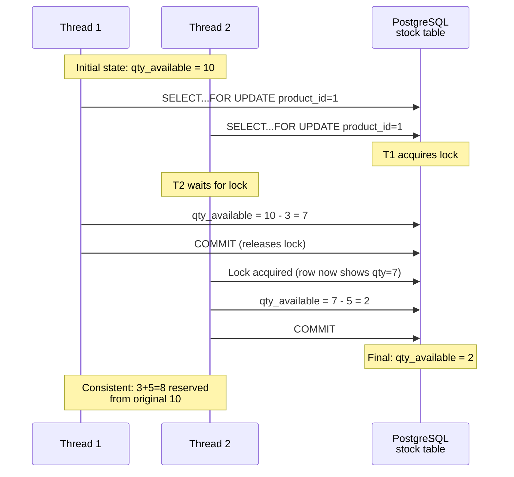

# Inventory Service - Sequence Diagram

```mermaid
sequenceDiagram
    participant Checkout as Checkout Service
    participant InventorySvc as Inventory Service
    participant StockRepo as StockRepository
    participant PostgreSQL as PostgreSQL
    participant Scheduler as Expiry Scheduler

    Checkout->>InventorySvc: POST /inventory/reserve
    InventorySvc->>InventorySvc: Validate request
    InventorySvc->>PostgreSQL: BEGIN TRANSACTION
    InventorySvc->>StockRepo: findByProductAndStore<br/>(SELECT...FOR UPDATE)
    StockRepo->>PostgreSQL: SELECT * FROM stock<br/>WHERE product_id=? AND store_id=?<br/>FOR UPDATE
    PostgreSQL-->>StockRepo: Locked row / waiting
    Note over PostgreSQL: Row lock acquired<br/>Other threads wait
    StockRepo-->>InventorySvc: Stock entity

    InventorySvc->>InventorySvc: Check qty_available >= qty_requested
    alt Insufficient quantity
        InventorySvc->>PostgreSQL: ROLLBACK
        InventorySvc-->>Checkout: HTTP 409 Conflict
    else Sufficient quantity
        InventorySvc->>InventorySvc: qty_available -= qty_requested<br/>qty_reserved += qty_requested
        InventorySvc->>StockRepo: save(stock)
        StockRepo->>PostgreSQL: UPDATE stock SET quantity_available=?, quantity_reserved=?
        PostgreSQL-->>StockRepo: Updated
        InventorySvc->>PostgreSQL: INSERT INTO reservations (order_id, product_id, expires_at=now()+5min)
        PostgreSQL-->>InventorySvc: Inserted
        InventorySvc->>PostgreSQL: COMMIT
        PostgreSQL-->>InventorySvc: Committed, lock released
        InventorySvc-->>Checkout: HTTP 200 ReservationResponse
    end

    loop Every 30 seconds
        Scheduler->>PostgreSQL: SELECT * FROM reservations WHERE expires_at < NOW()
        PostgreSQL-->>Scheduler: Expired rows
        Scheduler->>PostgreSQL: BEGIN TRANSACTION
        loop For each expired reservation
            Scheduler->>StockRepo: findByProductAndStore(SELECT...FOR UPDATE)
            StockRepo->>PostgreSQL: Lock
            Scheduler->>InventorySvc: Restore quantities
            Scheduler->>PostgreSQL: UPDATE stock qty_available += qty
            Scheduler->>PostgreSQL: DELETE FROM reservations
        end
        Scheduler->>PostgreSQL: COMMIT
    end
```

## Concurrent Reservations Sequence

```mermaid
sequenceDiagram
    participant T1 as Thread 1
    participant T2 as Thread 2
    participant PostgreSQL as PostgreSQL<br/>stock table

    Note over T1,T2: Initial state: qty_available = 10

    T1->>PostgreSQL: SELECT...FOR UPDATE product_id=1
    T2->>PostgreSQL: SELECT...FOR UPDATE product_id=1
    Note over PostgreSQL: T1 acquires lock
    Note over T2: T2 waits for lock

    T1->>PostgreSQL: qty_available = 10 - 3 = 7
    T1->>PostgreSQL: COMMIT (releases lock)

    T2->>PostgreSQL: Lock acquired (row now shows qty=7)
    T2->>PostgreSQL: qty_available = 7 - 5 = 2
    T2->>PostgreSQL: COMMIT

    Note over PostgreSQL: Final: qty_available = 2
    Note over T1,T2: Consistent: 3+5=8 reserved<br/>from original 10
```
