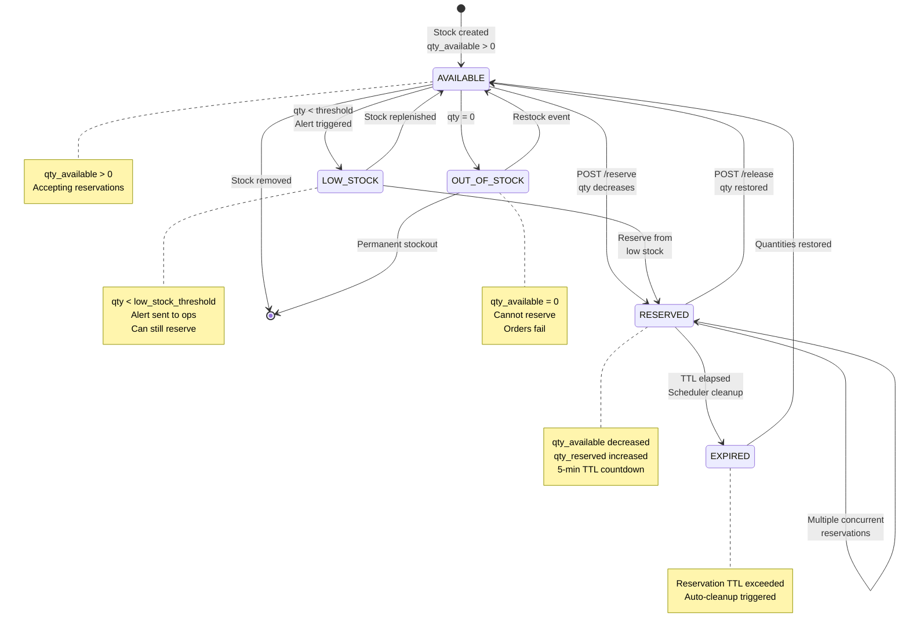
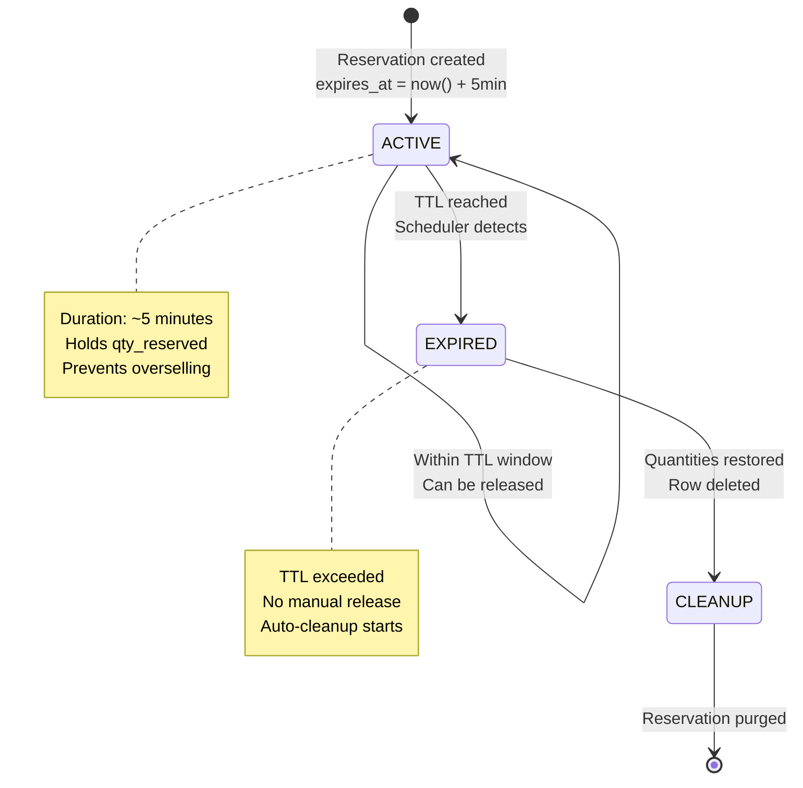

# Inventory Service - State Machine Diagram

```mermaid
stateDiagram-v2
    [*] --> AVAILABLE: Stock created<br/>qty_available > 0

    AVAILABLE --> RESERVED: POST /reserve<br/>qty decreases

    RESERVED --> AVAILABLE: POST /release<br/>qty restored

    RESERVED --> RESERVED: Multiple concurrent<br/>reservations

    AVAILABLE --> LOW_STOCK: qty < threshold<br/>Alert triggered

    LOW_STOCK --> AVAILABLE: Stock replenished

    LOW_STOCK --> RESERVED: Reserve from<br/>low stock

    AVAILABLE --> OUT_OF_STOCK: qty = 0

    OUT_OF_STOCK --> AVAILABLE: Restock event

    RESERVED --> EXPIRED: TTL elapsed<br/>Scheduler cleanup

    EXPIRED --> AVAILABLE: Quantities restored

    AVAILABLE --> [*]: Stock removed
    OUT_OF_STOCK --> [*]: Permanent stockout

    note right of AVAILABLE
        qty_available > 0
        Accepting reservations
    end note

    note right of RESERVED
        qty_available decreased
        qty_reserved increased
        5-min TTL countdown
    end note

    note right of LOW_STOCK
        qty < low_stock_threshold
        Alert sent to ops
        Can still reserve
    end note

    note right of OUT_OF_STOCK
        qty_available = 0
        Cannot reserve
        Orders fail
    end note

    note right of EXPIRED
        Reservation TTL exceeded
        Auto-cleanup triggered
    end note
```

## Reservation TTL Lifecycle

```mermaid
stateDiagram-v2
    [*] --> ACTIVE: Reservation created<br/>expires_at = now() + 5min

    ACTIVE --> ACTIVE: Within TTL window<br/>Can be released

    ACTIVE --> EXPIRED: TTL reached<br/>Scheduler detects

    EXPIRED --> CLEANUP: Quantities restored<br/>Row deleted

    CLEANUP --> [*]: Reservation purged

    note right of ACTIVE
        Duration: ~5 minutes
        Holds qty_reserved
        Prevents overselling
    end note

    note right of EXPIRED
        TTL exceeded
        No manual release
        Auto-cleanup starts
    end note
```
