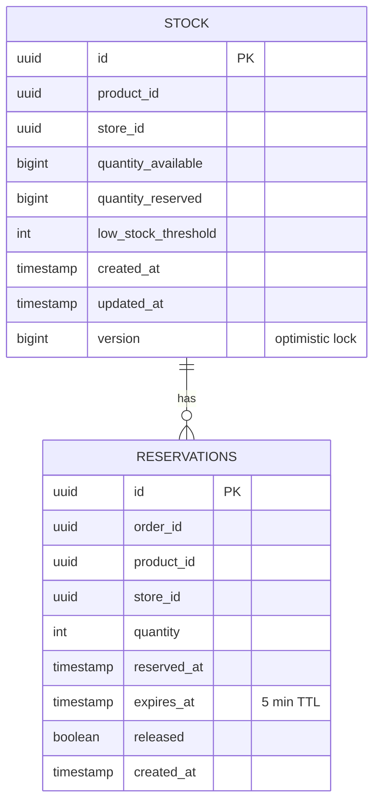
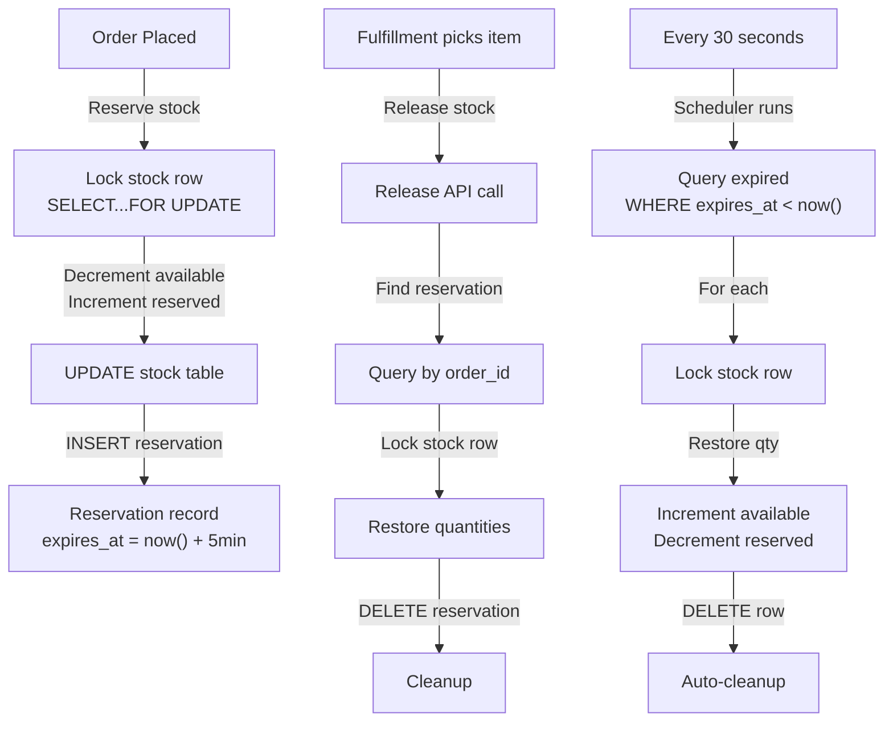
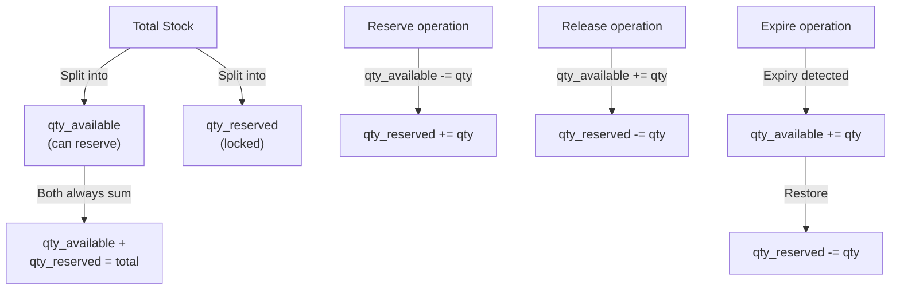

# Inventory Service - Entity-Relationship Diagram (ERD)



## Indexes

```sql
CREATE INDEX idx_stock_product_store ON stock(product_id, store_id);
CREATE INDEX idx_stock_created_at ON stock(created_at);
CREATE INDEX idx_reservations_order_id ON reservations(order_id);
CREATE INDEX idx_reservations_expires_at ON reservations(expires_at);
CREATE INDEX idx_reservations_product_store ON reservations(product_id, store_id);
```

## Data Flow



## Constraints & Uniqueness

```markdown
## Unique Constraint
- (product_id, store_id) on STOCK table
- Prevents duplicate stock records for same product/store

## Foreign Key
- RESERVATIONS.product_id -> STOCK.product_id
- RESERVATIONS.store_id -> STOCK.store_id
- Implicit: product + store must exist in STOCK

## Version Column
- Optimistic locking for STOCK table
- Prevents lost updates in concurrent scenarios
- Checked during UPDATE operations

## Reservation Constraint
- released boolean: false until explicitly released or auto-expired
- Helps track which reservations are still active
```

## Quantities Logic


