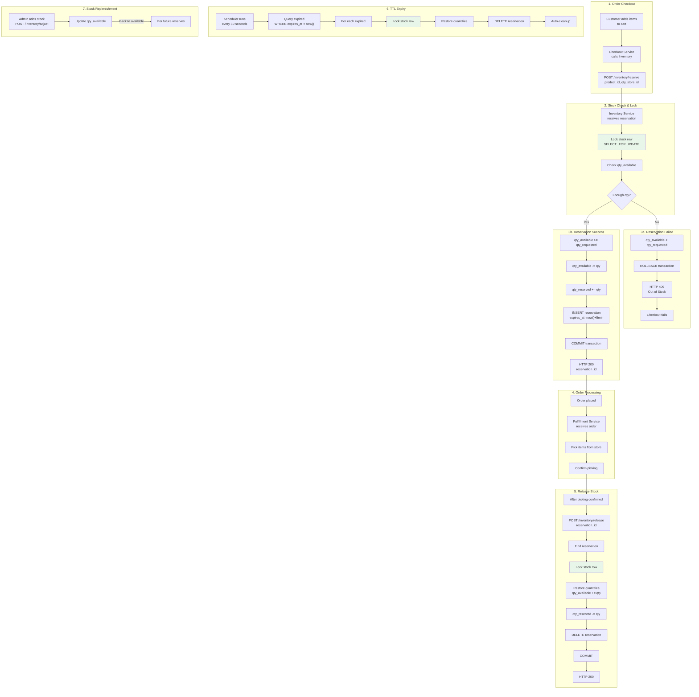
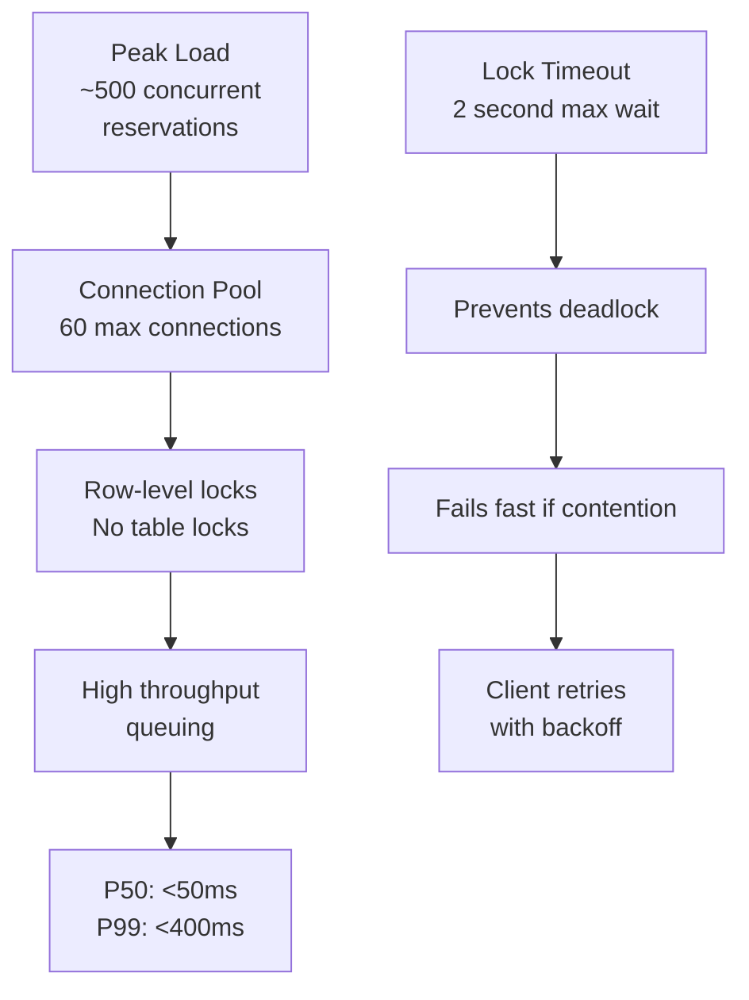
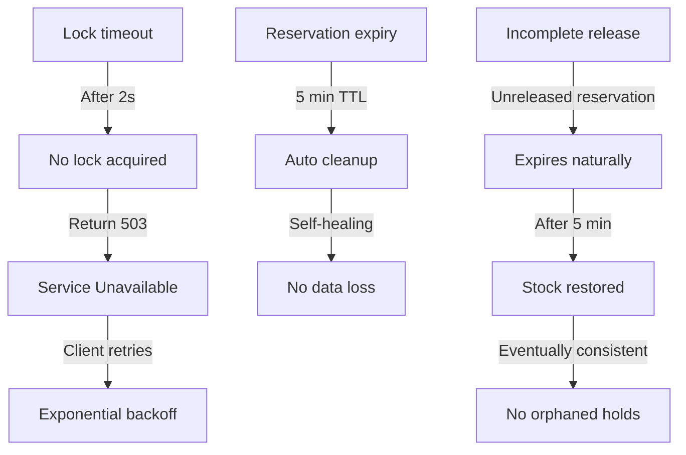
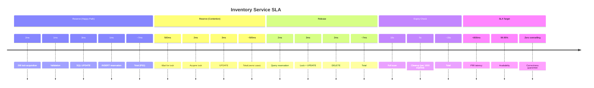

# Inventory Service - End-to-End Flow

```mermaid
graph TB
    subgraph "1. Order Checkout"
        A["Customer adds items<br/>to cart"]
        B["Checkout Service<br/>calls Inventory"]
        C["POST /inventory/reserve<br/>product_id, qty, store_id"]
    end

    subgraph "2. Stock Check & Lock"
        D["Inventory Service<br/>receives reservation"]
        E["Lock stock row<br/>SELECT...FOR UPDATE"]
        F["Check qty_available"]
        G{Enough qty?}
    end

    subgraph "3a. Reservation Failed"
        H["qty_available < qty_requested"]
        I["ROLLBACK transaction"]
        J["HTTP 409<br/>Out of Stock"]
        K["Checkout fails"]
    end

    subgraph "3b. Reservation Success"
        L["qty_available >= qty_requested"]
        M["qty_available -= qty"]
        N["qty_reserved += qty"]
        O["INSERT reservation<br/>expires_at=now()+5min"]
        P["COMMIT transaction"]
        Q["HTTP 200<br/>reservation_id"]
    end

    subgraph "4. Order Processing"
        R["Order placed"]
        S["Fulfillment Service<br/>receives order"]
        T["Pick items from store"]
        U["Confirm picking"]
    end

    subgraph "5. Release Stock"
        V["After picking confirmed"]
        W["POST /inventory/release<br/>reservation_id"]
        X["Find reservation"]
        Y["Lock stock row"]
        Z["Restore quantities<br/>qty_available += qty"]
        AA["qty_reserved -= qty"]
        AB["DELETE reservation"]
        AC["COMMIT"]
        AD["HTTP 200"]
    end

    subgraph "6. TTL Expiry"
        AE["Scheduler runs<br/>every 30 seconds"]
        AF["Query expired<br/>WHERE expires_at < now()"]
        AG["For each expired"]
        AH["Lock stock row"]
        AI["Restore quantities"]
        AJ["DELETE reservation"]
        AK["Auto-cleanup"]
    end

    subgraph "7. Stock Replenishment"
        AL["Admin adds stock<br/>POST /inventory/adjust"]
        AM["Update qty_available"]
        AM -->|Back to available| AN["For future reserves"]
    end

    A --> B
    B --> C
    C --> D
    D --> E
    E --> F
    F --> G
    G -->|No| H
    H --> I
    I --> J
    J --> K
    G -->|Yes| L
    L --> M
    M --> N
    N --> O
    O --> P
    P --> Q
    Q --> R
    R --> S
    S --> T
    T --> U
    U --> V
    V --> W
    W --> X
    X --> Y
    Y --> Z
    Z --> AA
    AA --> AB
    AB --> AC
    AC --> AD

    AE --> AF
    AF --> AG
    AG --> AH
    AH --> AI
    AI --> AJ
    AJ --> AK

    AL --> AM

    style E fill:#e8f5e9
    style Y fill:#e8f5e9
    style AH fill:#e8f5e9
```

## Concurrency & Throughput

```mermaid
graph TD
    A["Peak Load<br/>~500 concurrent<br/>reservations"]
    A --> B["Connection Pool<br/>60 max connections"]
    B --> C["Row-level locks<br/>No table locks"]
    C --> D["High throughput<br/>queuing"]
    D --> E["P50: <50ms<br/>P99: <400ms"]

    F["Lock Timeout<br/>2 second max wait"]
    F --> G["Prevents deadlock"]
    G --> H["Fails fast if contention"]
    H --> I["Client retries<br/>with backoff"]
```

## Error Recovery

```mermaid
graph TD
    A["Lock timeout"] -->|After 2s| B["No lock acquired"]
    B -->|Return 503| C["Service Unavailable"]
    C -->|Client retries| D["Exponential backoff"]

    E["Reservation expiry"] -->|5 min TTL| F["Auto cleanup"]
    F -->|Self-healing| G["No data loss"]

    H["Incomplete release"] -->|Unreleased reservation| I["Expires naturally"]
    I -->|After 5 min| J["Stock restored"]
    J -->|Eventually consistent| K["No orphaned holds"]
```

## Performance Characteristics

```mermaid
timeline
    title Inventory Service SLA
    section Reserve (Happy Path)
        2ms : DB lock acquisition
        1ms : Validation
        3ms : SQL UPDATE
        1ms : INSERT reservation
        ~7ms : Total (P50)
    section Reserve (Contention)
        500ms : Wait for lock
        2ms : Acquire lock
        3ms : UPDATE
        ~505ms : Total (worst case)
    section Release
        2ms : Query reservation
        3ms : Lock + UPDATE
        2ms : DELETE
        ~7ms : Total
    section Expiry Check
        10s : Full scan
        5s : Cleanup (per 1000 expired)
        ~15s : Total
    section SLA Target
        <800ms : P99 latency
        99.95% : Availability
        Zero overselling : Correctness guarantee
```
