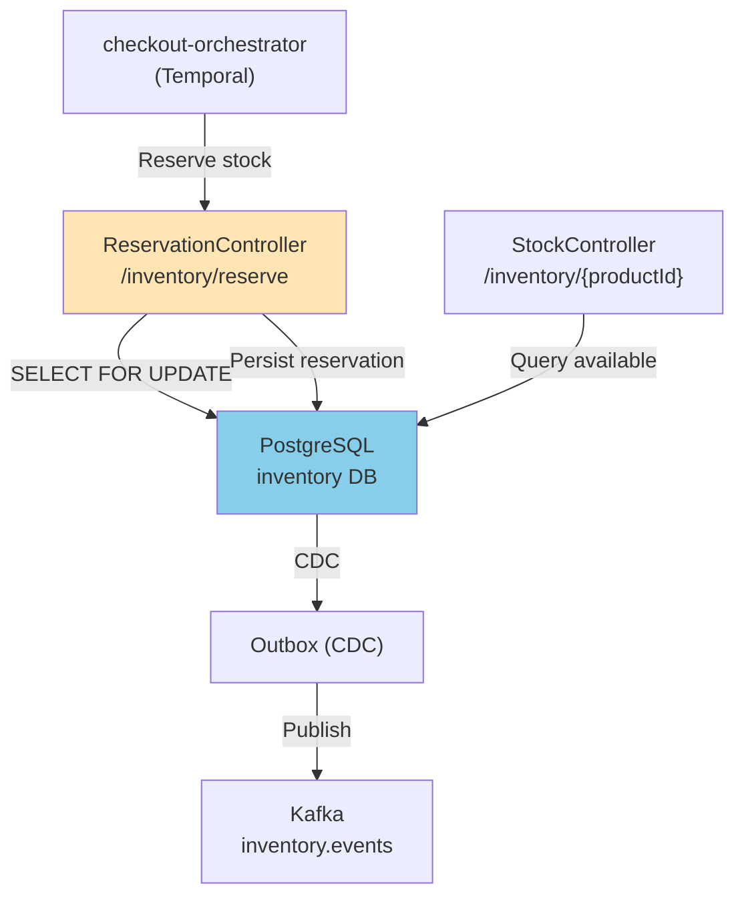

# Inventory Service - HLD & Database Schema

## High-Level Architecture



## Key Components

### ReservationController
**Endpoints**:
- `POST /inventory/reserve` - Create TTL-based reservation (5 min)
- `POST /inventory/release` - Release reservation

**Lock Strategy**:
- SELECT...FOR UPDATE (pessimistic, row-level)
- Lock timeout: 2 seconds (fail fast on contention)
- High connection pool: 60 max

### StockController
**Endpoints**:
- `GET /inventory/{productId}` - Check available stock
- `POST /inventory/{productId}/adjust` - Admin adjust

### Reservation Expiry Job
```java
@Scheduled(fixedRate = 30000)  // Every 30 seconds
@SchedulerLock(name = "inventory_expiry")
public void expireReservations() {
    inventoryRepository.deleteExpired(Instant.now());
}
```

---

## Database Schema

```sql
CREATE TABLE stock (
    id UUID PRIMARY KEY,
    product_id UUID NOT NULL,
    store_id VARCHAR(50) NOT NULL,
    quantity_available INT NOT NULL CHECK (quantity_available >= 0),
    quantity_reserved INT NOT NULL CHECK (quantity_reserved >= 0),
    low_stock_threshold INT NOT NULL DEFAULT 10,
    updated_at TIMESTAMPTZ NOT NULL DEFAULT now(),
    UNIQUE(product_id, store_id)
);

CREATE TABLE reservations (
    id UUID PRIMARY KEY,
    order_id UUID NOT NULL,
    product_id UUID NOT NULL,
    store_id VARCHAR(50) NOT NULL,
    quantity INT NOT NULL CHECK (quantity > 0),
    reserved_at TIMESTAMPTZ NOT NULL DEFAULT now(),
    expires_at TIMESTAMPTZ NOT NULL,
    released BOOLEAN NOT NULL DEFAULT false
);

CREATE TABLE outbox_events (
    id UUID PRIMARY KEY,
    aggregate_type VARCHAR(50) NOT NULL,
    aggregate_id VARCHAR(255) NOT NULL,
    event_type VARCHAR(50) NOT NULL,
    payload JSONB NOT NULL,
    created_at TIMESTAMPTZ NOT NULL DEFAULT now(),
    sent BOOLEAN NOT NULL DEFAULT false
);

CREATE INDEX idx_reservations_order ON reservations(order_id);
CREATE INDEX idx_reservations_expires ON reservations(expires_at) WHERE released = false;
CREATE INDEX idx_stock_product ON stock(product_id);
CREATE INDEX idx_outbox_unsent ON outbox_events(sent) WHERE sent = false;
```

---

## Concurrency Control

**Pessimistic Locking**:
```java
@Query("SELECT s FROM Stock s WHERE s.productId = ?1 AND s.storeId = ?2 FOR UPDATE")
Optional<Stock> findForUpdate(UUID productId, String storeId);
```

**Reserve Flow** (atomic):
```
1. BEGIN TRANSACTION (SERIALIZABLE)
2. SELECT * FROM stock WHERE product_id = ? FOR UPDATE (blocks others)
3. Check: quantity_available >= reserve_qty
4. UPDATE stock SET quantity_available -= reserve_qty
5. INSERT reservations (expires_at = now + 5 min)
6. INSERT outbox_events
7. COMMIT
8. Release lock (other threads unblock)
```

**TTL Cleanup** (batch):
```java
@Modifying
@Query("DELETE FROM reservations WHERE expires_at < :now AND released = false")
int deleteExpired(@Param("now") Instant now);
```

---

## API Examples

### Reserve Stock
```bash
POST /inventory/reserve
{
  "orderId": "order-550e8400-...",
  "items": [
    { "productId": "PROD-001", "storeId": "STORE-NYC", "quantity": 2 }
  ]
}

Response (201):
{
  "reservationId": "res-550e8400-...",
  "items": [
    { "productId": "PROD-001", "reserved": 2, "expiresAt": "2026-03-21T10:05:00Z" }
  ]
}
```

### Release Reservation
```bash
POST /inventory/release
{
  "reservationId": "res-550e8400-..."
}

Response (204 No Content)
```

### Check Stock
```bash
GET /inventory/{productId}?storeId=STORE-NYC

Response (200):
{
  "productId": "PROD-001",
  "storeId": "STORE-NYC",
  "availableQuantity": 50,
  "reservedQuantity": 10,
  "lowStockThreshold": 10
}
```

---

## Events

**StockReserved**:
```json
{
  "eventType": "StockReserved",
  "aggregateId": "res-550e8400-...",
  "payload": {
    "reservationId": "res-550e8400-...",
    "orderId": "order-550e8400-...",
    "items": [{ "productId": "PROD-001", "quantity": 2 }],
    "expiresAt": "2026-03-21T10:05:00Z"
  }
}
```

**ReservationExpired**:
```json
{
  "eventType": "ReservationExpired",
  "aggregateId": "res-550e8400-...",
  "payload": {
    "reservationId": "res-550e8400-...",
    "orderId": "order-550e8400-...",
    "expiredAt": "2026-03-21T10:05:00Z"
  }
}
```

---

## Performance Tuning

**High-Concurrency Configuration**:
- Connection pool: 60 max, 15 min-idle (many concurrent reservations)
- Lock timeout: 2 seconds (fail fast)
- Batch cleanup: Every 30 seconds
- Index: idx_reservations_expires (partial index on released=false)
