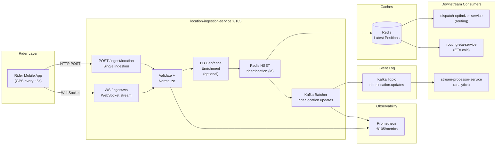

# Location Ingestion Service - High-Level Design

## Key Characteristics

- **High-Throughput Ingestion**: HTTP POST and WebSocket endpoints
- **Ephemeral State**: Redis latest-position cache (no persistent DB)
- **Validation & Normalization**: Coordinate bounds, precision checks
- **Optional H3 Geofencing**: In-process zone detection (log-only)
- **Dual Output**: Redis for query-time access, Kafka for durable event log
- **Stateless Design**: No message ordering guarantees, but fire-and-forget
- **Configurable TTL**: Redis keys with automatic expiration
- **Observability**: Kafka batching metrics, validation counters
