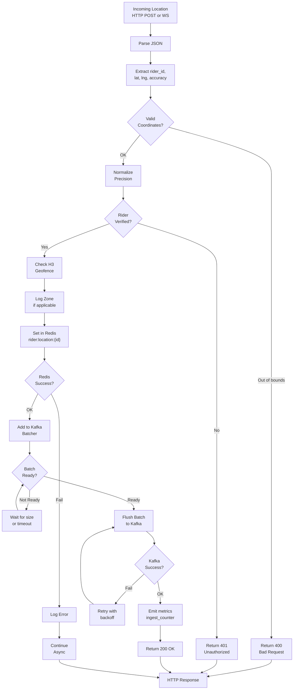

# Location Ingestion Service - Ingestion Flowchart

## Flow Details

1. **JSON Parsing**: Validate request structure
2. **Coordinate Extraction**: rider_id, latitude, longitude, accuracy_ms, timestamp
3. **Bounds Check**: Latitude [-90, 90], Longitude [-180, 180]
4. **Precision Normalization**: Round to configurable decimals (e.g., 6 = ~0.1m)
5. **Rider Verification**: Check if rider_id is known (optional auth)
6. **Geofence Check**: H3 cell computation and zone lookup (optional, log-only)
7. **Redis Set**: Store latest position with TTL (configurable, default 1 hour)
8. **Kafka Batch**: Add to accumulator, flush on size or timeout
9. **Metrics**: Record ingestion counter and latency
10. **Response**: Return 200 OK for successful ingestion
