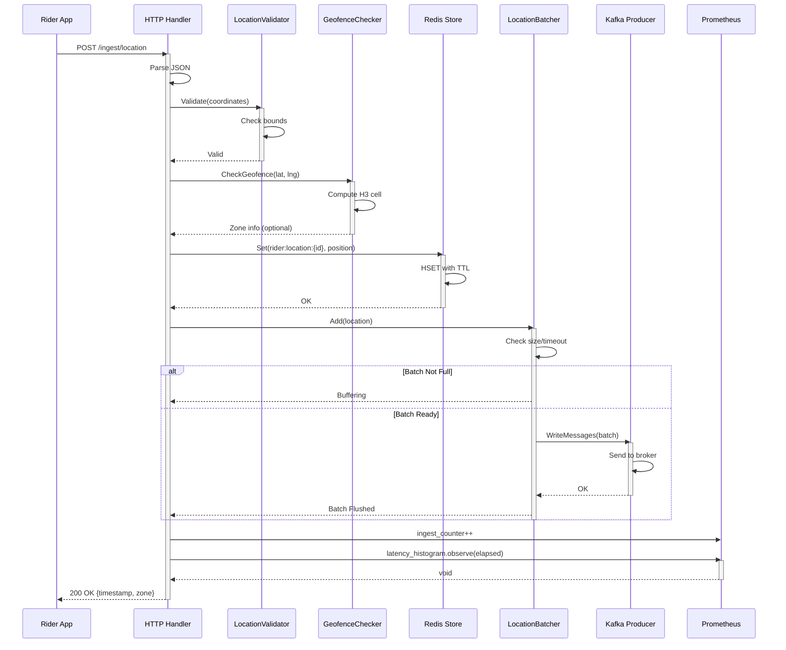

# Location Ingestion Service - Ingestion Sequence

## Sequence Patterns

- **Synchronous Validation**: Coordinate bounds check before storage
- **Optional Geofencing**: Zone detection does not block response
- **Redis Set**: Latest position overwrite (no transaction needed)
- **Kafka Batching**: Messages accumulated, async flush
- **Fire-and-Forget**: Response sent before Kafka confirmation
- **Metrics Async**: Prometheus emission non-blocking
