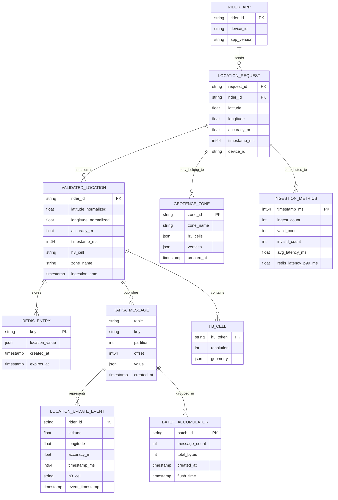

# Location Ingestion Service - Data Model

## Key Entities

| Entity | Purpose |
|--------|---------|
| **RIDER_APP** | Mobile app instance with device ID |
| **LOCATION_REQUEST** | Incoming GPS update |
| **VALIDATED_LOCATION** | Sanitized and normalized location |
| **REDIS_ENTRY** | Latest position cache entry |
| **KAFKA_MESSAGE** | Persisted event in topic |
| **LOCATION_UPDATE_EVENT** | Domain event for subscribers |
| **GEOFENCE_ZONE** | Pre-defined geographic zone |
| **H3_CELL** | Hierarchical spatial index |
| **BATCH_ACCUMULATOR** | Kafka batching metadata |
| **INGESTION_METRICS** | Latency and throughput metrics |
