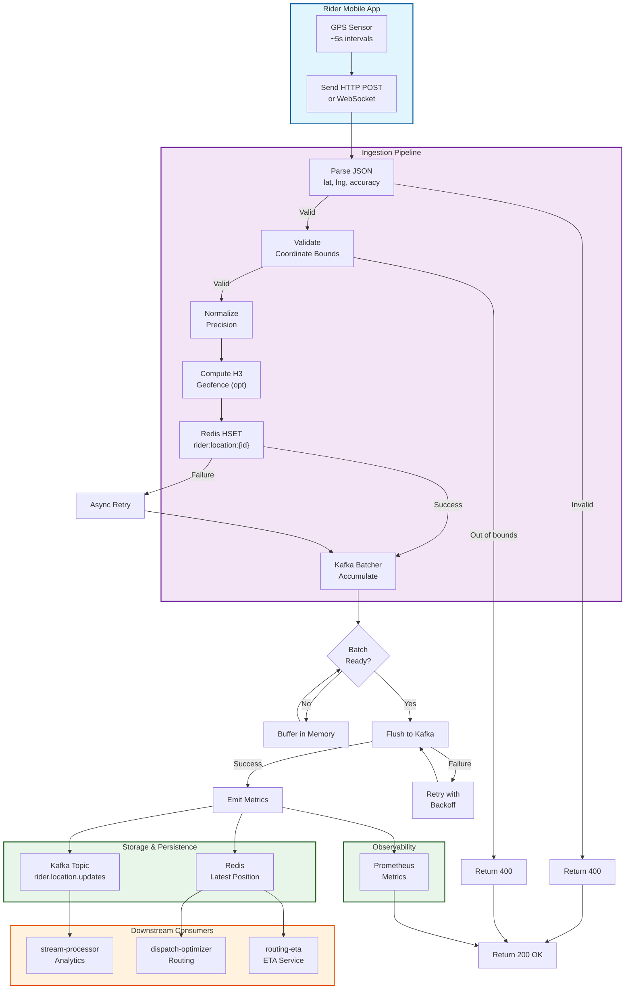

# Location Ingestion Service - End-to-End Ingestion Flow

## End-to-End Latency Budget

| Phase | Typical | Notes |
|-------|---------|-------|
| JSON parsing | <1 ms | FastAPI/Go JSON unmarshal |
| Validation | <1 ms | Bounds check only |
| Normalization | <1 ms | Precision rounding |
| Geofence (opt) | 1-5 ms | H3 cell computation |
| Redis SET | 1-5 ms | Network RTT to Redis |
| Kafka batch flush | 10-50 ms | Broker acknowledgment |
| Metrics emission | <1 ms | Prometheus async |
| **Total (p99)** | **<100 ms** | Per-location ingestion |

## Data Flow Guarantees

✓ **No message ordering**: Fire-and-forget semantics
✓ **Latest-position cache**: Redis keys with TTL (default 1 hour)
✓ **Durable event log**: Kafka topic for analytics/replay
✓ **Coordinate validation**: Bounds and precision checks
✓ **Stateless service**: Scales horizontally without affinity

## Consumer Access Patterns

| Consumer | Access Mode | Use Case |
|----------|------------|----------|
| **dispatch-optimizer** | Redis HGET | Real-time rider location lookup |
| **routing-eta** | Redis HGET | ETA calculation with current position |
| **stream-processor** | Kafka subscribe | Time-series aggregation and analytics |
| **analytics** | Kafka historical | BigQuery warehouse ingestion |

## High-Throughput Characteristics

- **Horizontal scalability**: Stateless service, multiple replicas
- **Kafka batching**: 1000 messages or 5s timeout
- **Redis optimization**: Single hash per rider (efficient)
- **Connection pooling**: Kafka + Redis connection reuse
- **Fire-and-forget**: No waiting for broker confirmation
