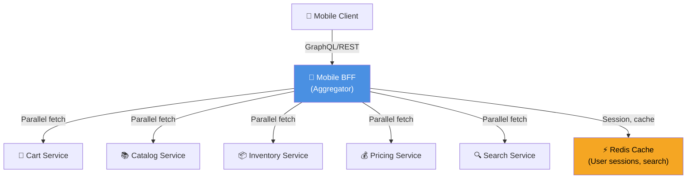
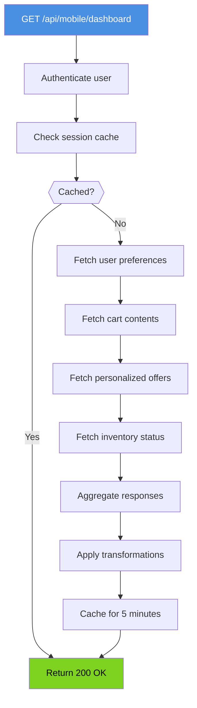
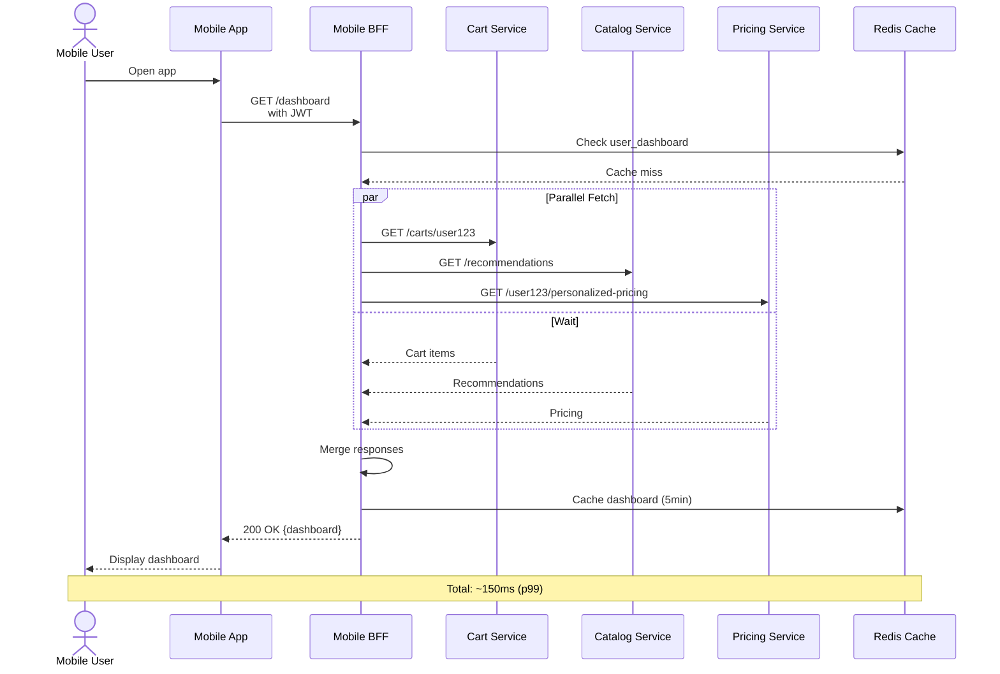
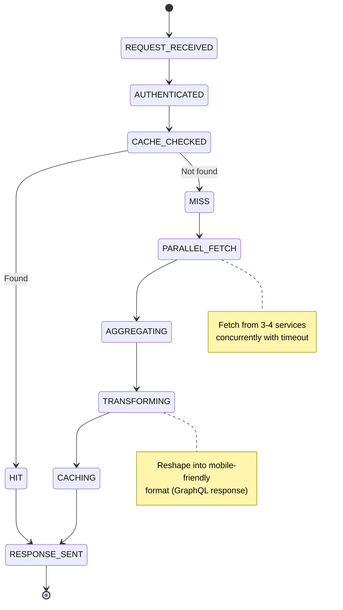
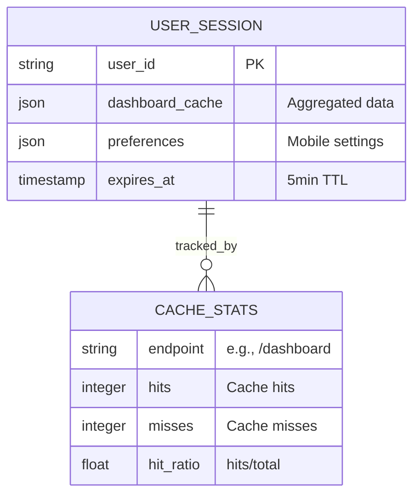

# Mobile BFF - All 7 Diagrams

## 1. High-Level Design



## 2. Low-Level Design

```mermaid
graph LR
    Request["HTTP Request"]
    AuthFilter["Auth Filter<br/>(JWT validation)"]
    RequestParser["Parser<br/>(JSON/GraphQL)"]
    DataAggregator["Data Aggregator<br/>(Parallel fetcher)"]
    DataTransformer["Transformer<br/>(API response shaping)"]
    ResponseBuilder["Response Builder<br/>(GraphQL resolver)"]
    Response["HTTP Response"]

    Request --> AuthFilter
    AuthFilter --> RequestParser
    RequestParser --> DataAggregator
    DataAggregator --> DataTransformer
    DataTransformer --> ResponseBuilder
    ResponseBuilder --> Response

    style DataAggregator fill:#7ED321,color:#000
    style ResponseBuilder fill:#7ED321,color:#000
```



## 3. Flowchart - Dashboard Query



## 4. Sequence Diagram



## 5. State Machine



## 6. ER Diagram



## 7. End-to-End Diagram

```mermaid
graph TB
    User["👤 User<br/>(Mobile App)"]
    CDN["🌍 CDN"]
    ALB["⚖️ ALB"]
    BFF["🔗 Mobile BFF<br/>(Load balanced: 3 pods)"]
    Cache["⚡ Redis"]
    CartSvc["🛒 Cart Service"]
    CatalogSvc["📚 Catalog Service"]
    PricingSvc["💰 Pricing Service"]
    DB1["🗄️ Cart DB"]
    DB2["🗄️ Catalog DB"]

    User -->|1. HTTPS| CDN
    CDN -->|2. Forward| ALB
    ALB -->|3. Route| BFF
    BFF -->|4. Check| Cache
    Cache -->|5. Miss| BFF
    BFF -->|6. Fetch| CartSvc
    BFF -->|7. Fetch| CatalogSvc
    BFF -->|8. Fetch| PricingSvc
    CartSvc -->|Query| DB1
    CatalogSvc -->|Query| DB2
    CartSvc -->|Data| BFF
    CatalogSvc -->|Data| BFF
    PricingSvc -->|Data| BFF
    BFF -->|9. Aggregate| BFF
    BFF -->|10. Cache (5min)| Cache
    BFF -->|11. Response| ALB
    ALB -->|12. HTTPS| User

    style BFF fill:#4A90E2,color:#fff
    style Cache fill:#F5A623,color:#000

    classDef parallelFetch fill:#50E3C2,color:#000
    class 6,7,8 parallelFetch
```
