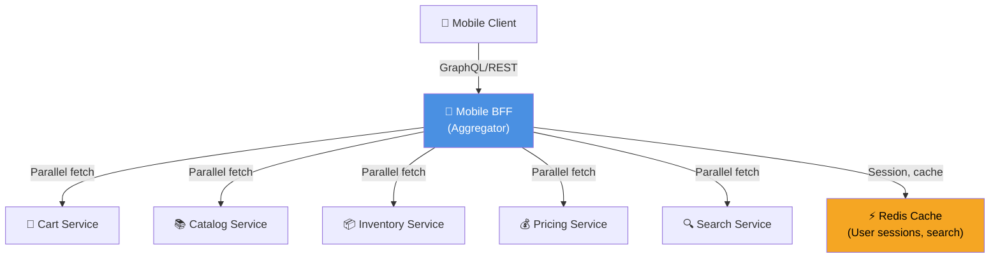

# Mobile BFF - High-Level Design

## High-Level Architecture Components

- **Mobile Client**: iOS/Android applications communicating over HTTPS
- **Mobile BFF**: Central aggregator service implementing GraphQL/REST façade
- **Downstream Services**: Cart, Catalog, Inventory, Pricing, Search services
- **Redis Cache**: Session storage and search result caching (5-minute TTL)

## Request Flow Summary

1. Mobile app sends GraphQL query to BFF
2. BFF authenticates user (JWT validation)
3. BFF fetches data from multiple services in parallel
4. BFF checks Redis for cached responses
5. BFF aggregates and transforms responses
6. BFF returns mobile-optimized JSON/GraphQL response
7. Response cached for 5 minutes

## Performance Targets

- **Latency SLA**: p99 < 150ms (typical dashboard query)
- **Cache Hit Rate**: > 60% for dashboard endpoint
- **Availability**: 99.9% (mirrors downstream services)
