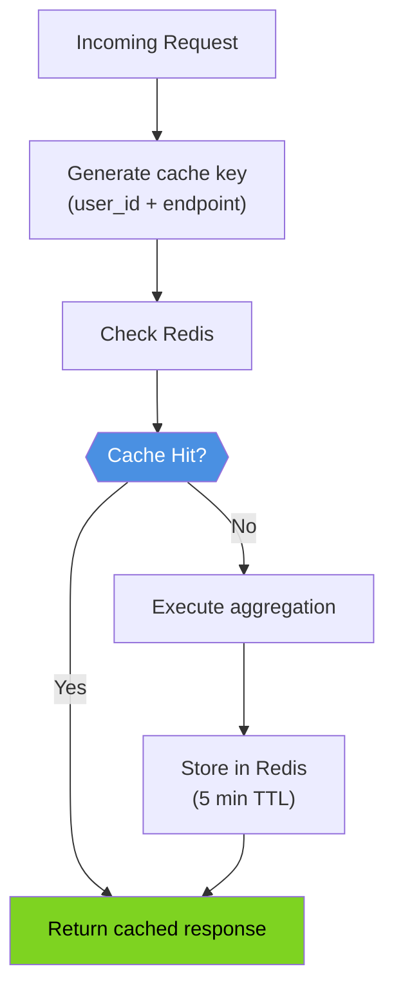

# Mobile BFF - Low-Level Design

```mermaid
graph LR
    Request["HTTP Request"]
    AuthFilter["Auth Filter<br/>(JWT validation)"]
    RequestParser["Parser<br/>(JSON/GraphQL)"]
    DataAggregator["Data Aggregator<br/>(Parallel fetcher)"]
    DataTransformer["Transformer<br/>(API response shaping)"]
    ResponseBuilder["Response Builder<br/>(GraphQL resolver)"]
    Response["HTTP Response"]

    Request --> AuthFilter
    AuthFilter --> RequestParser
    RequestParser --> DataAggregator
    DataAggregator --> DataTransformer
    DataTransformer --> ResponseBuilder
    ResponseBuilder --> Response

    style DataAggregator fill:#7ED321,color:#000
    style ResponseBuilder fill:#7ED321,color:#000
```

## Request Processing Pipeline

### 1. Authentication Filter
- Validates JWT token from Authorization header
- Extracts user_id and tenant_id from claims
- Sets RequestContext for downstream use
- Enforces JWT expiration and signature verification

### 2. Request Parser
- Parses GraphQL query or REST endpoint
- Resolves requested fields/data requirements
- Validates query parameters
- Maps to internal data aggregator requirements

### 3. Data Aggregator
- Executes parallel requests to downstream services
- Implements timeout per service (2-3 seconds)
- Circuit breaker for failing services
- Deduplication of requests (e.g., same user profile called twice)

### 4. Data Transformer
- Reshapes service responses into mobile-friendly format
- Removes unnecessary fields (reduces bandwidth)
- Applies business logic transformations
- Handles null/missing values gracefully

### 5. Response Builder
- Assembles final GraphQL/JSON response
- Serializes to compact format
- Applies response compression (gzip)
- Adds cache headers (ETag, Cache-Control)

## Caching Strategy

## Service Integration Points

| Service | Protocol | Timeout | Circuit Breaker |
|---------|----------|---------|-----------------|
| Cart    | gRPC     | 2s      | 50% error rate  |
| Catalog | REST     | 3s      | 60% error rate  |
| Inventory | gRPC   | 2s      | 50% error rate  |
| Pricing | gRPC     | 2s      | 50% error rate  |
| Search  | REST     | 3s      | 60% error rate  |

## Error Handling

- **Service Down**: Return cached response if available, else partial response
- **Timeout**: Skip service, return available data
- **Invalid JWT**: Return 401 Unauthorized
- **Rate Limited**: Return 429 Too Many Requests
