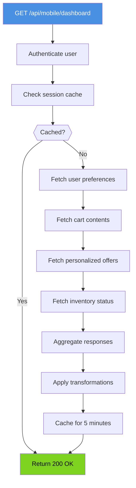

# Mobile BFF - Flowchart (Dashboard Query)

## Step-by-Step Execution

### Authentication & Cache Check
1. **Incoming Request**: GET /api/mobile/dashboard
2. **Authenticate User**: Validate JWT token from Authorization header
3. **Check Session Cache**: Query Redis for user_id + endpoint cache key

### Cache Hit Path
- If cache hit (within 5-minute TTL):
  - Return cached response immediately
  - Update cache expiry
  - Return 200 OK with ETag for CDN

### Cache Miss Path
- If cache miss:
  - Fetch user preferences from Pricing Service
  - Fetch cart contents from Cart Service
  - Fetch personalized offers from Catalog Service
  - Fetch real-time inventory from Inventory Service

### Response Assembly
4. **Aggregate Responses**: Combine all service responses into single payload
5. **Apply Transformations**:
   - Remove unused fields
   - Format for mobile display
   - Convert to mobile-friendly units (e.g., thousands for large numbers)
6. **Cache Response**: Store in Redis with 5-minute TTL
7. **Return 200 OK**: Send JSON response to mobile client

## Performance Characteristics

- **Cache Hit**: ~50ms (Redis lookup + serialization)
- **Cache Miss**: ~150ms (parallel service calls + aggregation)
- **Parallel Fetch**: All services called concurrently, overall timeout = max(service timeouts)
- **Transformation**: < 10ms (in-process)

## Error Scenarios

| Scenario | Action | Response |
|----------|--------|----------|
| JWT invalid | Reject | 401 Unauthorized |
| Cache hit | Return | Cached response |
| Cart Service down | Skip, use cache | Partial response |
| All services down | Fail | 503 Service Unavailable |
| Rate limited | Wait | 429 Too Many Requests |
