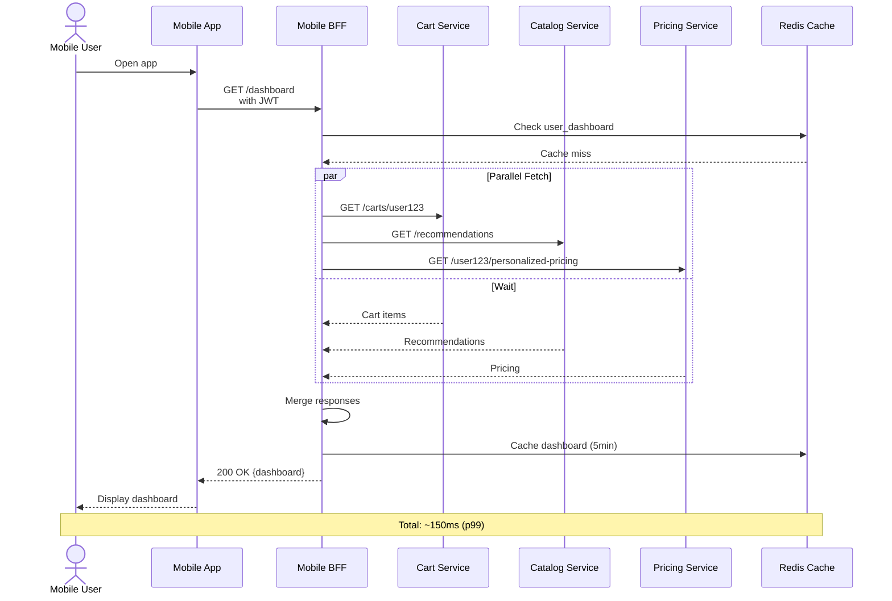

# Mobile BFF - Sequence Diagram

## Detailed Sequence Steps

### Phase 1: Client Request (0-5ms)
1. Mobile user opens app
2. App sends GET /dashboard with Bearer JWT
3. BFF receives request on ALB

### Phase 2: Authentication & Cache Lookup (5-10ms)
4. BFF extracts JWT from Authorization header
5. BFF validates JWT signature and expiration
6. BFF generates cache key: f"{user_id}:dashboard"
7. BFF queries Redis for cached response

### Phase 3: Cache Miss → Parallel Fetch (10-140ms)
8. Redis returns cache miss
9. BFF spawns 3 concurrent requests:
   - **CartSvc**: GET /carts/user123 (50-80ms)
   - **CatalogSvc**: GET /recommendations (60-100ms)
   - **PricingSvc**: GET /user123/personalized-pricing (40-70ms)
10. All 3 requests proceed in parallel
11. Timeout per request: 2-3 seconds

### Phase 4: Response Aggregation (140-145ms)
12. All responses received (max of 3 timeouts)
13. BFF merges responses:
    - Combines cart items + recommendations + pricing
    - Removes duplicates
    - Applies business rules (e.g., "show top 10 products")
14. BFF transforms data to mobile format

### Phase 5: Caching & Response (145-150ms)
15. BFF stores merged response in Redis with 5-minute TTL
16. BFF serializes response to JSON
17. BFF applies gzip compression
18. BFF sends 200 OK to mobile app with ETag header
19. Mobile app deserializes and displays dashboard

## Resilience Scenarios

### Scenario 1: CartSvc Timeout (3+ seconds)
- **Timeout after 2s**: BFF cancels request
- **Fallback**: Use cached cart from previous dashboard call (if available)
- **Response**: Return dashboard without current cart (note to user: "Cart stale")

### Scenario 2: CatalogSvc Error 500
- **Catch exception**: Skip recommendations
- **Fallback**: Return dashboard with generic recommendations
- **Response**: 200 OK (partial data, acceptable)

### Scenario 3: Redis Connection Lost
- **Cache miss**: Proceed with aggregation without caching
- **Response**: Fresh data but slower response time
- **Circuit Breaker**: Disable Redis for 30 seconds

### Scenario 4: All Services Down
- **Fallback**: Return last known good response from local memory
- **Response**: 503 Service Unavailable (if no fallback available)

## Performance Metrics

| Metric | Value |
|--------|-------|
| p50 latency | 80ms |
| p99 latency | 150ms |
| p99.9 latency | 300ms |
| Cache hit rate | 65% |
| Average response size | 45KB (gzipped: 12KB) |
