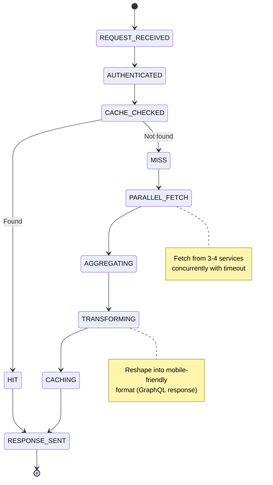

# Mobile BFF - State Machine

## State Descriptions

### REQUEST_RECEIVED
- **Entry**: Incoming HTTP request arrives at BFF
- **Actions**:
  - Log request (user_id, endpoint, timestamp)
  - Extract headers and body
  - Create RequestContext
- **Exit**: Proceed to authentication
- **Timeout**: N/A

### AUTHENTICATED
- **Entry**: Moving from REQUEST_RECEIVED
- **Actions**:
  - Extract JWT from Authorization header
  - Validate RS256 signature against identity-service JWKS
  - Check JWT expiration (exp < now())
  - Extract user_id, tenant_id, roles from claims
  - Create Security Context
- **Exit**: Proceed to cache check (if authenticated)
- **Failure Path**: Return 401 Unauthorized → [*]
- **Timeout**: 50ms (JWKS lookup + validation)

### CACHE_CHECKED
- **Entry**: User authenticated successfully
- **Actions**:
  - Generate cache key: f"{user_id}:{endpoint}"
  - Query Redis for cached response
  - Check TTL (must be < 5 minutes old)
  - Parse cached response if found
- **Exit**: Branch on HIT or MISS
- **Timeout**: 20ms (Redis round-trip)

### HIT (Cache Hit)
- **Entry**: Cached response found in Redis
- **Actions**:
  - Validate ETag (for CDN support)
  - Update cache expiry (extend TTL by 5 min)
  - Increment hit counter (metrics)
  - Prepare response headers
- **Exit**: RESPONSE_SENT
- **Latency**: < 50ms

### MISS (Cache Miss)
- **Entry**: No cached response found
- **Actions**:
  - Prepare service request templates
  - Spawn 3-4 concurrent requests
  - Set timeout per request (2-3 seconds)
  - Enable request tracking
- **Exit**: PARALLEL_FETCH
- **Latency**: N/A

### PARALLEL_FETCH
- **Entry**: Cache miss detected
- **Actions**:
  - Fetch Cart Service (GET /carts/{user_id}) → 50-100ms
  - Fetch Catalog Service (GET /recommendations) → 60-120ms
  - Fetch Inventory Service (GET /inventory) → 40-80ms
  - Fetch Pricing Service (GET /pricing/{user_id}) → 30-70ms
  - All 4 requests proceed concurrently
  - Wait for max(timeout) or all responses
- **Exit**: AGGREGATING (when all responses received or timeout)
- **Timeout**: max(2-3 seconds per service)
- **Partial Response**: If 1-2 services timeout, continue with available data

### AGGREGATING
- **Entry**: All service responses received (or timeout)
- **Actions**:
  - Merge responses from multiple services
  - Remove duplicate products/data
  - Sort results per business logic (e.g., top 10 recommendations)
  - Validate response completeness
  - Apply business rules (pricing, availability)
- **Exit**: TRANSFORMING
- **Latency**: 5-10ms

### TRANSFORMING
- **Entry**: Data aggregation complete
- **Actions**:
  - Filter fields (remove internal-only fields)
  - Convert units (e.g., cents → dollars)
  - Format for mobile display (shortened strings, compact JSON)
  - Apply data transformations (e.g., "available" flag calculation)
  - Add metadata (query_id, timestamp)
- **Exit**: CACHING
- **Latency**: 5-10ms

### CACHING
- **Entry**: Data transformation complete
- **Actions**:
  - Serialize response to JSON
  - Store in Redis with key: f"{user_id}:{endpoint}"
  - Set TTL: 5 minutes
  - Store alongside timestamp
  - Increment miss counter (metrics)
- **Exit**: RESPONSE_SENT
- **Latency**: 10-20ms (includes Redis write)
- **Failure**: If Redis unavailable, skip caching (still return response)

### RESPONSE_SENT
- **Entry**: Response ready (from HIT or CACHING)
- **Actions**:
  - Serialize to JSON (if not already serialized)
  - Apply gzip compression
  - Set response headers:
    - Content-Type: application/json
    - Content-Encoding: gzip
    - Cache-Control: public, max-age=300 (5 min)
    - ETag: hash of response
  - Log response (user_id, endpoint, status, latency)
  - Emit metrics
- **Exit**: [*]
- **Latency**: 5-10ms

## State Transitions

### Happy Path (Cache Hit)
REQUEST_RECEIVED → AUTHENTICATED → CACHE_CHECKED → HIT → RESPONSE_SENT → [*]
**Total Latency**: 50-100ms

### Happy Path (Cache Miss)
REQUEST_RECEIVED → AUTHENTICATED → CACHE_CHECKED → MISS → PARALLEL_FETCH → AGGREGATING → TRANSFORMING → CACHING → RESPONSE_SENT → [*]
**Total Latency**: 150-200ms

### Error Path (Invalid JWT)
REQUEST_RECEIVED → AUTHENTICATED (fail) → 401 Unauthorized → [*]
**Latency**: 50ms

### Error Path (All Services Down)
REQUEST_RECEIVED → AUTHENTICATED → CACHE_CHECKED → MISS → PARALLEL_FETCH (all timeout) → 503 Service Unavailable → [*]
**Latency**: 3+ seconds (timeout)

## Metrics Tracked

- State entry/exit timestamps (latency per state)
- Cache hit/miss rate (goal: > 60%)
- Service timeout rate (goal: < 0.1%)
- Total response latency (p99: < 150ms)
