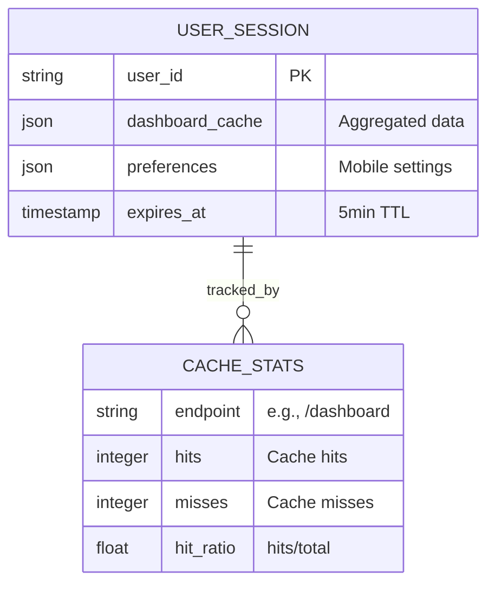

# Mobile BFF - ER Diagram



## Data Model

### USER_SESSION
Transient session data cached in Redis.

**Purpose**: Store per-user aggregated dashboard data for 5-minute TTL

**Schema**:
| Field | Type | Description |
|-------|------|-------------|
| user_id | string (PK) | Unique user identifier |
| dashboard_cache | json | Aggregated dashboard response (cart + recommendations + pricing) |
| preferences | json | Mobile-specific preferences (theme, language, layout) |
| expires_at | timestamp | Cache expiration time (now + 5 minutes) |

**Indexes**:
- PRIMARY: user_id
- TTL: expires_at (Redis auto-expiry)

**Cache Key Format**: `mobile-bff:user:{user_id}:dashboard`

**Sample Data**:
```json
{
  "user_id": "user_12345",
  "dashboard_cache": {
    "cart": {
      "items": [
        {"product_id": "prod_001", "quantity": 2, "price": 29.99}
      ],
      "total": 59.98
    },
    "recommendations": [
      {"product_id": "prod_002", "title": "Related Item", "price": 19.99}
    ],
    "pricing": {
      "user_segment": "premium",
      "discount": 0.10
    }
  },
  "preferences": {
    "language": "en",
    "currency": "USD",
    "theme": "dark"
  },
  "expires_at": "2026-03-21T14:45:00Z"
}
```

### CACHE_STATS
Transient metrics tracked per endpoint.

**Purpose**: Monitor cache effectiveness and performance

**Schema**:
| Field | Type | Description |
|-------|------|-------------|
| endpoint | string (PK) | HTTP endpoint (e.g., /dashboard) |
| hits | integer | Total cache hits since service start |
| misses | integer | Total cache misses since service start |
| hit_ratio | float | hits / (hits + misses) |

**Indexes**:
- PRIMARY: endpoint

**Update Frequency**: Real-time (per request)

**Sample Data**:
```json
{
  "endpoint": "/api/mobile/dashboard",
  "hits": 6500,
  "misses": 3500,
  "hit_ratio": 0.65
}
```

## Relationships

### USER_SESSION → CACHE_STATS
- **Type**: One-to-Many (1:M)
- **Cardinality**: Each user session can contribute to multiple endpoint statistics
- **Description**: Tracks cache effectiveness for each user's requests

## Redis Storage Strategy

### Key Naming Conventions
```
mobile-bff:user:{user_id}:dashboard          # Main cache key
mobile-bff:metrics:{endpoint}:hits           # Cache hit counter
mobile-bff:metrics:{endpoint}:misses         # Cache miss counter
```

### TTL Configuration
- **Dashboard Response**: 5 minutes (300 seconds)
- **Metrics**: No TTL (persistent)
- **Auto-Expiry**: Redis deletes expired keys automatically

### Memory Management
- **Estimated per user**: ~10KB (gzipped: ~2KB)
- **User capacity (1GB Redis)**: ~500,000 concurrent sessions
- **Eviction Policy**: LRU (least recently used)

## Performance Characteristics

- **Write Latency**: 5-10ms (Redis SET with expiry)
- **Read Latency**: 2-5ms (Redis GET)
- **Serialization**: JSON with custom codec
- **Deserialization**: < 1ms for typical payload

## Monitoring & Alerts

| Metric | Alert Threshold | Action |
|--------|-----------------|--------|
| Hit Ratio < 50% | Warning | Review cache invalidation |
| Redis latency > 10ms | Warning | Check Redis load |
| Redis memory > 80% | Critical | Increase capacity or reduce TTL |
| Cache miss spike | Alert | Check service health |
