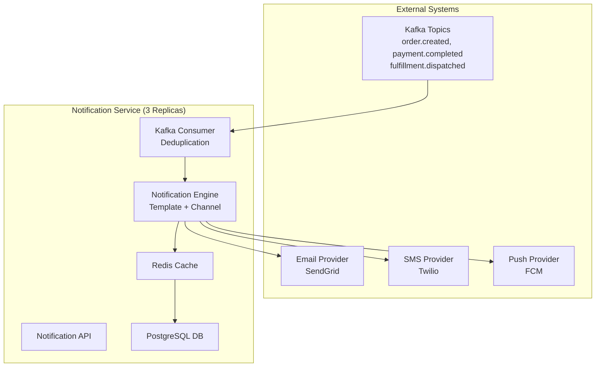

# Notification Service - High-Level Design

## Architecture Overview

## System Characteristics

| Feature | Value |
|---|---|
| Throughput | 50K events/sec |
| Latency (E2E) | <5s p99 |
| Availability | 99.9% |
| Deployment | 3 replicas |
| Data Retention | 7 days hot, 90 days cold |

## Data Flow

1. **Event Ingestion**: Kafka consumer (12 partitions)
2. **Processing**: Template rendering, preference lookup, deduplication (24h window)
3. **Delivery**: Email/SMS/Push with circuit breaker
4. **Observability**: Metrics, tracing, structured logs

