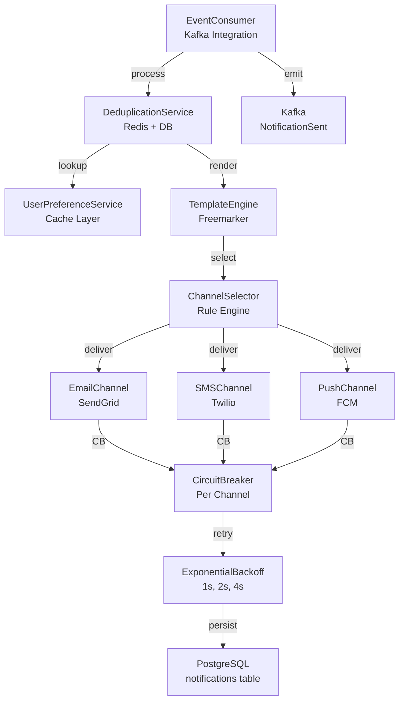

# Notification Service - Low-Level Design

## Component Architecture

## Key Classes

### NotificationEventConsumer
- Partition assignment strategy: manual
- Deduplication key: `{userId}-{eventType}-{timestamp}`
- Error handling: Send to DLQ on 3 retries

### TemplateEngine
- Support: Email HTML, SMS plain text, Push JSON
- Context variables: user, order, payment, fulfillment
- Caching: 1-hour TTL in Redis

### ChannelSelector
- Rules: User preference, time zone, channel availability
- Fallback: Email > SMS > Push
- A/B testing: Feature flag integration

### CircuitBreaker
- Failure threshold: 5 consecutive failures
- Half-open timeout: 30 seconds
- Success threshold to transition: 2 successes

## Error Handling

- **Transient failures**: Exponential backoff (max 3 retries)
- **Permanent failures**: Log + DLQ
- **Channel down**: Graceful fallback to next channel
- **Redis unavailable**: Use PostgreSQL cache (slower path)
