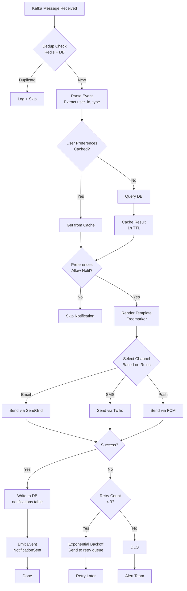
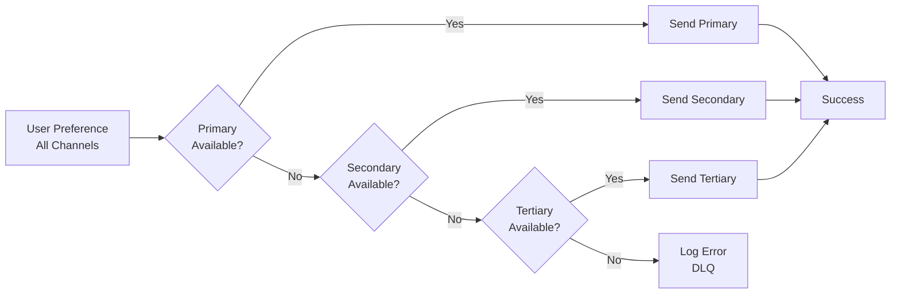
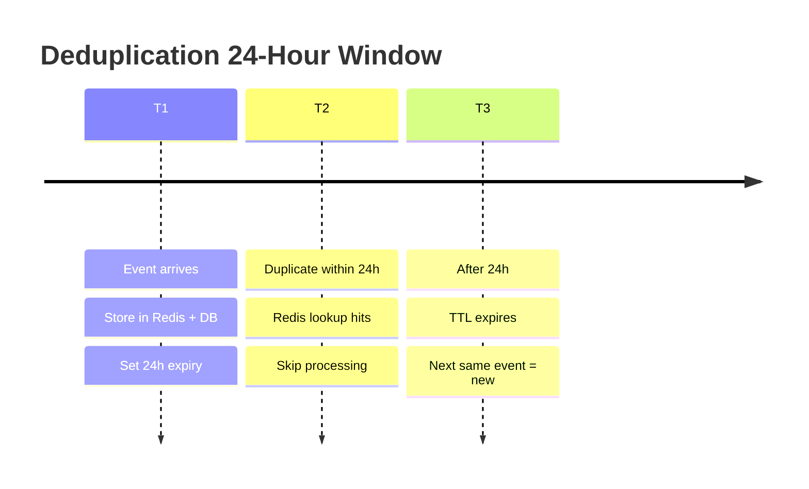

# Notification Service - Flowchart

## Event Processing Flow

```mermaid
flowchart TD
    A["Kafka Message Received"] --> B{Dedup Check<br/>Redis + DB}
    B -->|Duplicate| C["Log + Skip"]
    B -->|New| D["Parse Event<br/>Extract user_id, type"]
    D --> E{User Preferences<br/>Cached?}
    E -->|Yes| F["Get from Cache"]
    E -->|No| G["Query DB"]
    G --> H["Cache Result<br/>1h TTL"]
    F --> I{Preferences<br/>Allow Notif?}
    H --> I
    I -->|No| J["Skip Notification"]
    I -->|Yes| K["Render Template<br/>Freemarker"]
    K --> L{Select Channel<br/>Based on Rules}
    L -->|Email| M["Send via SendGrid"]
    L -->|SMS| N["Send via Twilio"]
    L -->|Push| O["Send via FCM"]
    M --> P{Success?}
    N --> P
    O --> P
    P -->|Yes| Q["Write to DB<br/>notifications table"]
    P -->|No| R{Retry Count<br/>< 3?}
    R -->|Yes| S["Exponential Backoff<br/>Send to retry queue"]
    R -->|No| T["DLQ"]
    Q --> U["Emit Event<br/>NotificationSent"]
    S --> W["Retry Later"]
    T --> X["Alert Team"]
    U --> Y["Done"]
```

## Channel Fallback Strategy

```mermaid
flowchart LR
    A["User Preference<br/>All Channels"] --> B{Primary<br/>Available?}
    B -->|Yes| C["Send Primary"]
    B -->|No| D{Secondary<br/>Available?}
    D -->|Yes| E["Send Secondary"]
    D -->|No| F{Tertiary<br/>Available?}
    F -->|Yes| G["Send Tertiary"]
    F -->|No| H["Log Error<br/>DLQ"]
    C --> I["Success"]
    E --> I
    G --> I
```

## Deduplication Window

```mermaid
timeline
    title Deduplication 24-Hour Window
    T1 : Event arrives : Store in Redis + DB : Set 24h expiry
    T2 : Duplicate within 24h : Redis lookup hits : Skip processing
    T3 : After 24h : TTL expires : Next same event = new
```
