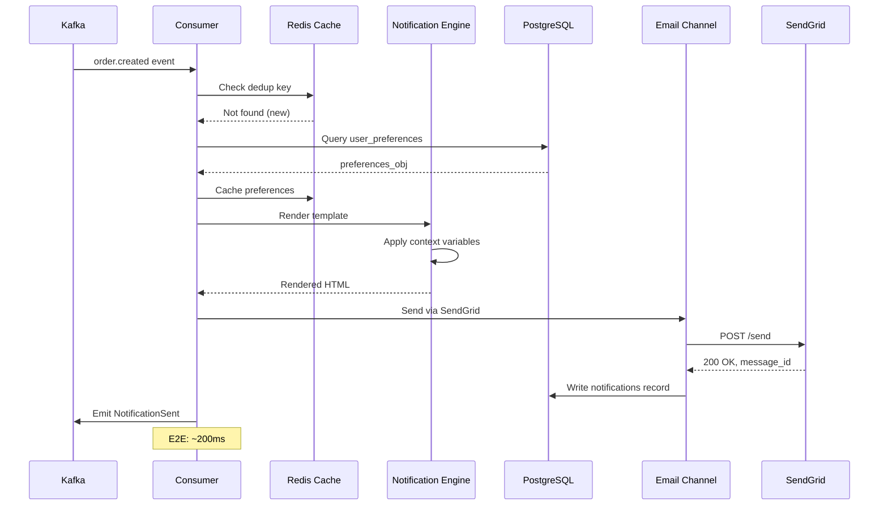
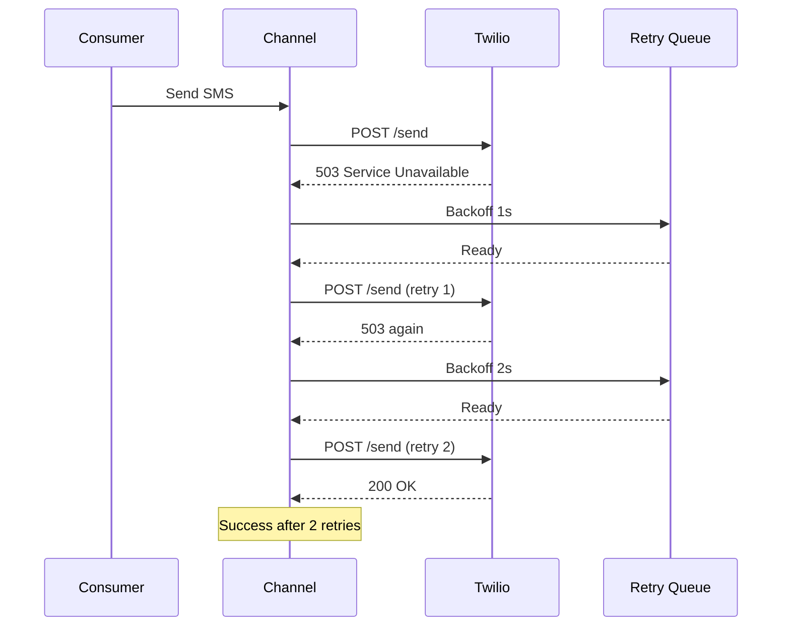
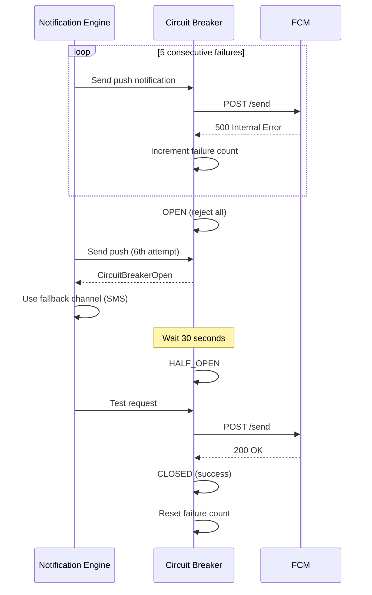
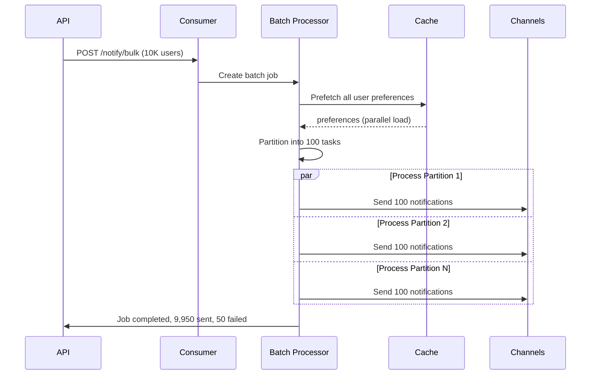

# Notification Service - Sequence Diagrams

## Successful Notification Delivery (Happy Path)

```mermaid
sequenceDiagram
    participant Kafka
    participant Consumer
    participant Cache as Redis Cache
    participant Engine as Notification Engine
    participant DB as PostgreSQL
    participant Channel as Email Channel
    participant External as SendGrid

    Kafka->>Consumer: order.created event
    Consumer->>Cache: Check dedup key
    Cache-->>Consumer: Not found (new)
    Consumer->>DB: Query user_preferences
    DB-->>Consumer: preferences_obj
    Consumer->>Cache: Cache preferences
    Consumer->>Engine: Render template
    Engine->>Engine: Apply context variables
    Engine-->>Consumer: Rendered HTML
    Consumer->>Channel: Send via SendGrid
    Channel->>External: POST /send
    External-->>Channel: 200 OK, message_id
    Channel->>DB: Write notifications record
    Consumer->>Kafka: Emit NotificationSent
    Note over Consumer: E2E: ~200ms
```

## Retry on Transient Failure

```mermaid
sequenceDiagram
    participant Consumer
    participant Channel
    participant Twilio
    participant Retry as Retry Queue

    Consumer->>Channel: Send SMS
    Channel->>Twilio: POST /send
    Twilio-->>Channel: 503 Service Unavailable
    Channel->>Retry: Backoff 1s
    Retry-->>Channel: Ready
    Channel->>Twilio: POST /send (retry 1)
    Twilio-->>Channel: 503 again
    Channel->>Retry: Backoff 2s
    Retry-->>Channel: Ready
    Channel->>Twilio: POST /send (retry 2)
    Twilio-->>Channel: 200 OK
    Note over Channel: Success after 2 retries
```

## Circuit Breaker Activation

```mermaid
sequenceDiagram
    participant Engine as Notification Engine
    participant CB as Circuit Breaker
    participant FCM

    loop 5 consecutive failures
        Engine->>CB: Send push notification
        CB->>FCM: POST /send
        FCM-->>CB: 500 Internal Error
        CB->>CB: Increment failure count
    end
    
    CB->>CB: OPEN (reject all)
    Engine->>CB: Send push (6th attempt)
    CB-->>Engine: CircuitBreakerOpen
    Engine->>Engine: Use fallback channel (SMS)
    
    Note over CB: Wait 30 seconds
    CB->>CB: HALF_OPEN
    
    Engine->>CB: Test request
    CB->>FCM: POST /send
    FCM-->>CB: 200 OK
    CB->>CB: CLOSED (success)
    CB->>CB: Reset failure count
```

## Bulk Notification for Campaign

```mermaid
sequenceDiagram
    participant API
    participant Consumer
    participant Batch as Batch Processor
    participant Cache
    participant Channels

    API->>Consumer: POST /notify/bulk (10K users)
    Consumer->>Batch: Create batch job
    Batch->>Cache: Prefetch all user preferences
    Cache-->>Batch: preferences (parallel load)
    Batch->>Batch: Partition into 100 tasks
    par Process Partition 1
        Batch->>Channels: Send 100 notifications
    and Process Partition 2
        Batch->>Channels: Send 100 notifications
    and Process Partition N
        Batch->>Channels: Send 100 notifications
    end
    Batch->>API: Job completed, 9,950 sent, 50 failed
```
