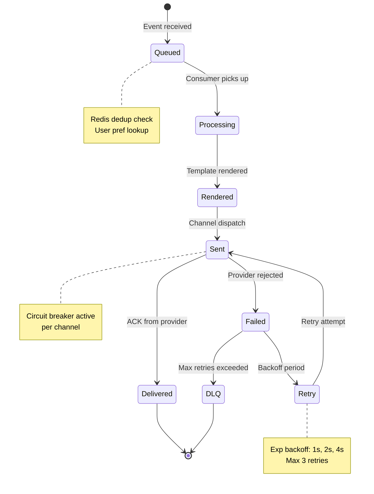
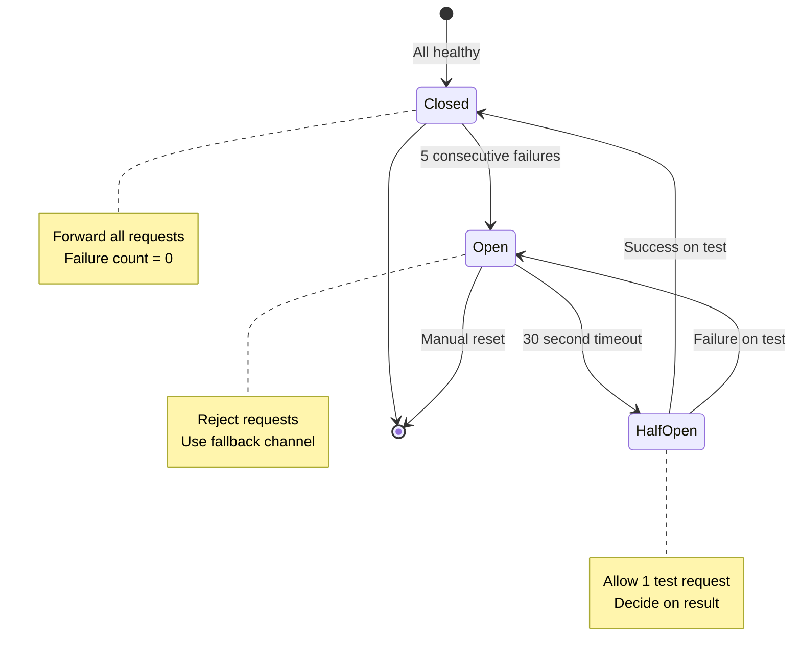
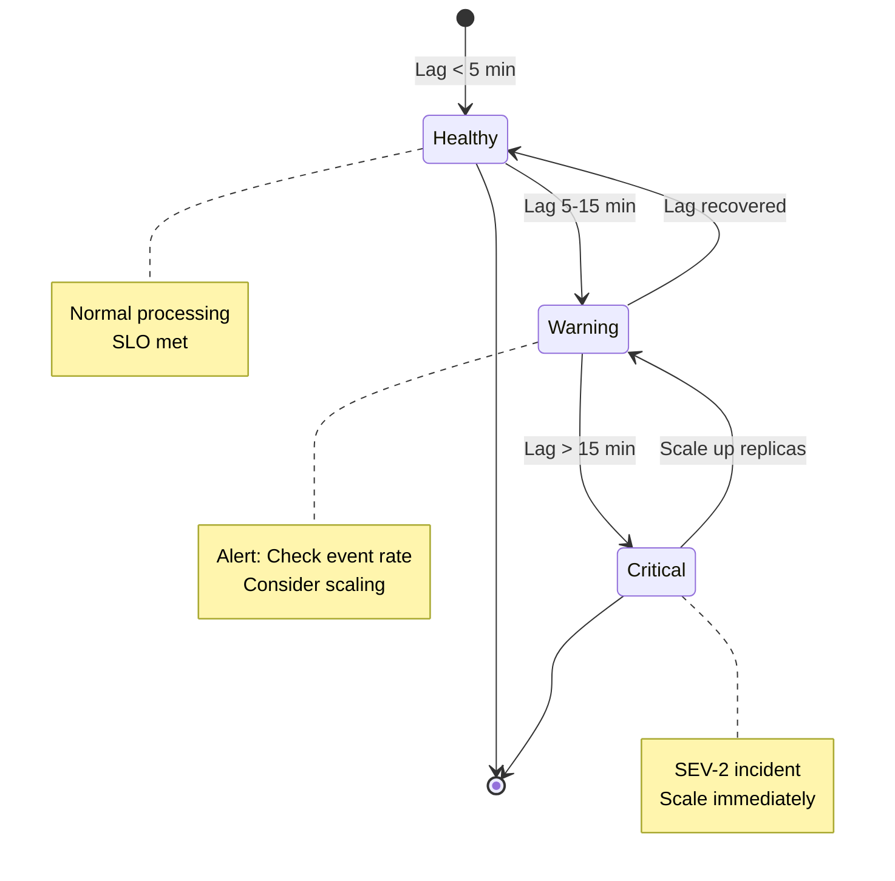
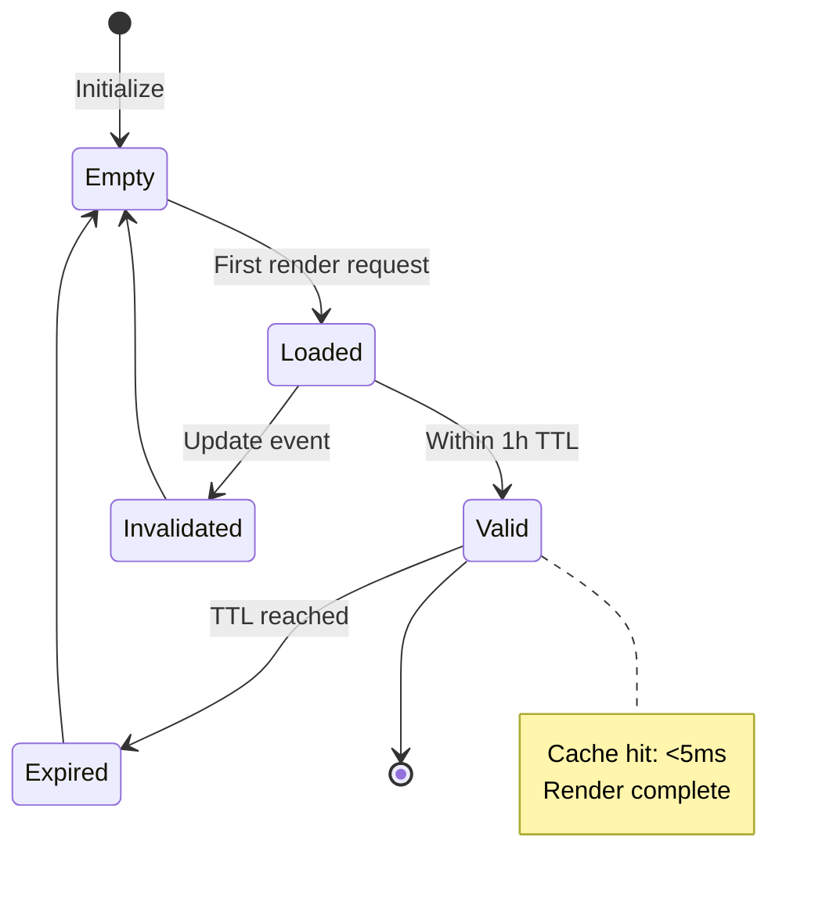

# Notification Service - State Machines

## Notification Lifecycle

```mermaid
stateDiagram-v2
    [*] --> Queued: Event received
    Queued --> Processing: Consumer picks up
    Processing --> Rendered: Template rendered
    Rendered --> Sent: Channel dispatch
    Sent --> Delivered: ACK from provider
    Sent --> Failed: Provider rejected
    Failed --> Retry: Backoff period
    Retry --> Sent: Retry attempt
    Failed --> DLQ: Max retries exceeded
    Delivered --> [*]
    DLQ --> [*]
    
    note right of Queued
        Redis dedup check
        User pref lookup
    end note
    
    note right of Sent
        Circuit breaker active
        per channel
    end note
    
    note right of Retry
        Exp backoff: 1s, 2s, 4s
        Max 3 retries
    end note
```

## Channel Circuit Breaker States

```mermaid
stateDiagram-v2
    [*] --> Closed: All healthy
    Closed --> Open: 5 consecutive failures
    Open --> HalfOpen: 30 second timeout
    HalfOpen --> Closed: Success on test
    HalfOpen --> Open: Failure on test
    Closed --> [*]
    Open --> [*]: Manual reset
    
    note right of Closed
        Forward all requests
        Failure count = 0
    end note
    
    note right of Open
        Reject requests
        Use fallback channel
    end note
    
    note right of HalfOpen
        Allow 1 test request
        Decide on result
    end note
```

## Consumer Lag Management

```mermaid
stateDiagram-v2
    [*] --> Healthy: Lag < 5 min
    Healthy --> Warning: Lag 5-15 min
    Warning --> Critical: Lag > 15 min
    Critical --> Warning: Scale up replicas
    Warning --> Healthy: Lag recovered
    Healthy --> [*]
    Critical --> [*]
    
    note right of Healthy
        Normal processing
        SLO met
    end note
    
    note right of Warning
        Alert: Check event rate
        Consider scaling
    end note
    
    note right of Critical
        SEV-2 incident
        Scale immediately
    end note
```

## Template Cache Lifecycle

```mermaid
stateDiagram-v2
    [*] --> Empty: Initialize
    Empty --> Loaded: First render request
    Loaded --> Valid: Within 1h TTL
    Valid --> Expired: TTL reached
    Loaded --> Invalidated: Update event
    Invalidated --> Empty
    Expired --> Empty
    Valid --> [*]
    
    note right of Valid
        Cache hit: <5ms
        Render complete
    end note
```
