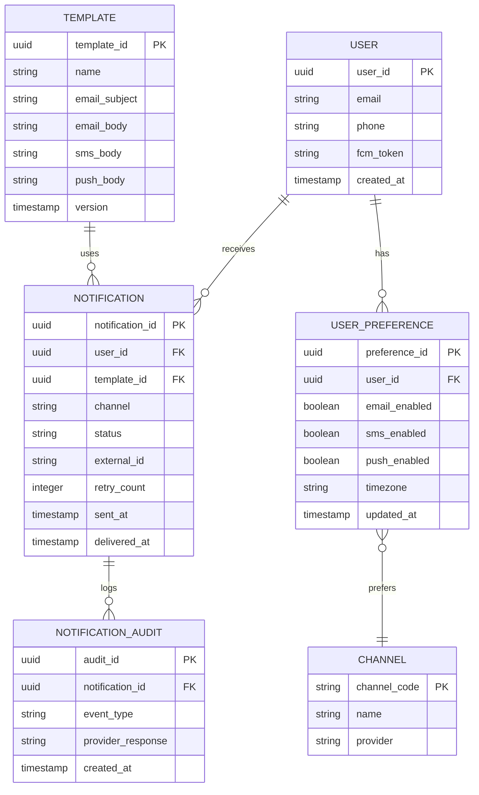

# Notification Service - Entity-Relationship & Schema

## ER Diagram



## PostgreSQL Schema

```sql
CREATE TABLE users (
    user_id UUID PRIMARY KEY,
    email VARCHAR(255),
    phone VARCHAR(20),
    fcm_token TEXT,
    created_at TIMESTAMP DEFAULT CURRENT_TIMESTAMP
);

CREATE TABLE user_preferences (
    preference_id UUID PRIMARY KEY,
    user_id UUID NOT NULL UNIQUE REFERENCES users(user_id) ON DELETE CASCADE,
    email_enabled BOOLEAN DEFAULT TRUE,
    sms_enabled BOOLEAN DEFAULT TRUE,
    push_enabled BOOLEAN DEFAULT TRUE,
    timezone VARCHAR(50) DEFAULT 'UTC',
    updated_at TIMESTAMP DEFAULT CURRENT_TIMESTAMP
);

CREATE TABLE templates (
    template_id UUID PRIMARY KEY,
    name VARCHAR(255) NOT NULL UNIQUE,
    email_subject VARCHAR(255),
    email_body TEXT,
    sms_body VARCHAR(160),
    push_body TEXT,
    version INT DEFAULT 1,
    created_at TIMESTAMP DEFAULT CURRENT_TIMESTAMP
);

CREATE TABLE notifications (
    notification_id UUID PRIMARY KEY,
    user_id UUID NOT NULL REFERENCES users(user_id),
    template_id UUID REFERENCES templates(template_id),
    channel VARCHAR(50),
    status VARCHAR(20) DEFAULT 'QUEUED',
    external_id VARCHAR(255),
    retry_count INT DEFAULT 0,
    sent_at TIMESTAMP,
    delivered_at TIMESTAMP,
    created_at TIMESTAMP DEFAULT CURRENT_TIMESTAMP,
    CONSTRAINT valid_status CHECK (status IN ('QUEUED', 'SENT', 'DELIVERED', 'FAILED', 'DLQ'))
);

CREATE INDEX idx_notifications_user_id ON notifications(user_id);
CREATE INDEX idx_notifications_status ON notifications(status);
CREATE INDEX idx_notifications_created ON notifications(created_at);
CREATE INDEX idx_user_pref_user_id ON user_preferences(user_id);

CREATE TABLE notification_audit (
    audit_id UUID PRIMARY KEY,
    notification_id UUID REFERENCES notifications(notification_id) ON DELETE CASCADE,
    event_type VARCHAR(50),
    provider_response TEXT,
    created_at TIMESTAMP DEFAULT CURRENT_TIMESTAMP
);
```

## Deduplication Strategy

- **Key**: `MD5(user_id || event_type || order_id)`
- **Storage**: Redis (24h TTL) + PostgreSQL (audit table)
- **Lookup**: Redis first (fast path), DB on miss
- **Consistency**: Transactional insert in PostgreSQL
