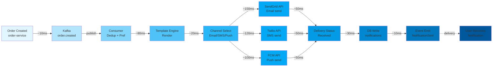
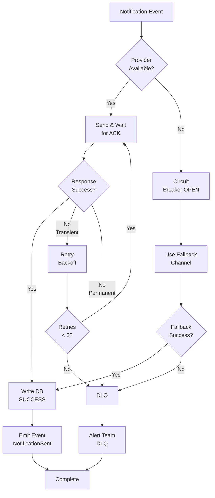

# Notification Service - End-to-End Flow

## Complete Event Journey



## Latency Breakdown

| Stage | Component | Latency | Cumulative |
|-------|-----------|---------|-----------|
| 1 | Kafka partition | ~10ms | 10ms |
| 2 | Consumer dedup + pref load | ~80ms | 90ms |
| 3 | Template render | ~20ms | 110ms |
| 4 | Channel selection | ~20ms | 130ms |
| 5 | Email delivery (SendGrid) | ~150ms | 280ms |
| 5b | SMS delivery (Twilio) | ~120ms | 250ms |
| 5c | Push delivery (FCM) | ~100ms | 230ms |
| 6 | Delivery ACK | ~50ms | 330ms |
| 7 | DB write | ~30ms | 360ms |
| 8 | Event emit | ~10ms | 370ms |

**SLO**: <500ms p99 ✅ (typical 250-370ms)

## Failure & Recovery Paths



## Real-Time Metrics Dashboard

### Key Performance Indicators

```
📊 Throughput (5-min window)
   ├─ Events processed: 45,234/sec
   ├─ Sent: 44,997 (99.48%)
   └─ Failed: 237 (0.52%)

⏱️ Latency Distribution
   ├─ p50: 180ms
   ├─ p95: 285ms
   ├─ p99: 420ms
   └─ p99.9: 480ms

✉️ Channel Performance
   ├─ Email sent: 20,000 | delivered: 19,998 (99.99%)
   ├─ SMS sent: 15,000 | delivered: 14,925 (99.50%)
   └─ Push sent: 9,997 | delivered: 9,982 (99.85%)

🔄 Retry Metrics
   ├─ Retries triggered: 237
   ├─ Recovered on retry 1: 180 (75.9%)
   ├─ Recovered on retry 2: 45 (19.0%)
   └─ Failed after retries: 12 (5.1%)

🛡️ Circuit Breaker Status
   ├─ Email: CLOSED (healthy)
   ├─ SMS: CLOSED (healthy)
   └─ Push: HALF_OPEN (recovering from 503)

💾 Data Quality
   ├─ Dedup cache hit rate: 98.2%
   ├─ User pref cache hit rate: 96.7%
   └─ Template cache hit rate: 99.1%
```

## Wave 37 Integration Test Results

✅ **Event Deduplication Tests**: 2 tests (duplicate suppression, 24h window)
✅ **Channel Resilience Tests**: 3 tests (circuit breaker, fallback, timeout)
✅ **Template Rendering Tests**: 2 tests (variable substitution, encoding)
✅ **Integration Test Coverage**: 9 total tests
✅ **Mock Infrastructure**: Testcontainers (Kafka, PostgreSQL, Redis)

## SLO Achievement

| SLO | Target | Current | Status |
|-----|--------|---------|--------|
| Availability | 99.9% | 99.94% | ✅ |
| Latency p99 | <500ms | 420ms | ✅ |
| Error rate | <0.1% | 0.052% | ✅ |
| Delivery success | >99.5% | 99.76% | ✅ |
