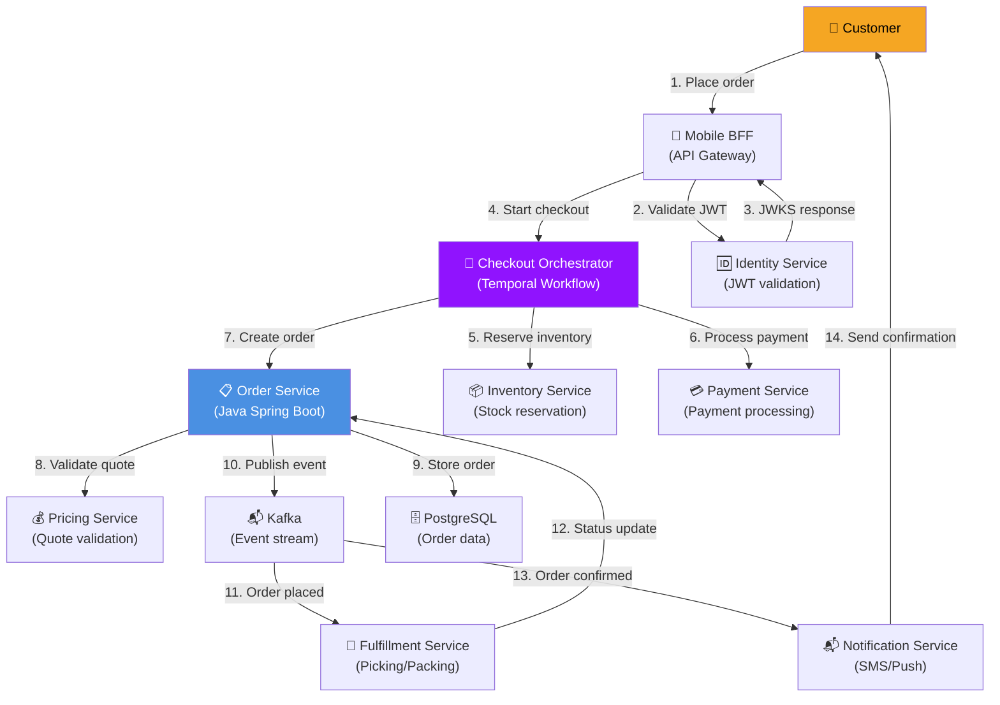
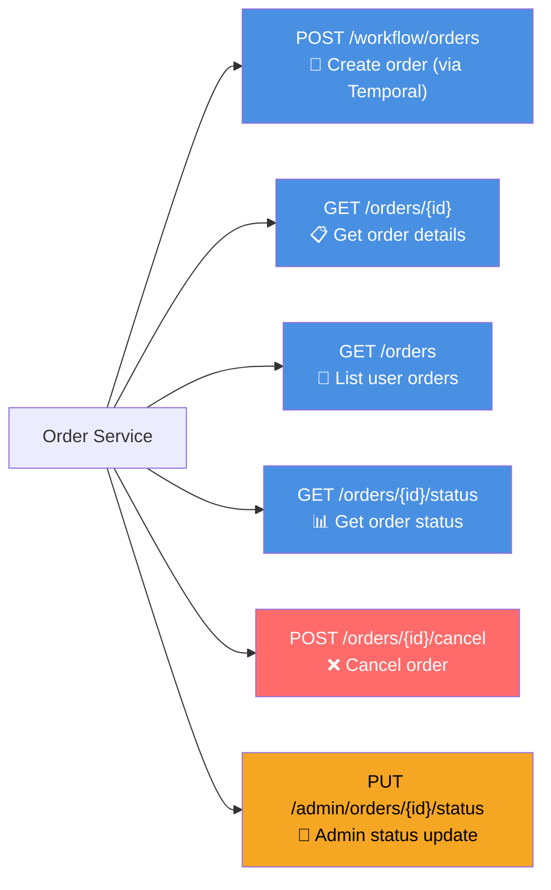
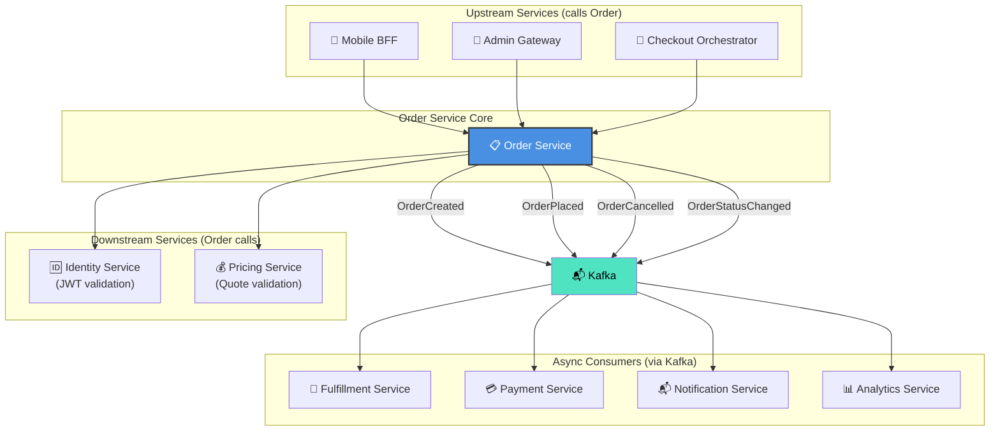
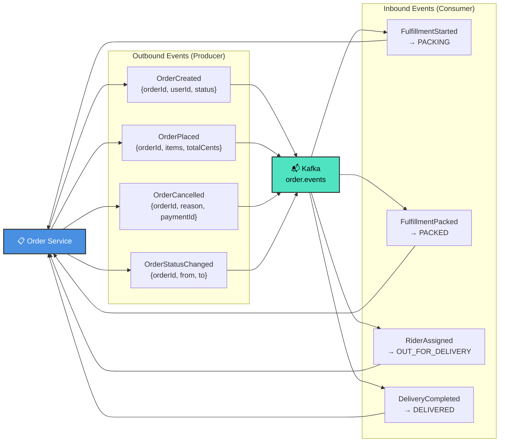
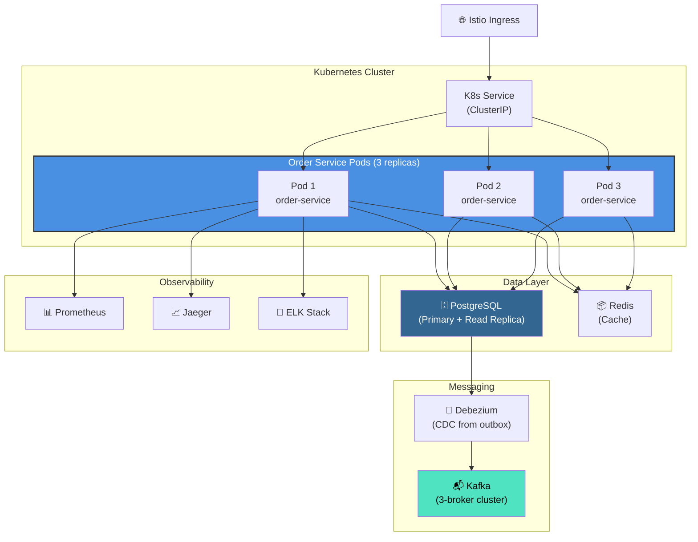

# Order Service - High-Level Design

```mermaid
graph TB
    Customer["👤 Customer"]
    MobileBFF["📱 Mobile BFF<br/>(API Gateway)"]
    CheckoutOrchestrator["🎯 Checkout Orchestrator<br/>(Temporal Workflow)"]
    OrderService["📋 Order Service<br/>(Java Spring Boot)"]
    IdentityService["🆔 Identity Service<br/>(JWT validation)"]
    InventoryService["📦 Inventory Service<br/>(Stock reservation)"]
    PaymentService["💳 Payment Service<br/>(Payment processing)"]
    PricingService["💰 Pricing Service<br/>(Quote validation)"]
    FulfillmentService["🚚 Fulfillment Service<br/>(Picking/Packing)"]
    NotificationService["📬 Notification Service<br/>(SMS/Push)"]
    Kafka["📬 Kafka<br/>(Event stream)"]
    PostgreSQL["🗄️ PostgreSQL<br/>(Order data)"]

    Customer -->|1. Place order| MobileBFF
    MobileBFF -->|2. Validate JWT| IdentityService
    IdentityService -->|3. JWKS response| MobileBFF
    MobileBFF -->|4. Start checkout| CheckoutOrchestrator
    CheckoutOrchestrator -->|5. Reserve inventory| InventoryService
    CheckoutOrchestrator -->|6. Process payment| PaymentService
    CheckoutOrchestrator -->|7. Create order| OrderService
    OrderService -->|8. Validate quote| PricingService
    OrderService -->|9. Store order| PostgreSQL
    OrderService -->|10. Publish event| Kafka
    Kafka -->|11. Order placed| FulfillmentService
    FulfillmentService -->|12. Status update| OrderService
    Kafka -->|13. Order confirmed| NotificationService
    NotificationService -->|14. Send confirmation| Customer

    style OrderService fill:#4A90E2,color:#fff
    style CheckoutOrchestrator fill:#9013FE,color:#fff
    style Customer fill:#F5A623,color:#000
```

## Order API Endpoints

```mermaid
graph LR
    OrderService["Order Service"]

    CreateEP["POST /workflow/orders<br/>📝 Create order (via Temporal)"]
    GetEP["GET /orders/{id}<br/>📋 Get order details"]
    ListEP["GET /orders<br/>📃 List user orders"]
    StatusEP["GET /orders/{id}/status<br/>📊 Get order status"]
    CancelEP["POST /orders/{id}/cancel<br/>❌ Cancel order"]
    AdminStatusEP["PUT /admin/orders/{id}/status<br/>🔧 Admin status update"]

    OrderService --> CreateEP
    OrderService --> GetEP
    OrderService --> ListEP
    OrderService --> StatusEP
    OrderService --> CancelEP
    OrderService --> AdminStatusEP

    style CreateEP fill:#4A90E2,color:#fff
    style GetEP fill:#4A90E2,color:#fff
    style ListEP fill:#4A90E2,color:#fff
    style StatusEP fill:#4A90E2,color:#fff
    style CancelEP fill:#FF6B6B,color:#fff
    style AdminStatusEP fill:#F5A623,color:#000
```

## Service Dependencies

```mermaid
graph TD
    subgraph upstream["Upstream Services (calls Order)"]
        MobileBFF["📱 Mobile BFF"]
        AdminGateway["🔐 Admin Gateway"]
        CheckoutOrchestrator["🎯 Checkout Orchestrator"]
    end

    subgraph ordercore["Order Service Core"]
        OrderService["📋 Order Service"]
    end

    subgraph downstream["Downstream Services (Order calls)"]
        IdentityService["🆔 Identity Service<br/>(JWT validation)"]
        PricingService["💰 Pricing Service<br/>(Quote validation)"]
    end

    subgraph async["Async Consumers (via Kafka)"]
        FulfillmentService["🚚 Fulfillment Service"]
        PaymentService["💳 Payment Service"]
        NotificationService["📬 Notification Service"]
        AnalyticsService["📊 Analytics Service"]
    end

    MobileBFF --> OrderService
    AdminGateway --> OrderService
    CheckoutOrchestrator --> OrderService

    OrderService --> IdentityService
    OrderService --> PricingService

    OrderService -->|OrderCreated| Kafka["📬 Kafka"]
    OrderService -->|OrderPlaced| Kafka
    OrderService -->|OrderCancelled| Kafka
    OrderService -->|OrderStatusChanged| Kafka

    Kafka --> FulfillmentService
    Kafka --> PaymentService
    Kafka --> NotificationService
    Kafka --> AnalyticsService

    style OrderService fill:#4A90E2,color:#fff,stroke:#333,stroke-width:2px
    style Kafka fill:#50E3C2,color:#000
```

## Event-Driven Architecture

```mermaid
graph LR
    OrderService["📋 Order Service"]

    subgraph outbound["Outbound Events (Producer)"]
        OrderCreated["OrderCreated<br/>{orderId, userId, status}"]
        OrderPlaced["OrderPlaced<br/>{orderId, items, totalCents}"]
        OrderCancelled["OrderCancelled<br/>{orderId, reason, paymentId}"]
        OrderStatusChanged["OrderStatusChanged<br/>{orderId, from, to}"]
    end

    subgraph inbound["Inbound Events (Consumer)"]
        FulfillmentStarted["FulfillmentStarted<br/>→ PACKING"]
        FulfillmentPacked["FulfillmentPacked<br/>→ PACKED"]
        RiderAssigned["RiderAssigned<br/>→ OUT_FOR_DELIVERY"]
        DeliveryCompleted["DeliveryCompleted<br/>→ DELIVERED"]
    end

    Kafka["📬 Kafka<br/>order.events"]

    OrderService --> OrderCreated --> Kafka
    OrderService --> OrderPlaced --> Kafka
    OrderService --> OrderCancelled --> Kafka
    OrderService --> OrderStatusChanged --> Kafka

    Kafka --> FulfillmentStarted --> OrderService
    Kafka --> FulfillmentPacked --> OrderService
    Kafka --> RiderAssigned --> OrderService
    Kafka --> DeliveryCompleted --> OrderService

    style OrderService fill:#4A90E2,color:#fff,stroke:#333,stroke-width:2px
    style Kafka fill:#50E3C2,color:#000,stroke:#333,stroke-width:2px
```

## Infrastructure Overview

```mermaid
graph TB
    subgraph k8s["Kubernetes Cluster"]
        subgraph orderPods["Order Service Pods (3 replicas)"]
            Pod1["Pod 1<br/>order-service"]
            Pod2["Pod 2<br/>order-service"]
            Pod3["Pod 3<br/>order-service"]
        end

        K8sService["K8s Service<br/>(ClusterIP)"]
    end

    subgraph storage["Data Layer"]
        PostgreSQL["🗄️ PostgreSQL<br/>(Primary + Read Replica)"]
        Redis["📦 Redis<br/>(Cache)"]
    end

    subgraph messaging["Messaging"]
        Kafka["📬 Kafka<br/>(3-broker cluster)"]
        Debezium["🔄 Debezium<br/>(CDC from outbox)"]
    end

    subgraph observability["Observability"]
        Prometheus["📊 Prometheus"]
        Jaeger["📈 Jaeger"]
        ELK["📝 ELK Stack"]
    end

    Istio["🌐 Istio Ingress"]

    Istio --> K8sService
    K8sService --> Pod1
    K8sService --> Pod2
    K8sService --> Pod3

    Pod1 --> PostgreSQL
    Pod2 --> PostgreSQL
    Pod3 --> PostgreSQL

    Pod1 --> Redis
    Pod2 --> Redis
    Pod3 --> Redis

    PostgreSQL --> Debezium
    Debezium --> Kafka

    Pod1 --> Prometheus
    Pod1 --> Jaeger
    Pod1 --> ELK

    style orderPods fill:#4A90E2,color:#fff,stroke:#333,stroke-width:2px
    style PostgreSQL fill:#336791,color:#fff
    style Kafka fill:#50E3C2,color:#000
```
