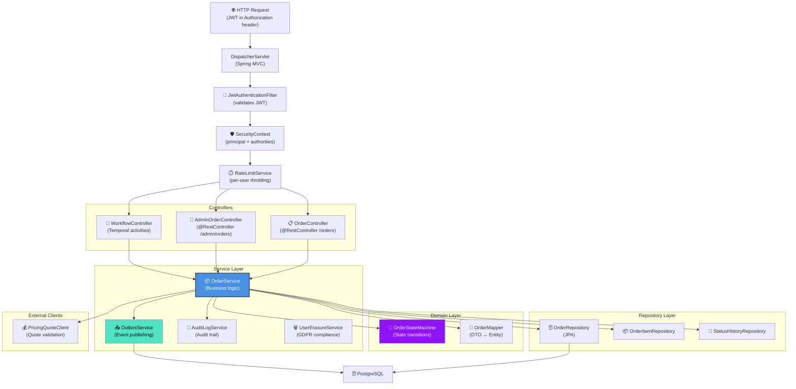
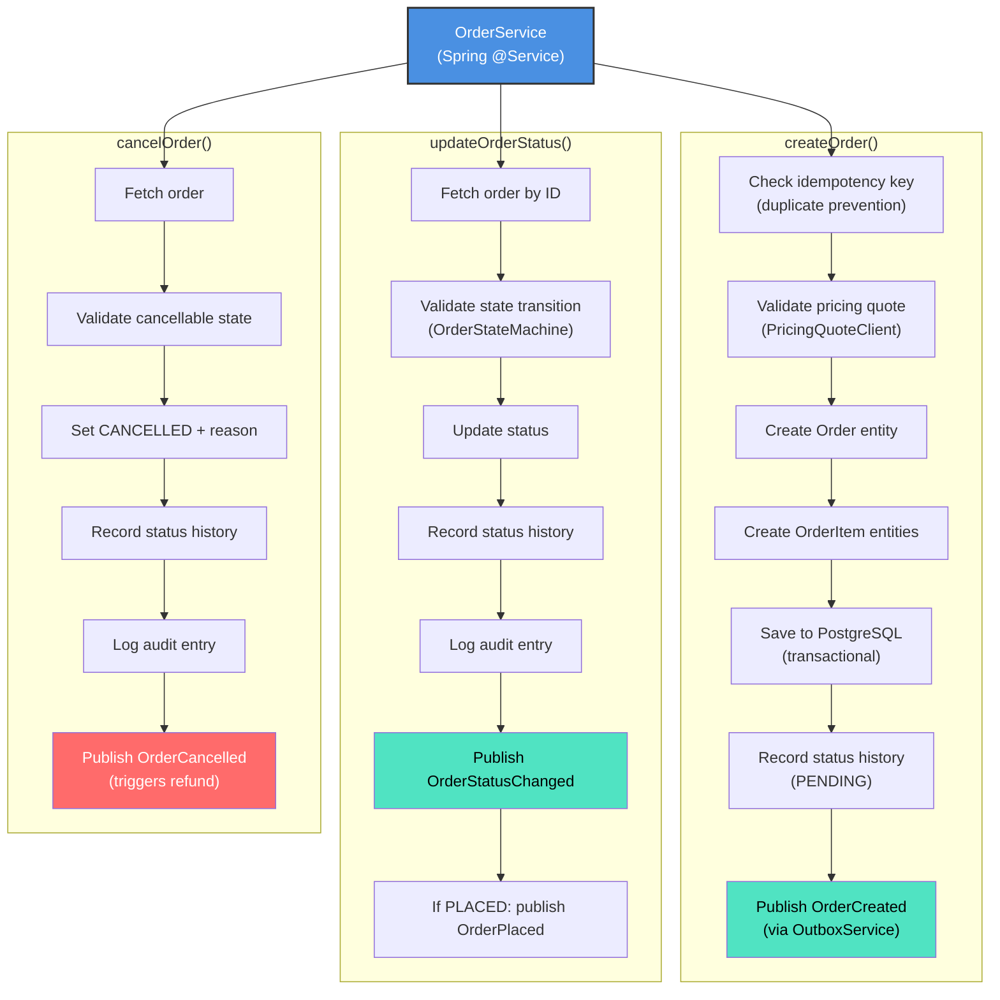
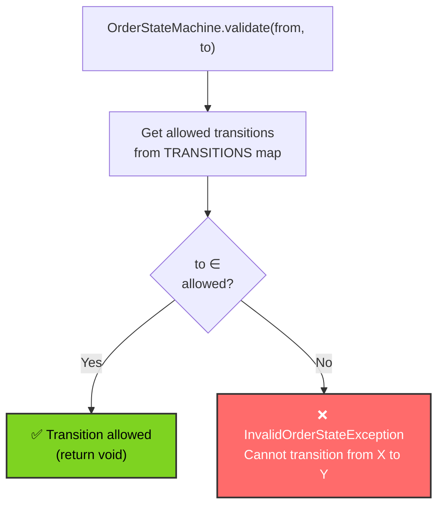
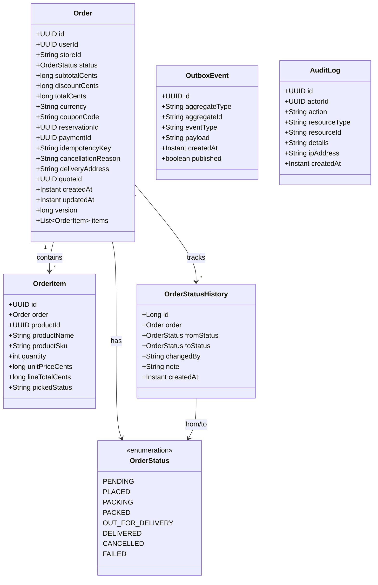
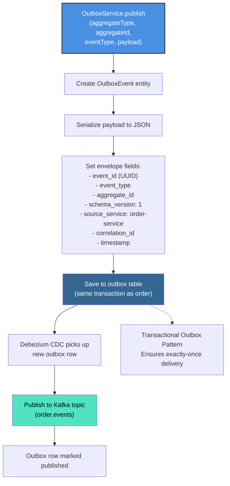
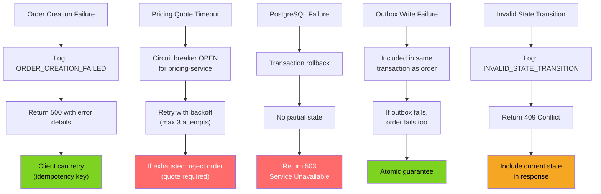

# Order Service - Low-Level Design

## Component Architecture



## OrderService Implementation



## OrderStateMachine Transitions



## Domain Model



## OutboxService Implementation



## Request Processing Pipeline

```mermaid
graph LR
    Request["🌐 HTTP Request"]
    Timer["⏱️ Timer start"]

    Auth["🔐 JWT Auth<br/>~10ms"]
    AuthMetric["jwt_auth_duration_ms"]

    RateLimit["🚦 Rate Limit<br/>~2ms"]
    RateLimitMetric["rate_limit_check_duration_ms"]

    Controller["🎯 Controller<br/>~5ms"]

    Service["📦 Service Logic<br/>~50-100ms"]
    ServiceMetric["order_service_duration_ms"]

    DB["🗄️ PostgreSQL<br/>~20-50ms"]
    DBMetric["db_query_duration_ms"]

    Outbox["📤 Outbox Write<br/>~10ms"]

    Response["📤 Response<br/>~5ms"]
    ResponseMetric["http_response_time_ms"]

    Request --> Timer --> Auth
    Auth --> AuthMetric --> RateLimit
    RateLimit --> RateLimitMetric --> Controller
    Controller --> Service
    Service --> ServiceMetric --> DB
    DB --> DBMetric --> Outbox
    Outbox --> Response
    Response --> ResponseMetric

    style Timer fill:#9013FE,color:#fff
    style AuthMetric fill:#9013FE,color:#fff
    style ServiceMetric fill:#9013FE,color:#fff
    style DBMetric fill:#9013FE,color:#fff
    style ResponseMetric fill:#9013FE,color:#fff
```



## SLO: P99 Latency Target <300ms

```
┌─────────────────────────────────────────────────────────────┐
│  Order Service Request Timeline (P99 target: <300ms)        │
├─────────────────────────────────────────────────────────────┤
│ JWT Extraction & Validation:           ~10ms                │
│ Rate Limit Check:                      ~2ms                 │
│ Controller + DTO Validation:           ~5ms                 │
│ Subtotal (Gateway overhead):           ~17ms                │
│                                                             │
│ OrderService.createOrder():                                 │
│   - Idempotency check:                 ~10ms                │
│   - Quote validation (REST call):      ~50ms p99            │
│   - Entity creation + mapping:         ~5ms                 │
│   - PostgreSQL transaction:            ~40ms p99            │
│   - Outbox event write:                ~10ms                │
│   - Subtotal:                          ~115ms               │
│                                                             │
│ Response Serialization:                ~10ms                │
│ Network I/O:                           ~20ms                │
│                                                             │
│ TOTAL P99:                             ~162ms               │
│ BUFFER (300ms target):                 ~138ms               │
│ STATUS:                                ✅ WITHIN SLO        │
└─────────────────────────────────────────────────────────────┘
```

## Error Handling & Resilience


