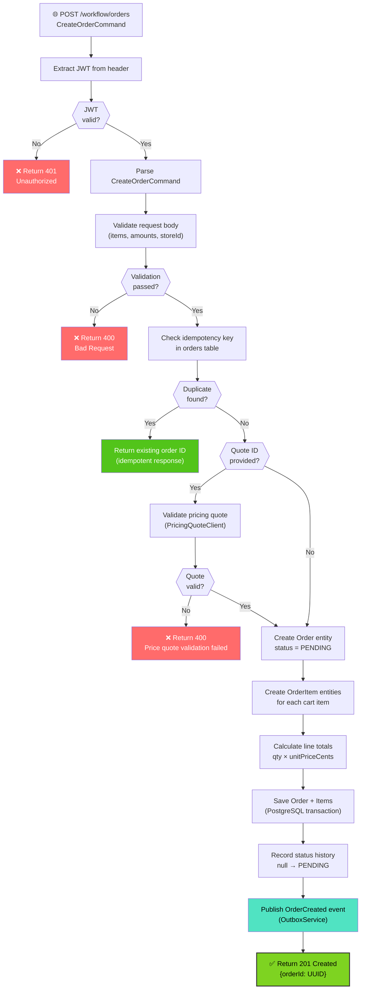
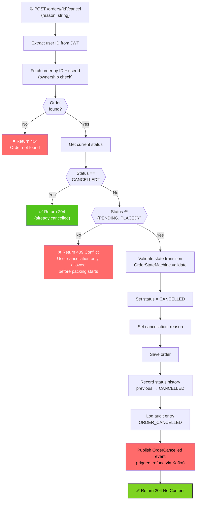
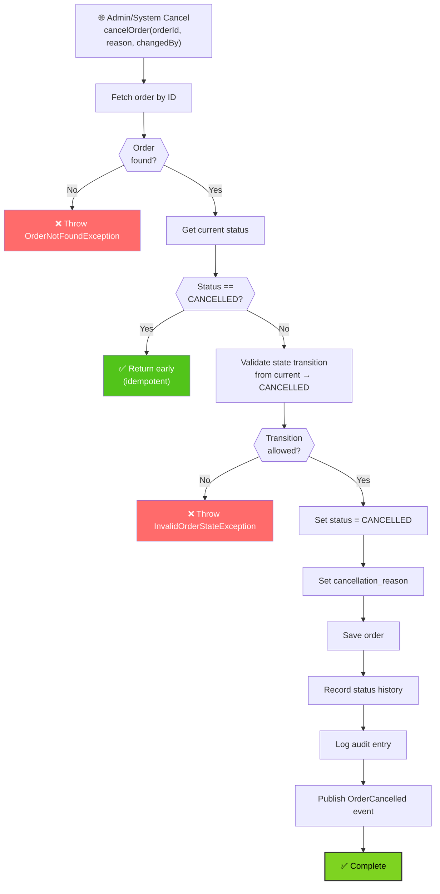
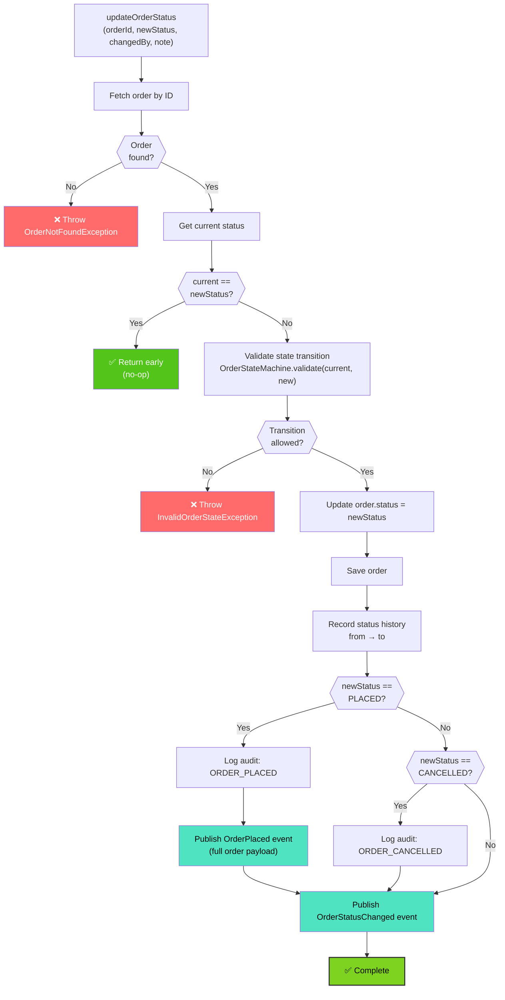
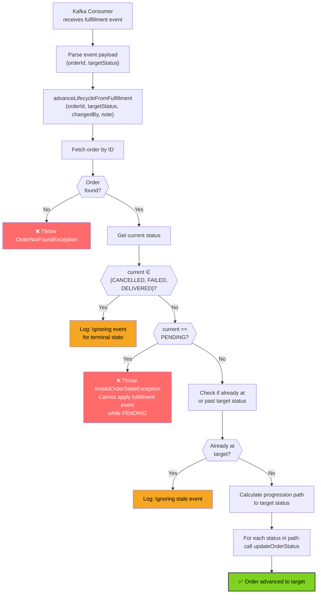
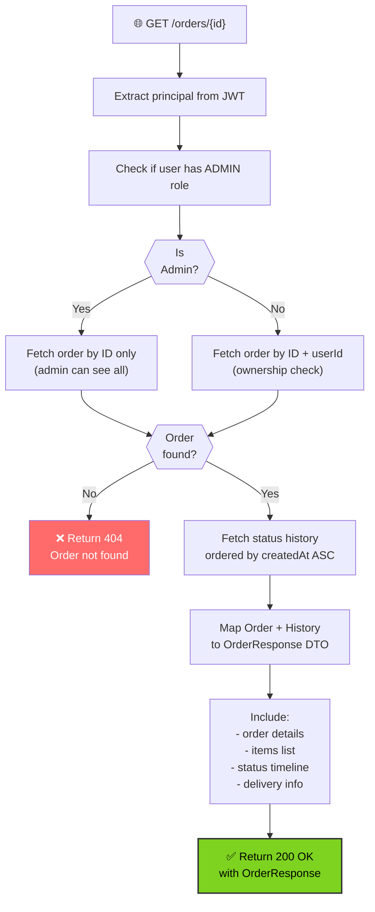
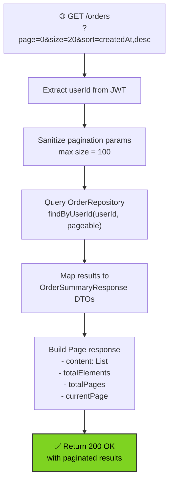
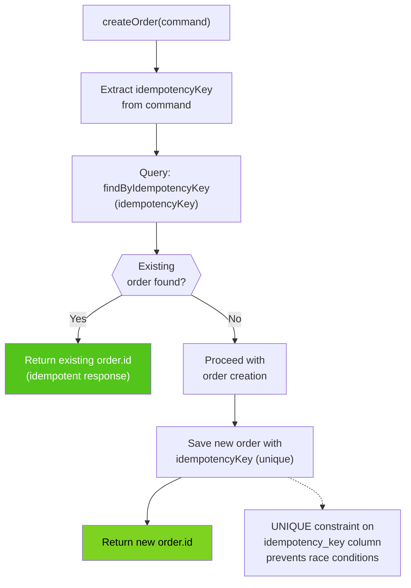
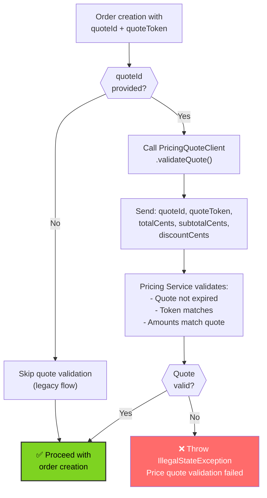

# Order Service - Flowcharts

## Order Creation Flow

## Order Cancellation Flow (User-Initiated)

## Order Cancellation Flow (Admin/System)

## Order Status Update Flow

## Fulfillment Event Processing Flow

## Get Order Details Flow

## List Orders Flow (Pagination)

## Idempotency Check Flow

## Pricing Quote Validation Flow

