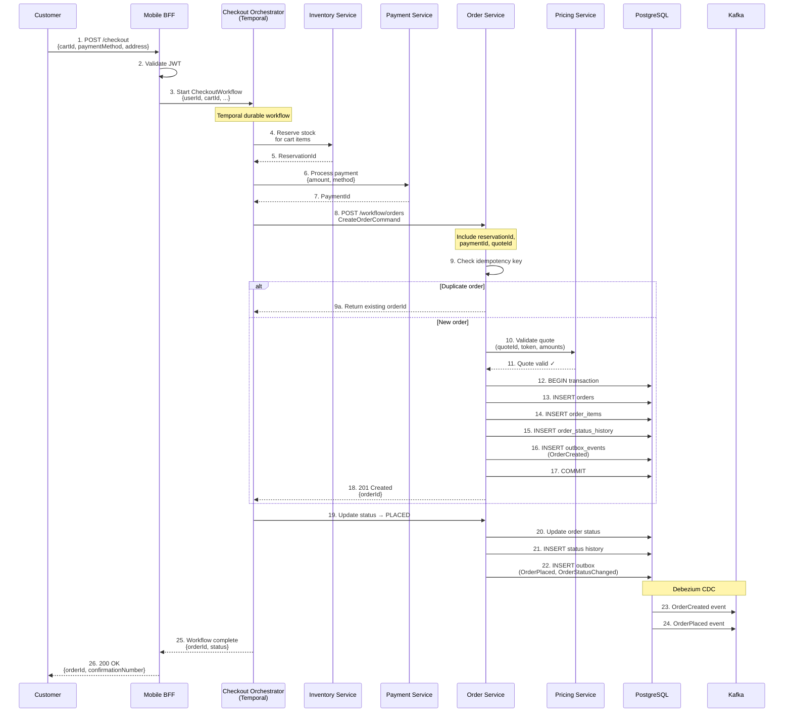
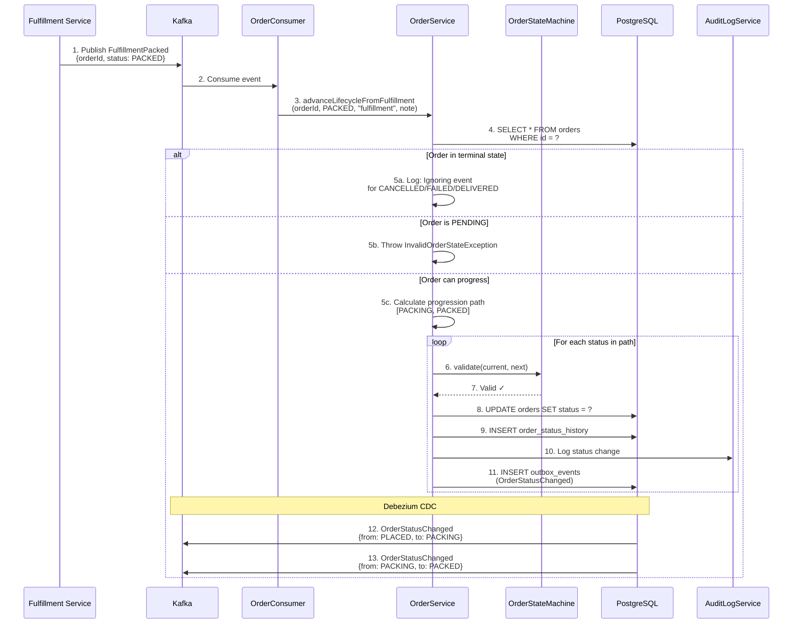
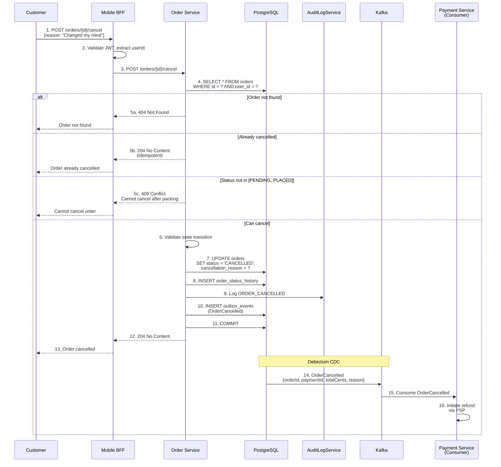
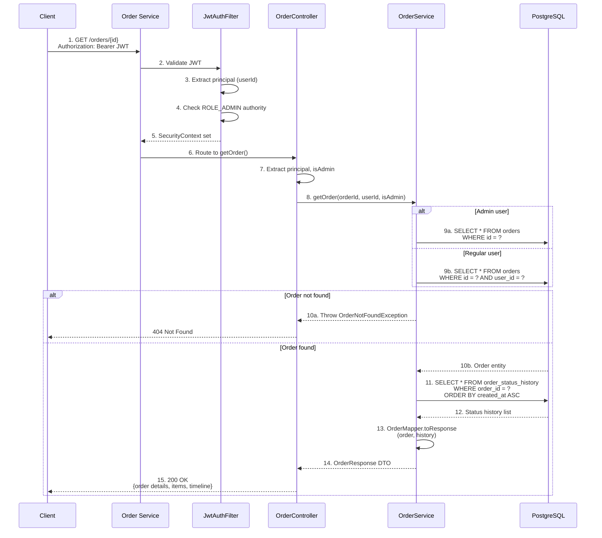
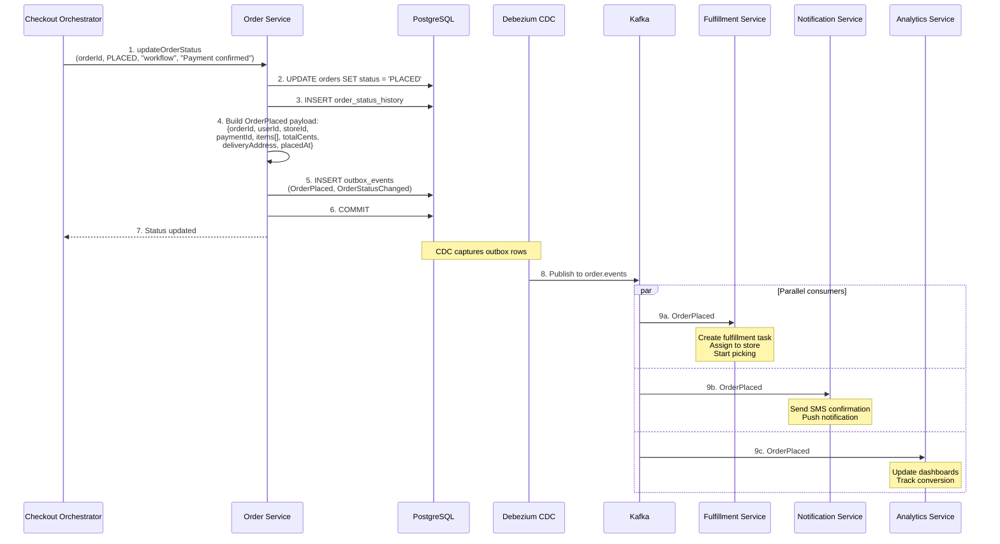
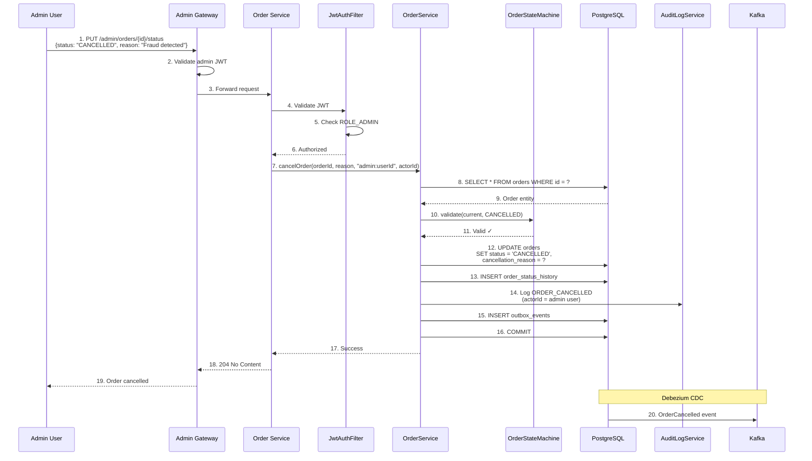
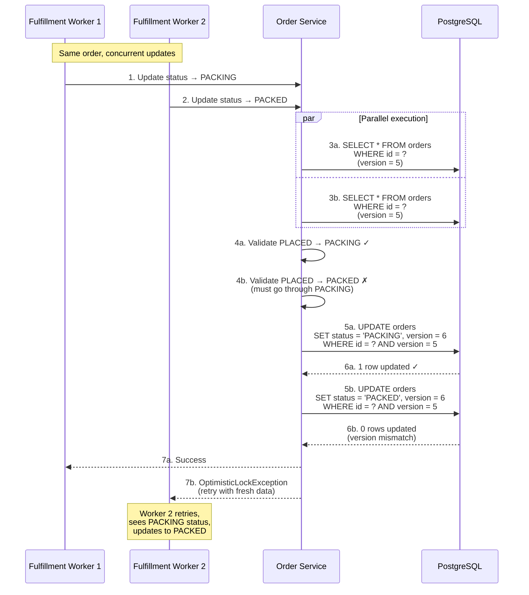

# Order Service - Sequence Diagrams

## Complete Order Creation Sequence (via Checkout Orchestrator)

## Order Status Update Sequence (Fulfillment Event)

## Order Cancellation Sequence (User-Initiated)

## Get Order Details Sequence

## Order Placed Event Sequence (Full Payload)

## Admin Status Override Sequence

## Concurrent Order Update Sequence (Optimistic Locking)

