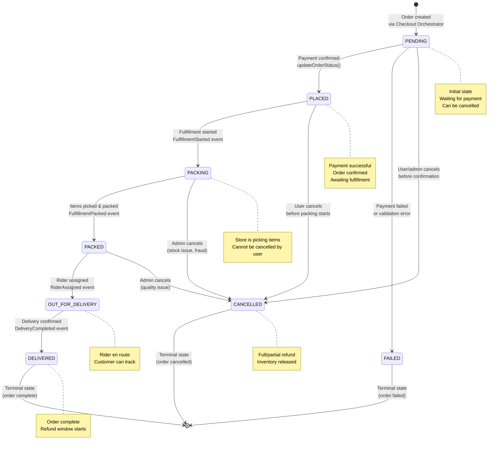
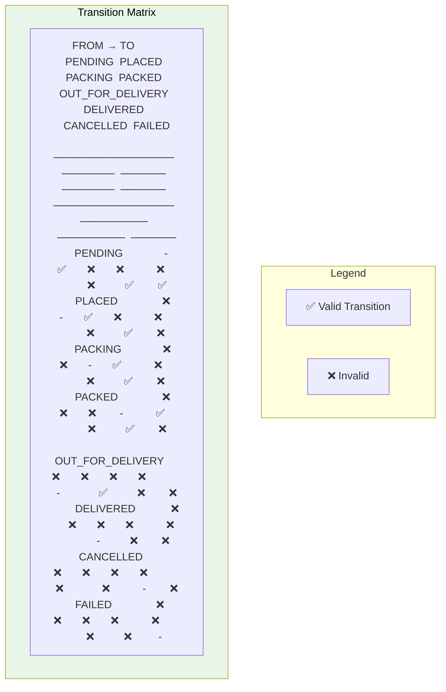
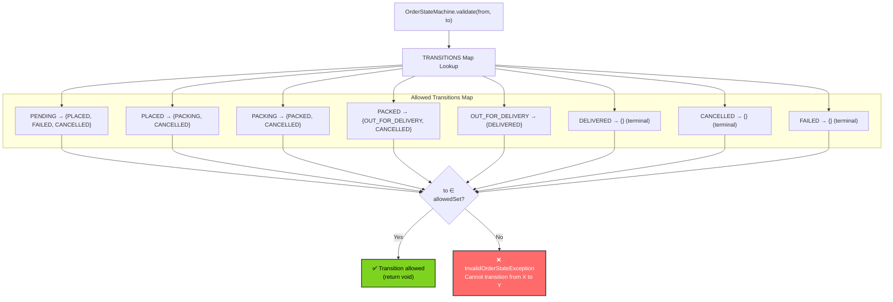
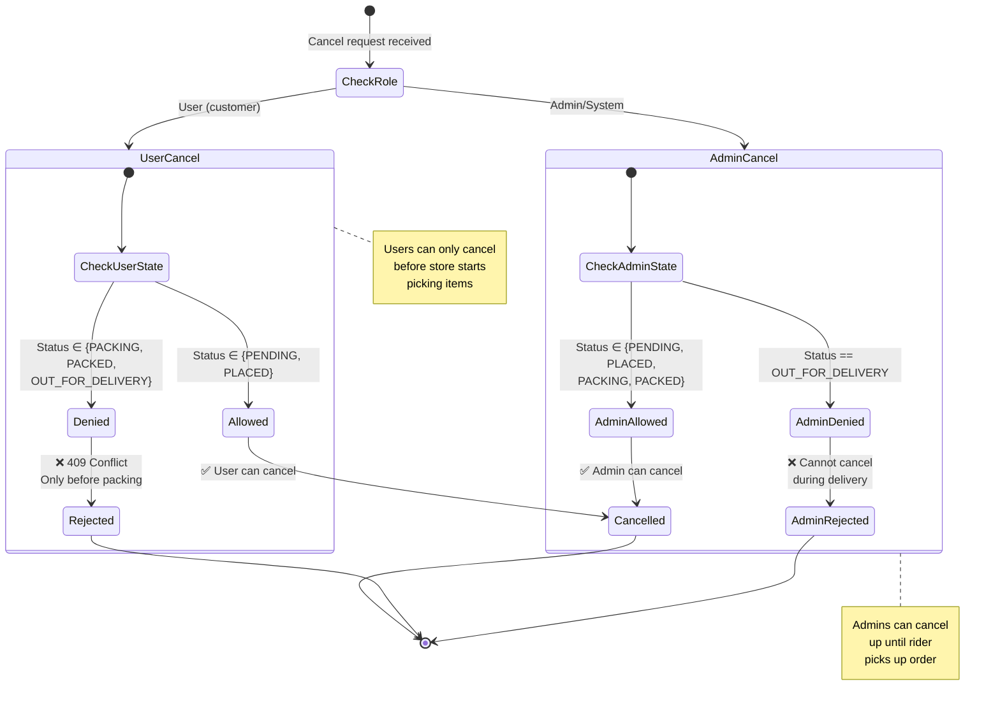
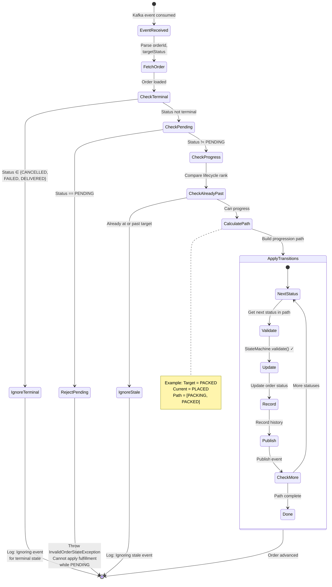
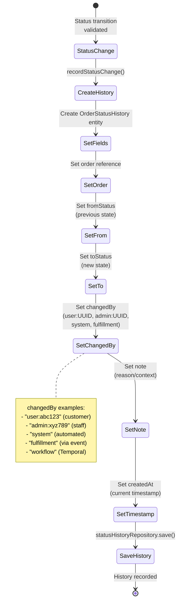
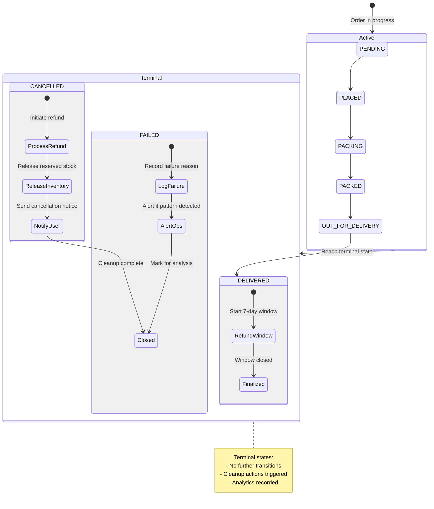
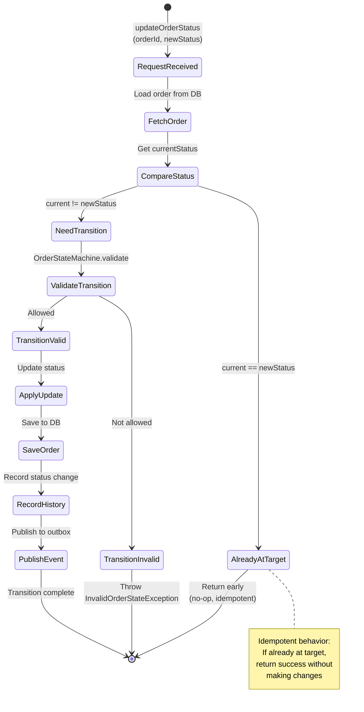

# Order Service - State Machine Diagrams

## Order Lifecycle State Machine (Complete)



## State Transition Matrix



## OrderStateMachine Implementation



## User vs Admin Cancellation Rules



## Fulfillment Event Processing State Machine



## Order Status History Recording



## Terminal States and Cleanup



## Idempotent State Transitions



## Lifecycle Rank Comparison

```mermaid
graph TD
    A["lifecycleRank(status)"]

    subgraph ranks["Status Ranks"]
        R1["PENDING: MIN_VALUE<br/>(not in fulfillment lifecycle)"]
        R2["PLACED: 1"]
        R3["PACKING: 2"]
        R4["PACKED: 3"]
        R5["OUT_FOR_DELIVERY: 4"]
        R6["DELIVERED: 5"]
        R7["CANCELLED/FAILED: MIN_VALUE"]
    end

    B["hasReachedLifecycleStep(current, target)"]
    C["lifecycleRank(current) >= lifecycleRank(target)"]
    D{{"Result"}}
    E["true: Skip (already at/past)"]
    F["false: Apply transition"]

    A --> ranks
    ranks --> B
    B --> C --> D
    D -->|rank(current) >= rank(target)| E
    D -->|rank(current) < rank(target)| F

    note1["Used to prevent<br/>stale fulfillment events<br/>from reversing progress"]
    B -.-> note1

    style E fill:#F5A623,color:#000
    style F fill:#7ED321,color:#000
```
