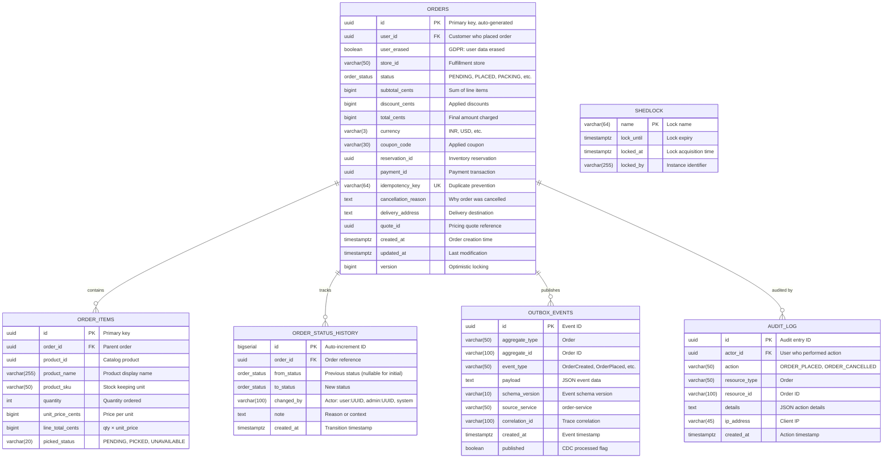
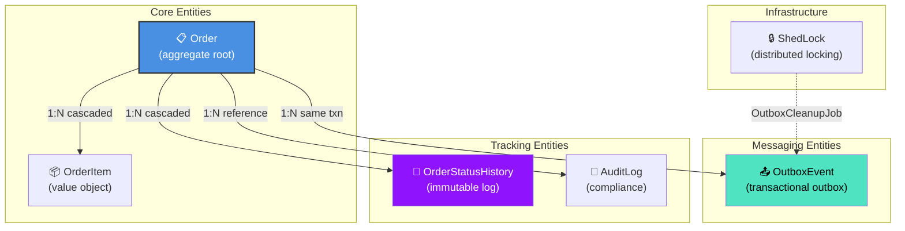
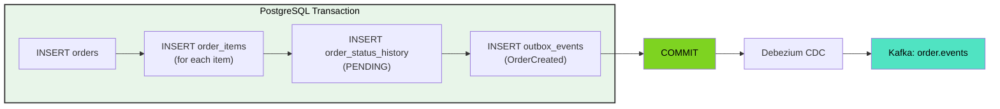
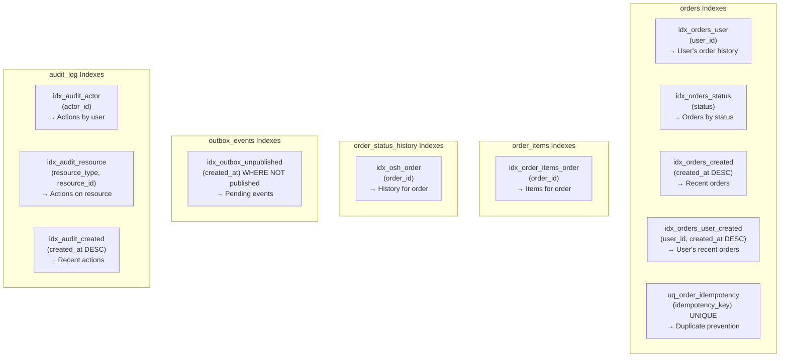
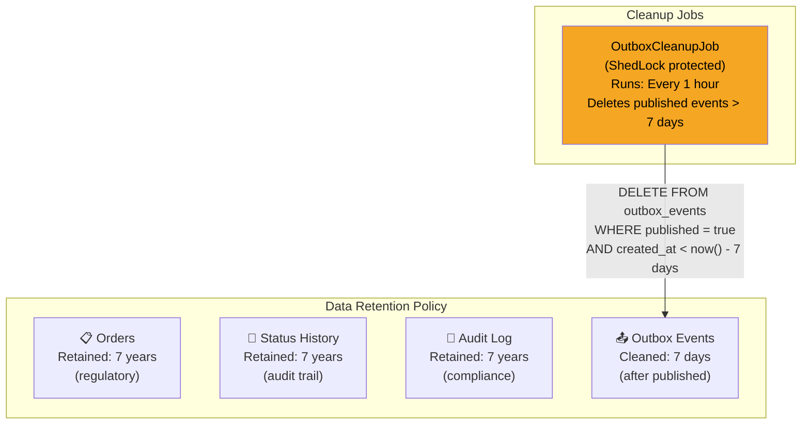
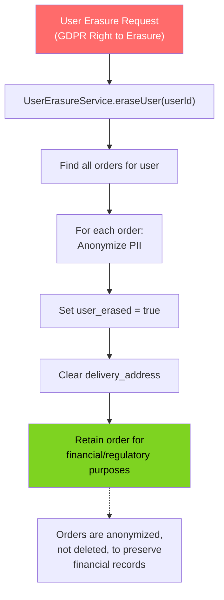

# Order Service - ER Diagram & Data Model

## Core Order Tables



## Detailed Schema: orders Table

```sql
-- PostgreSQL ENUM type for order status
CREATE TYPE order_status AS ENUM (
    'PENDING',
    'PLACED',
    'PACKING',
    'PACKED',
    'OUT_FOR_DELIVERY',
    'DELIVERED',
    'CANCELLED',
    'FAILED'
);

-- Main orders table
CREATE TABLE orders (
    id                  UUID PRIMARY KEY DEFAULT gen_random_uuid(),
    user_id             UUID            NOT NULL,
    user_erased         BOOLEAN         NOT NULL DEFAULT false,
    store_id            VARCHAR(50)     NOT NULL,
    status              order_status    NOT NULL DEFAULT 'PENDING',
    subtotal_cents      BIGINT          NOT NULL,
    discount_cents      BIGINT          NOT NULL DEFAULT 0,
    total_cents         BIGINT          NOT NULL,
    currency            VARCHAR(3)      NOT NULL DEFAULT 'INR',
    coupon_code         VARCHAR(30),
    reservation_id      UUID,
    payment_id          UUID,
    idempotency_key     VARCHAR(64)     NOT NULL,
    cancellation_reason TEXT,
    delivery_address    TEXT,
    quote_id            UUID,
    created_at          TIMESTAMPTZ     NOT NULL DEFAULT now(),
    updated_at          TIMESTAMPTZ     NOT NULL DEFAULT now(),
    version             BIGINT          NOT NULL DEFAULT 0,
    
    CONSTRAINT uq_order_idempotency UNIQUE (idempotency_key)
);

-- Performance indexes
CREATE INDEX idx_orders_user        ON orders (user_id);
CREATE INDEX idx_orders_status      ON orders (status);
CREATE INDEX idx_orders_created     ON orders (created_at DESC);
CREATE INDEX idx_orders_user_created ON orders (user_id, created_at DESC);
```

## Detailed Schema: order_items Table

```sql
CREATE TABLE order_items (
    id               UUID PRIMARY KEY DEFAULT gen_random_uuid(),
    order_id         UUID         NOT NULL REFERENCES orders(id) ON DELETE CASCADE,
    product_id       UUID         NOT NULL,
    product_name     VARCHAR(255) NOT NULL,
    product_sku      VARCHAR(50)  NOT NULL,
    quantity         INT          NOT NULL,
    unit_price_cents BIGINT       NOT NULL,
    line_total_cents BIGINT       NOT NULL,
    picked_status    VARCHAR(20)  DEFAULT 'PENDING',
    
    CONSTRAINT chk_qty CHECK (quantity > 0)
);

CREATE INDEX idx_order_items_order ON order_items (order_id);
```

## Detailed Schema: order_status_history Table

```sql
CREATE TABLE order_status_history (
    id          BIGSERIAL    PRIMARY KEY,
    order_id    UUID         NOT NULL REFERENCES orders(id) ON DELETE CASCADE,
    from_status order_status,
    to_status   order_status NOT NULL,
    changed_by  VARCHAR(100),
    note        TEXT,
    created_at  TIMESTAMPTZ  NOT NULL DEFAULT now()
);

CREATE INDEX idx_osh_order ON order_status_history (order_id);
```

## Detailed Schema: outbox_events Table

```sql
CREATE TABLE outbox_events (
    id              UUID PRIMARY KEY DEFAULT gen_random_uuid(),
    aggregate_type  VARCHAR(50)  NOT NULL,
    aggregate_id    VARCHAR(100) NOT NULL,
    event_type      VARCHAR(50)  NOT NULL,
    payload         TEXT         NOT NULL,
    schema_version  VARCHAR(10)  NOT NULL DEFAULT '1',
    source_service  VARCHAR(50)  NOT NULL DEFAULT 'order-service',
    correlation_id  VARCHAR(100),
    created_at      TIMESTAMPTZ  NOT NULL DEFAULT now(),
    published       BOOLEAN      NOT NULL DEFAULT false
);

CREATE INDEX idx_outbox_unpublished ON outbox_events (created_at) WHERE NOT published;
```

## Detailed Schema: audit_log Table

```sql
CREATE TABLE audit_log (
    id            UUID PRIMARY KEY DEFAULT gen_random_uuid(),
    actor_id      UUID,
    action        VARCHAR(50) NOT NULL,
    resource_type VARCHAR(50) NOT NULL,
    resource_id   VARCHAR(100) NOT NULL,
    details       TEXT,
    ip_address    VARCHAR(45),
    created_at    TIMESTAMPTZ NOT NULL DEFAULT now()
);

CREATE INDEX idx_audit_actor ON audit_log (actor_id);
CREATE INDEX idx_audit_resource ON audit_log (resource_type, resource_id);
CREATE INDEX idx_audit_created ON audit_log (created_at DESC);
```

## Entity Relationships



## Data Flow: Order Creation



## Index Strategy



## Query Patterns

```sql
-- List user's orders (paginated, recent first)
SELECT * FROM orders
WHERE user_id = ?
ORDER BY created_at DESC
LIMIT 20 OFFSET 0;
-- Uses: idx_orders_user_created

-- Get order with items
SELECT o.*, oi.*
FROM orders o
LEFT JOIN order_items oi ON oi.order_id = o.id
WHERE o.id = ?;
-- Uses: PK, idx_order_items_order

-- Get order status history (timeline)
SELECT * FROM order_status_history
WHERE order_id = ?
ORDER BY created_at ASC;
-- Uses: idx_osh_order

-- Check idempotency (before creating)
SELECT id FROM orders
WHERE idempotency_key = ?;
-- Uses: uq_order_idempotency

-- Get pending outbox events (CDC backup)
SELECT * FROM outbox_events
WHERE NOT published
ORDER BY created_at ASC
LIMIT 100;
-- Uses: idx_outbox_unpublished

-- Audit trail for order
SELECT * FROM audit_log
WHERE resource_type = 'Order'
  AND resource_id = ?
ORDER BY created_at DESC;
-- Uses: idx_audit_resource
```

## Data Retention & Cleanup



## GDPR: User Erasure


