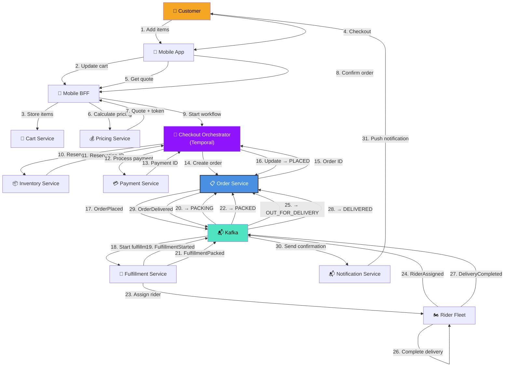
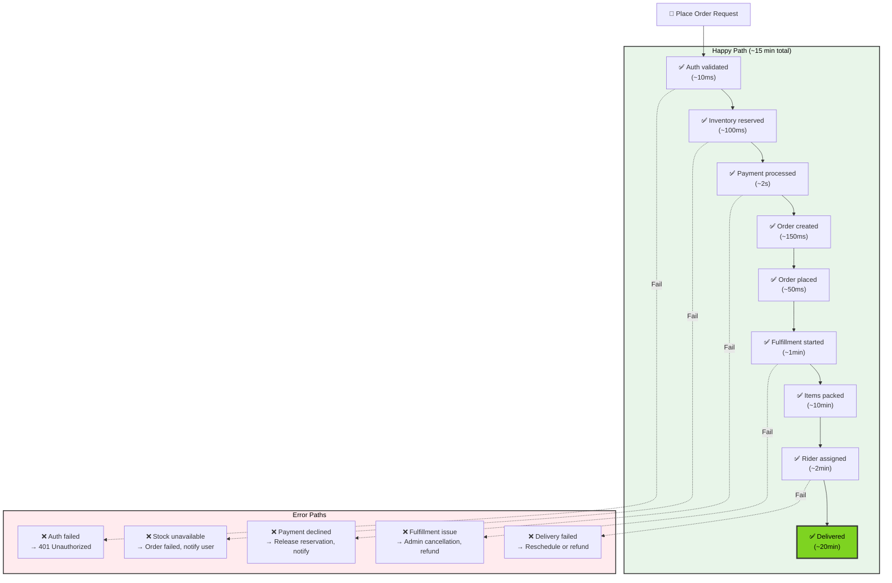
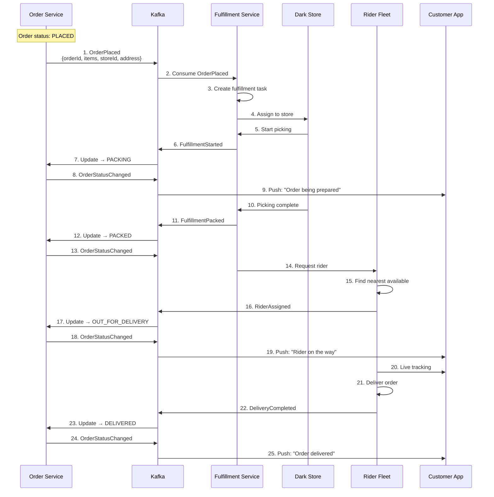
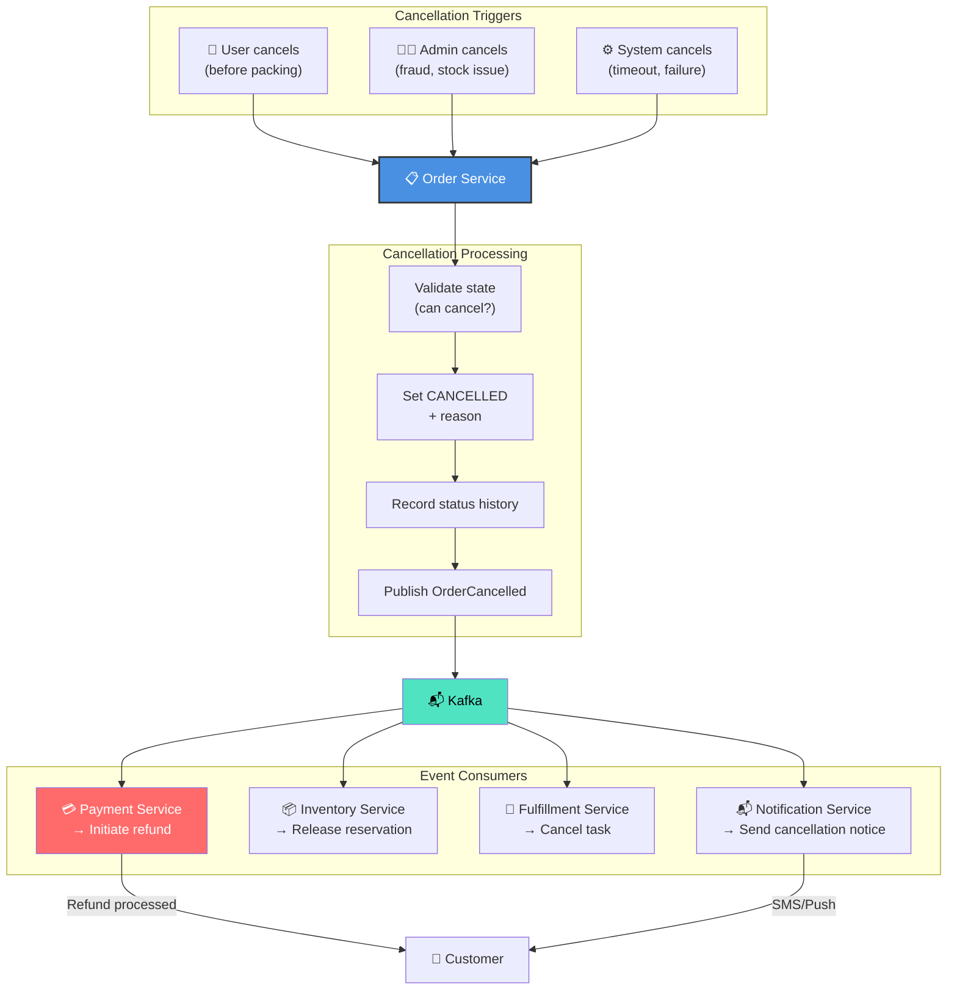
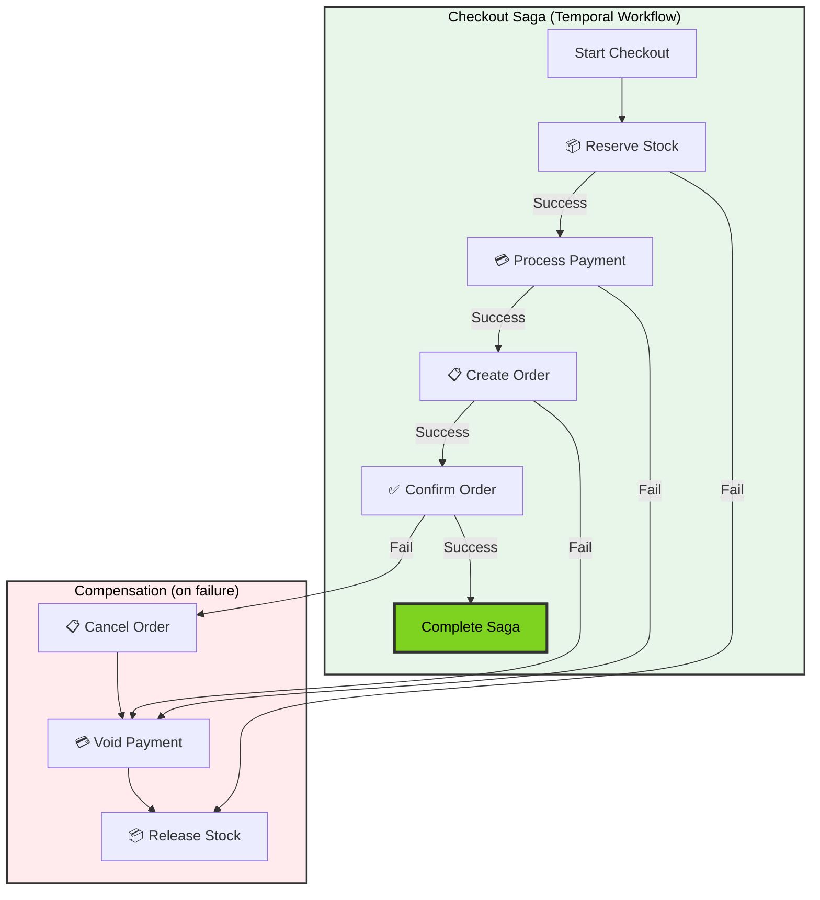
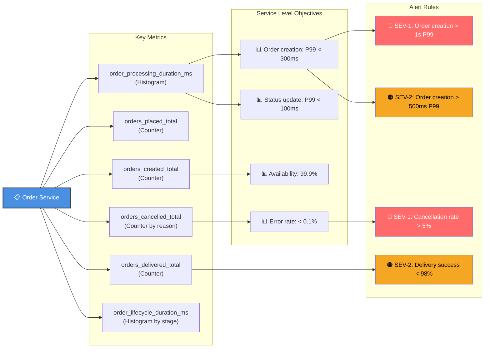
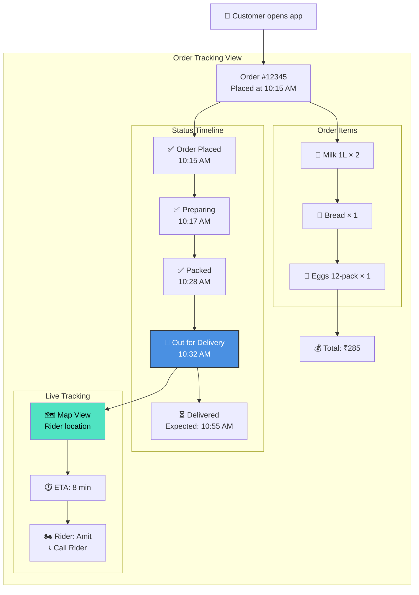
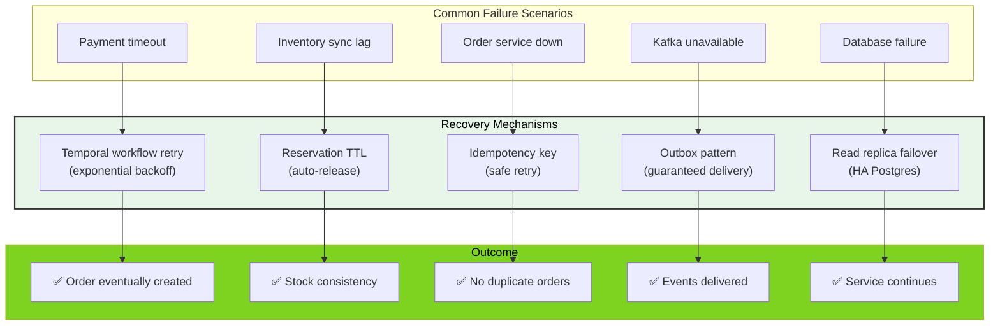
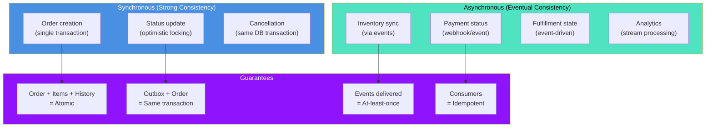

# Order Service - End-to-End Flows

## Complete Cart-to-Delivery Flow

## Order Lifecycle Timeline

```mermaid
gantt
    title Order Lifecycle Timeline
    dateFormat  HH:mm
    axisFormat  %H:%M

    section Customer
    Browse & Add to Cart       :c1, 10:00, 10m
    Review Cart                :c2, after c1, 2m
    Checkout & Pay             :c3, after c2, 3m
    Track Order                :c4, after c3, 90m

    section Order Service
    Order Created (PENDING)    :o1, 10:12, 1m
    Order Confirmed (PLACED)   :o2, after o1, 1m

    section Fulfillment
    Picking Started (PACKING)  :f1, 10:15, 10m
    Items Packed (PACKED)      :f2, after f1, 5m

    section Delivery
    Rider Assigned             :d1, 10:30, 2m
    Out for Delivery           :d2, after d1, 25m
    Delivered (DELIVERED)      :d3, after d2, 3m
```

## Request Flow with All Services

## Event Flow: Order → Fulfillment → Delivery

## Cancellation & Refund Flow

## Multi-Service Saga (Checkout)

## Observability: Order Metrics Dashboard

## Order Status Tracking (Customer View)

## Error Recovery Patterns

## Data Consistency Model

