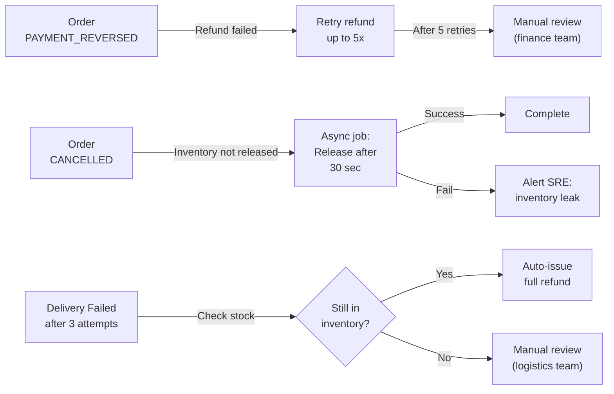

# Order Service - End-to-End Flow Diagram

## Complete Order Lifecycle: Cart → Delivered

```mermaid
sequenceDiagram
    participant Customer
    participant Mobile as Mobile BFF
    participant Order as Order Service
    participant Payment as Payment Service
    participant Inventory as Inventory Service
    participant Dispatch as Dispatch Optimizer
    participant Fulfillment as Fulfillment Service
    participant Rider as Rider Fleet
    participant Kafka as Kafka (Events)

    Customer->>Mobile: Select items, Checkout
    Mobile->>Order: POST /orders (cart_id, items[])
    activate Order
    Order->>Order: Create order PENDING_PAYMENT state
    Order->>Kafka: emit OrderCreatedEvent
    Order-->>Mobile: { order_id, status: PENDING_PAYMENT }
    deactivate Order

    Mobile->>Payment: Initiate payment (order_id, amount)
    activate Payment
    Payment->>Payment: Tokenize card via PSP
    Payment->>Payment: Create payment record
    Payment->>Kafka: emit PaymentAuthorizedEvent
    Payment-->>Mobile: { status: AUTHORIZED }
    deactivate Payment

    Order->>Inventory: POST /orders/{orderId}/reserve (items)
    activate Inventory
    Inventory->>Inventory: SELECT FOR UPDATE stock_items WHERE sku=? (pessimistic lock)
    alt Reserve succeeds
        Inventory->>Inventory: Decrement on_hand, increment reserved
        Inventory->>Kafka: emit InventoryReservedEvent
        Inventory-->>Order: { status: RESERVED, reservation_id }
    else Insufficient stock
        Inventory->>Kafka: emit InventoryReservationFailedEvent
        Inventory-->>Order: { error: INSUFFICIENT_STOCK }
        Order->>Payment: POST /payments/{paymentId}/refund
        Order->>Order: Move to PAYMENT_REVERSED state
        Order->>Kafka: emit PaymentReversedEvent
    end
    deactivate Inventory

    Order->>Order: Update to AWAITING_FULFILLMENT state
    Order->>Kafka: emit OrderReadyForFulfillmentEvent

    Dispatch->>Order: GET /orders?state=AWAITING_FULFILLMENT (batch)
    Dispatch->>Dispatch: Run assignment algorithm (locations, availability, ETA)
    Dispatch->>Fulfillment: POST /assignments (order_id, store_id, rider_id, estimated_pickup_time)
    activate Fulfillment
    Fulfillment->>Fulfillment: Create fulfillment record
    alt Success
        Fulfillment->>Kafka: emit FulfillmentAssignedEvent (includes rider_id, ETA)
        Fulfillment-->>Dispatch: { assignment_id, rider_id, estimated_time }
    else Dispatch error (no available rider)
        Fulfillment-->>Dispatch: { error: NO_AVAILABLE_RIDER }
        Dispatch->>Order: INCIDENT: Auto-escalate, retry later
    end
    deactivate Fulfillment

    Order->>Order: Move to FULFILLMENT_IN_PROGRESS state
    Order->>Kafka: emit FulfillmentAssignedEvent

    Rider->>Fulfillment: PICKUP_START (assignment_id, store_location)
    Fulfillment->>Kafka: emit RiderPickupStartedEvent

    rect rgb(200, 220, 255)
        Note over Rider,Fulfillment: Picking & Packing (store-side)
        Fulfillment->>Fulfillment: Verify items in order
        Fulfillment->>Fulfillment: Pick items from shelf
        Fulfillment->>Fulfillment: Pack into container
        Fulfillment->>Fulfillment: QC check
    end

    Rider->>Fulfillment: PICKUP_COMPLETE (proof_of_pick: photo/timestamp)
    Fulfillment->>Kafka: emit RiderPickupCompleteEvent
    Order->>Order: Move to OUT_FOR_DELIVERY state

    rect rgb(220, 255, 220)
        Note over Rider,Customer: Delivery Execution
        Rider->>Rider: Navigate to customer location (using Routing ETA Service)
        Rider->>Customer: SMS/notification "Driver arriving (ETA 5 min)"
        Rider->>Customer: DELIVERY_START
        Rider->>Rider: Confirm location/wait for customer
        Customer->>Rider: Accept delivery / sign
    end

    alt Delivery Success
        Rider->>Fulfillment: DELIVERY_COMPLETE (proof: photo, signature, notes)
        Fulfillment->>Kafka: emit DeliveryCompletedEvent
        Order->>Order: Move to DELIVERED state
        Order->>Kafka: emit OrderDeliveredEvent
        Order->>Payment: POST /settlements (order_id, final_amount)
        Payment->>Payment: Process payout to PSP/bank (async)
        Payment->>Kafka: emit PaymentSettled Event
        Order-->>Mobile: Order complete ✓ (SLA met if <18 min)
        Mobile->>Customer: "Order delivered! Rate delivery"
        Customer->>Mobile: Leave rating/review
    else Delivery Failed (Customer unavailable, address wrong, etc.)
        Rider->>Fulfillment: DELIVERY_FAILED (reason: CUSTOMER_UNAVAILABLE / ADDRESS_ISSUE)
        Fulfillment->>Kafka: emit DeliveryFailedEvent
        Order->>Order: Move to DELIVERY_FAILED state
        Order->>Order: Attempt count += 1
        alt Final attempt < 3
            Dispatch->>Fulfillment: POST /reassignments (order_id, new_rider)
            Order->>Order: Move back to OUT_FOR_DELIVERY
            Order->>Kafka: emit ReassignmentEvent
            Note over Rider: (Retry loop: up to 15 min intervals)
        else Max attempts reached (3)
            Order->>Order: Move to CANCELLED state
            Order->>Payment: POST /payments/{paymentId}/refund
            Order->>Inventory: POST /orders/{orderId}/release
            Order->>Kafka: emit OrderCancelledEvent
            Order-->>Mobile: Order cancelled (failed delivery after 3 attempts)
            Mobile-->>Customer: "We couldn't deliver. Refund issued."
        end
    end

    deactivate Order

    == Observability (Parallel) ==
    Order->>Kafka: Continuous SLO metrics (duration, error rate, burn rate)
    loop Every 5 seconds
        Kafka-->>Dispatch: SLO burns > 10% error rate? → Notification: SEV-1 page
    end
```

## Key Handoff Points & Latency SLOs

| Handoff | Duration (SLO) | Timeout | Action on Breach |
|---------|---|---|---|
| Payment Confirmation | < 3 sec | 5 min | Retry 3x, then refund & cancel |
| Inventory Reservation | < 2 sec | 30 sec | Refund, move to PAYMENT_REVERSED |
| Fulfillment Assignment (dispatch) | < 5 sec | 30 min | Escalate, retry with other rider |
| Rider Pickup | ≤ 8 min | Manual escalation | Customer notification, reattempt |
| Delivery (in-transit to delivery) | ≤ 15 min | Alert on >5 min over SLO | Attempt reassignment |
| Complete Journey | ≤ 18 min (95%ile) | SLO tracking | Error-budget consumed; postmortem |

## Rollback & Compensation Logic



## Data Integrity & Constraints

- **Idempotency**: All API calls include `idempotency_key = format(order_id + timestamp + operation)`; server returns cached response if duplicate within 24 hours
- **Order ID immutability**: UUID generated at creation, never changes
- **State machine enforcement**: PostgreSQL `CHECK (status IN ('PENDING_PAYMENT', 'PAYMENT_AUTHORIZED', ...))` ensures only valid transitions
- **Audit trail**: Every state change logged with `{order_id, old_state, new_state, reason, timestamp, actor_service}`
- **Referential integrity**: Order → Payment (1:1), Order → Inventory Reservation (1:1), Order → Fulfillment Assn (1:1)

## Error Scenarios & Handling

1. **Customer abandons payment**: Order stuck in PENDING_PAYMENT; cleanup job after 5 min → CANCELLED
2. **Stock depleted before fulfillment**: Inventory reserve fails → Movement to PAYMENT_REVERSED → Refund issued
3. **Rider no-show**: Fulfillment assignment created but rider never picks; timeout 30 min → Reassign; if 2nd attempt fails → CANCELLED
4. **Network partition during delivery**: Rider loses connection; order stuck in OUT_FOR_DELIVERY; circuit breaker engages; manual check by SRE
5. **PSP refund fails**: Payment marked for manual refund; finance team alerted; order remains CANCELLED until refund confirmed

---

**End-to-End SLA**: 95% of orders complete delivery within 18 minutes from cart checkout
**Critical Path**: Cart → Payment (3s) → Inventory (2s) → Fulfillment Assignment (5s) → Pickup (≤8min) → Delivery (≤15min)
**Total**: 18 min maximum
