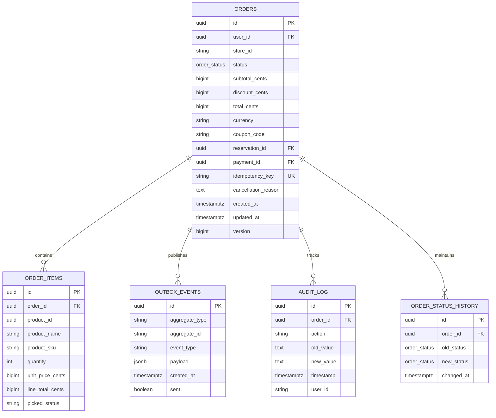

# Order Service - Entity Relationship Diagram

## Database Schema (ERD)



## Key Tables

### orders
**Purpose**: Master order data

| Column | Type | Constraint | Description |
|--------|------|-----------|-------------|
| id | UUID | PRIMARY KEY | Order identifier |
| user_id | UUID | NOT NULL | Customer user ID |
| store_id | VARCHAR(50) | NOT NULL | Fulfillment store |
| status | order_status ENUM | NOT NULL | Current status |
| subtotal_cents | BIGINT | NOT NULL | Pre-discount total |
| discount_cents | BIGINT | NOT NULL | Discount amount |
| total_cents | BIGINT | NOT NULL | Final total |
| currency | VARCHAR(3) | NOT NULL DEFAULT 'INR' | Currency code |
| coupon_code | VARCHAR(30) | NULLABLE | Applied coupon |
| reservation_id | UUID | NULLABLE | Inventory reservation |
| payment_id | UUID | NULLABLE | Payment transaction |
| idempotency_key | VARCHAR(64) | UNIQUE NOT NULL | Checkout dedup |
| cancellation_reason | TEXT | NULLABLE | Cancel reason |
| created_at | TIMESTAMPTZ | DEFAULT now() | Creation timestamp |
| updated_at | TIMESTAMPTZ | DEFAULT now() | Last update time |
| version | BIGINT | NOT NULL DEFAULT 0 | Optimistic lock |

**Indexes**:
- `idx_orders_user` (user_id) - Fast user lookups
- `idx_orders_status` (status) - Status-based queries
- `idx_orders_created` (created_at DESC) - Timeline queries

### order_items
**Purpose**: Line items within order

| Column | Type | Constraint | Description |
|--------|------|-----------|-------------|
| id | UUID | PRIMARY KEY | Item identifier |
| order_id | UUID | FOREIGN KEY | Order reference |
| product_id | UUID | NOT NULL | Product identifier |
| product_name | VARCHAR(255) | NOT NULL | Snapshot at time |
| product_sku | VARCHAR(50) | NOT NULL | Stock keeping unit |
| quantity | INT | CHECK (qty > 0) | Ordered quantity |
| unit_price_cents | BIGINT | NOT NULL | Price snapshot |
| line_total_cents | BIGINT | NOT NULL | qty * unit_price |
| picked_status | VARCHAR(20) | DEFAULT 'PENDING' | Fulfillment state |

### outbox_events
**Purpose**: Change data capture source (CDC pattern)

| Column | Type | Constraint | Description |
|--------|------|-----------|-------------|
| id | UUID | PRIMARY KEY | Event identifier |
| aggregate_type | VARCHAR(50) | NOT NULL | "Order" |
| aggregate_id | VARCHAR(255) | NOT NULL | orderId |
| event_type | VARCHAR(50) | NOT NULL | Event class |
| payload | JSONB | NOT NULL | Event data |
| created_at | TIMESTAMPTZ | DEFAULT now() | Event time |
| sent | BOOLEAN | NOT NULL DEFAULT false | CDC published flag |

**Indexes**:
- `idx_outbox_unsent` (sent) WHERE sent = false - Debezium polling

### audit_log
**Purpose**: GDPR-compliant audit trail

| Column | Type | Constraint | Description |
|--------|------|-----------|-------------|
| id | UUID | PRIMARY KEY | Audit record ID |
| order_id | UUID | FOREIGN KEY | Order reference |
| action | VARCHAR(50) | NOT NULL | CREATED, UPDATED, CANCELLED |
| old_value | TEXT | NULLABLE | Previous state (JSON) |
| new_value | TEXT | NULLABLE | New state (JSON) |
| timestamp | TIMESTAMPTZ | DEFAULT now() | When occurred |
| user_id | VARCHAR(255) | NULLABLE | Who initiated |

## Query Patterns

```sql
-- Fast user order lookup
SELECT * FROM orders WHERE user_id = ? ORDER BY created_at DESC LIMIT 20;

-- Unfulfilled orders (for warehouse)
SELECT * FROM orders WHERE status IN ('PLACED', 'PACKING', 'PACKED') ORDER BY created_at;

-- Unpublished events (for CDC)
SELECT * FROM outbox_events WHERE sent = false LIMIT 100;

-- Order status timeline
SELECT * FROM order_status_history WHERE order_id = ? ORDER BY changed_at;

-- Audit trail (GDPR)
SELECT * FROM audit_log WHERE order_id = ? ORDER BY timestamp DESC;
```

## Constraints & Validations

- **Unique Idempotency**: idempotency_key UNIQUE ensures 1 order per checkout
- **Quantity Check**: quantity > 0 in order_items
- **Status Enum**: Only valid order statuses allowed
- **User Isolation**: Implicit (queries always filter by user_id)
- **Referential Integrity**: order_items.order_id → orders.id (CASCADE DELETE)
