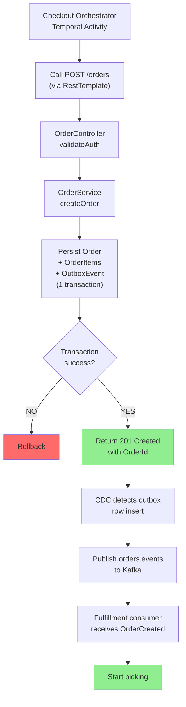
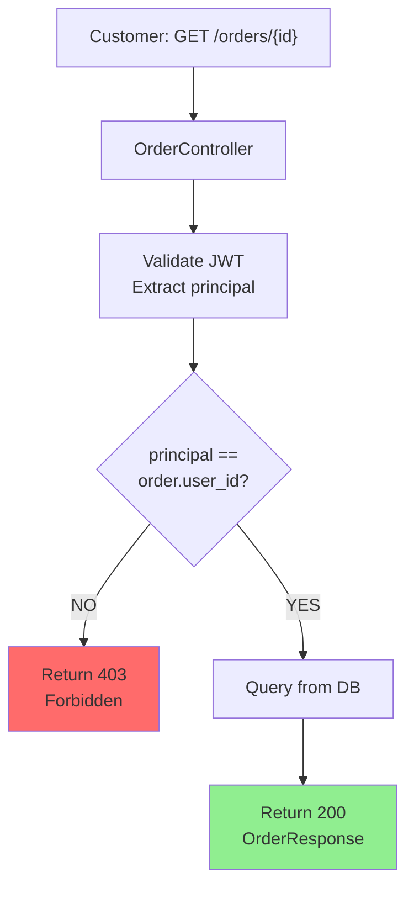
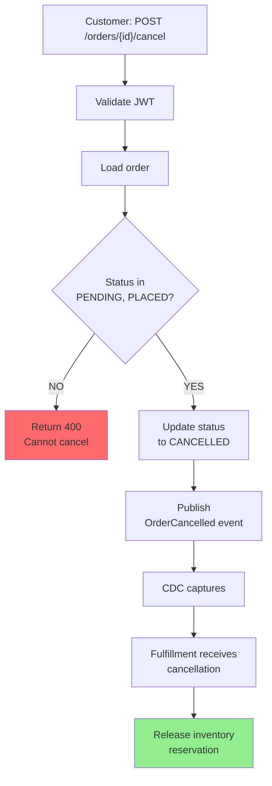
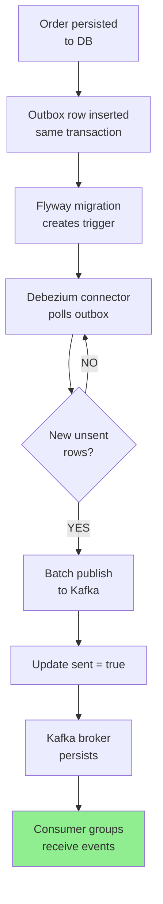
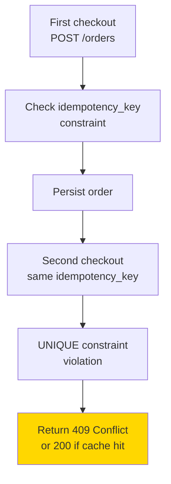
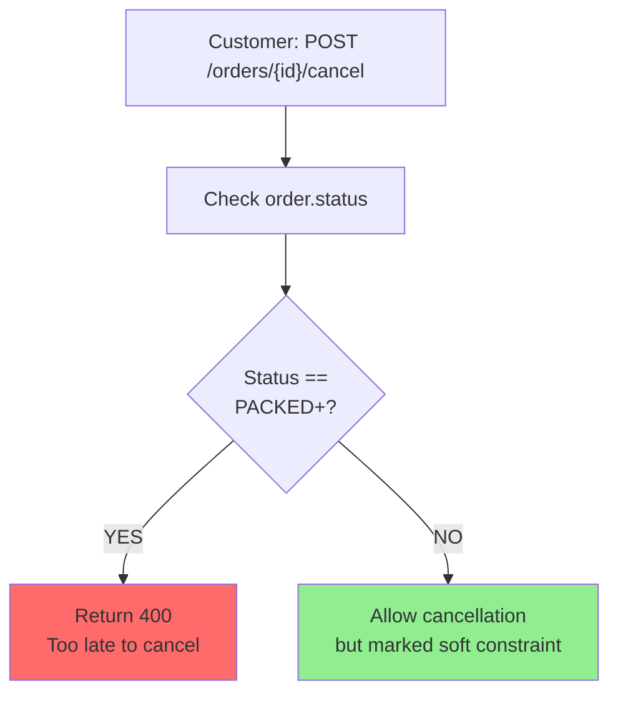

# Order Service - Request/Response Flows

## Order Creation Flow (Checkout Saga)

## Order Query Flow (Customer)

## Order Cancellation Flow

## Outbox/CDC Flow

## Failure Scenarios

### Scenario: Duplicate Order Creation

### Scenario: Cancellation After Packing

