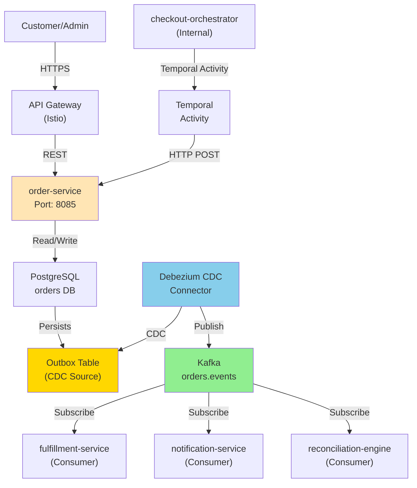

# Order Service - High-Level Design

## Deployed Topology



## Traffic Flow

1. **Order Creation (Checkout Saga)**:
   - checkout-orchestrator calls CreateOrderActivity (Temporal)
   - Temporal invokes `POST /orders` on order-service
   - order-service validates, persists order + outbox event in same transaction
   - Returns OrderId to orchestrator
   - CDC detects outbox row change, publishes to Kafka

2. **Order Query (Customer)**:
   - Customer calls `GET /orders/{id}`
   - order-service validates JWT principal, checks authorization
   - Returns OrderResponse with details + status

3. **Order Cancellation**:
   - Customer calls `POST /orders/{id}/cancel`
   - order-service validates status (must be PENDING/PLACED, not PACKED+)
   - Updates status to CANCELLED, publishes OrderCancelled event
   - CDC propagates cancellation to fulfillment for compensation

## Event-Driven Flows

```
Order Creation (Sync → Async):
  POST /orders (Temporal activity)
    ↓
  Persist orders + outbox_events (1 transaction)
    ↓
  CDC detects change
    ↓
  Publish orders.events
    ↓
  fulfillment-service: OrderCreated → start picking
  notification-service: OrderCreated → send confirmation email
  reconciliation-engine: OrderCreated → verify payment
```

## Key Dependencies

```
order-service
├── PostgreSQL (orders + outbox + audit_log + shedlock)
├── Kafka (orders.events topic)
├── Debezium (CDC relay)
├── Temporal (checkout saga coordination)
├── inventory-service (stock verification queries)
└── fulfillment-service (fulfillment status updates)
```
