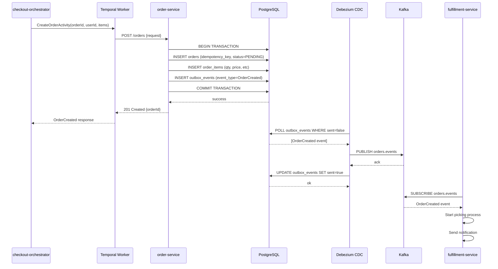
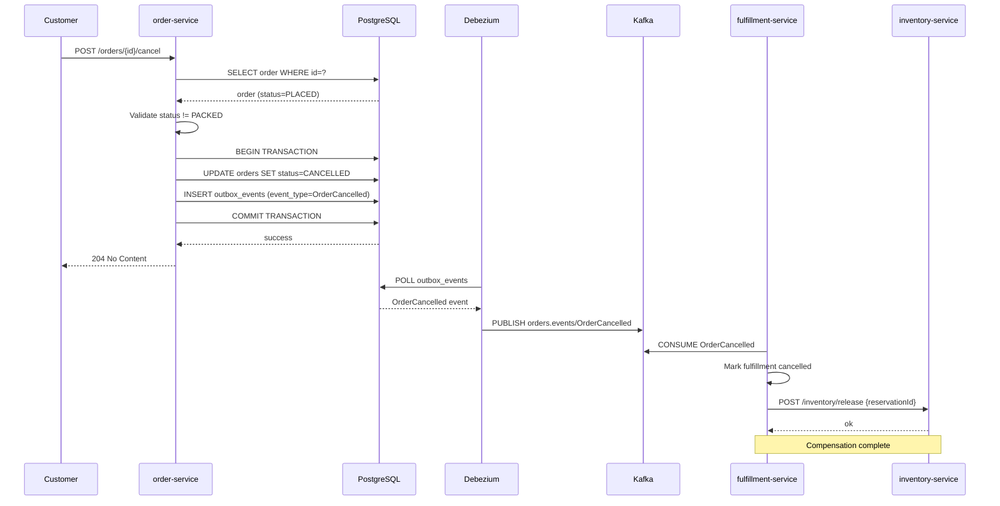
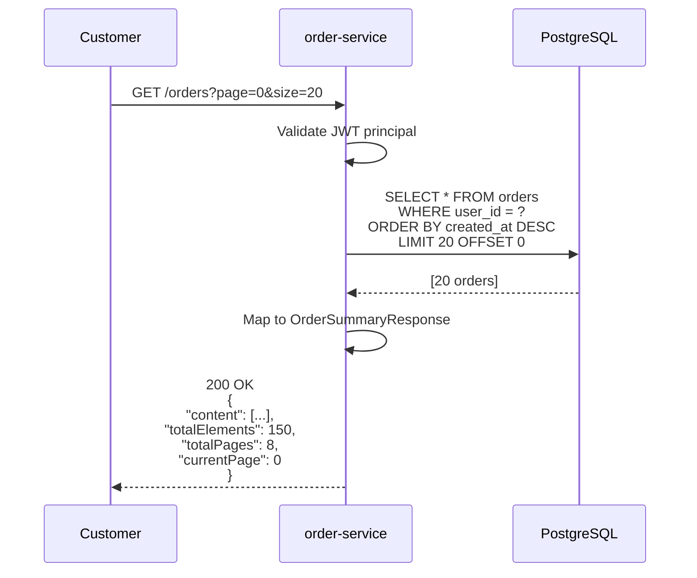
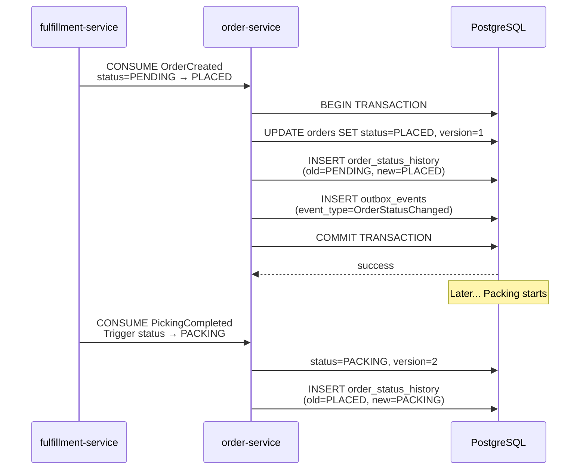

# Order Service - Sequence Diagrams

## Order Creation (Checkout to Fulfillment)

```mermaid
sequenceDiagram
    participant CO as checkout-orchestrator
    participant TW as Temporal Worker
    participant OS as order-service
    participant DB as PostgreSQL
    participant CDC as Debezium CDC
    participant Kafka as Kafka
    participant FS as fulfillment-service

    CO->>TW: CreateOrderActivity(orderId, userId, items)
    TW->>OS: POST /orders {request}
    OS->>DB: BEGIN TRANSACTION
    OS->>DB: INSERT orders (idempotency_key, status=PENDING)
    OS->>DB: INSERT order_items (qty, price, etc)
    OS->>DB: INSERT outbox_events (event_type=OrderCreated)
    OS->>DB: COMMIT TRANSACTION
    DB-->>OS: success
    OS-->>TW: 201 Created {orderId}
    TW-->>CO: OrderCreated response

    CDC->>DB: POLL outbox_events WHERE sent=false
    DB-->>CDC: [OrderCreated event]
    CDC->>Kafka: PUBLISH orders.events
    Kafka-->>CDC: ack

    CDC->>DB: UPDATE outbox_events SET sent=true
    DB-->>CDC: ok

    FS->>Kafka: SUBSCRIBE orders.events
    Kafka-->>FS: OrderCreated event
    FS->>FS: Start picking process
    FS->>FS: Send notification
```

## Order Cancellation with Fulfillment Compensation

```mermaid
sequenceDiagram
    participant Customer
    participant OS as order-service
    participant DB as PostgreSQL
    participant CDC as Debezium
    participant Kafka as Kafka
    participant FS as fulfillment-service
    participant IS as inventory-service

    Customer->>OS: POST /orders/{id}/cancel

    OS->>DB: SELECT order WHERE id=?
    DB-->>OS: order (status=PLACED)

    OS->>OS: Validate status != PACKED

    OS->>DB: BEGIN TRANSACTION
    OS->>DB: UPDATE orders SET status=CANCELLED
    OS->>DB: INSERT outbox_events (event_type=OrderCancelled)
    OS->>DB: COMMIT TRANSACTION
    DB-->>OS: success

    OS-->>Customer: 204 No Content

    CDC->>DB: POLL outbox_events
    DB-->>CDC: OrderCancelled event
    CDC->>Kafka: PUBLISH orders.events/OrderCancelled

    FS->>Kafka: CONSUME OrderCancelled
    FS->>FS: Mark fulfillment cancelled
    FS->>IS: POST /inventory/release {reservationId}
    IS-->>FS: ok

    Note over FS,IS: Compensation complete
```

## Pagination Query

```mermaid
sequenceDiagram
    participant Customer
    participant OS as order-service
    participant DB as PostgreSQL

    Customer->>OS: GET /orders?page=0&size=20

    OS->>OS: Validate JWT principal

    OS->>DB: SELECT * FROM orders<br/>WHERE user_id = ?<br/>ORDER BY created_at DESC<br/>LIMIT 20 OFFSET 0

    DB-->>OS: [20 orders]

    OS->>OS: Map to OrderSummaryResponse

    OS-->>Customer: 200 OK<br/>{<br/>  "content": [...],<br/>  "totalElements": 150,<br/>  "totalPages": 8,<br/>  "currentPage": 0<br/>}
```

## Status History Tracking

```mermaid
sequenceDiagram
    participant Fulfillment as fulfillment-service
    participant OS as order-service
    participant DB as PostgreSQL

    Fulfillment->>OS: CONSUME OrderCreated<br/>status=PENDING → PLACED

    OS->>DB: BEGIN TRANSACTION
    OS->>DB: UPDATE orders SET status=PLACED, version=1
    OS->>DB: INSERT order_status_history<br/>(old=PENDING, new=PLACED)
    OS->>DB: INSERT outbox_events<br/>(event_type=OrderStatusChanged)
    OS->>DB: COMMIT TRANSACTION
    DB-->>OS: success

    Note over DB: Later... Packing starts

    Fulfillment->>OS: CONSUME PickingCompleted<br/>Trigger status → PACKING

    OS->>DB: status=PACKING, version=2
    OS->>DB: INSERT order_status_history<br/>(old=PLACED, new=PACKING)
```
