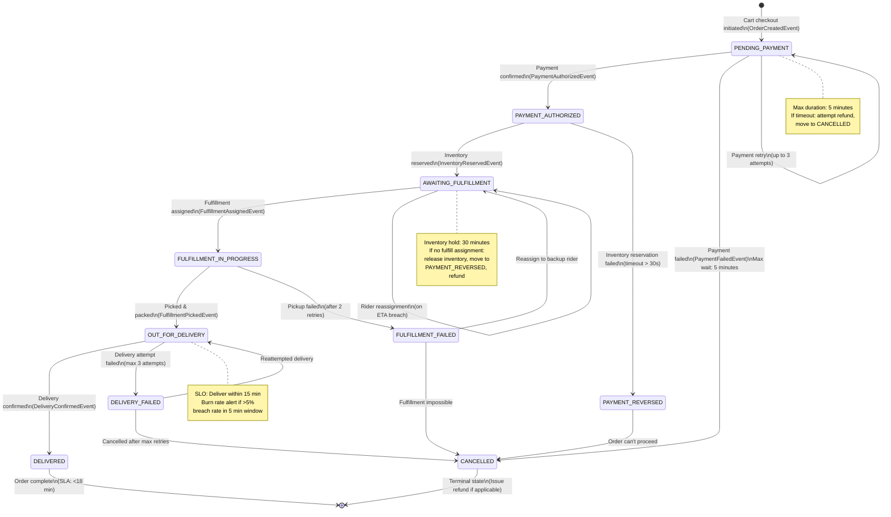
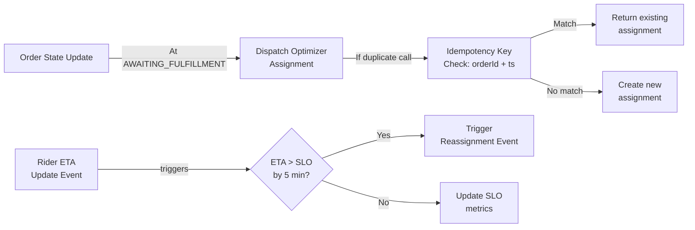

# Order Service - State Machine Diagram

## Order Lifecycle State Transitions

## Detailed State Descriptions

| State | Duration | Conditions | Next States | Actions |
|-------|----------|-----------|-----------|---------|
| **PENDING_PAYMENT** | ≤ 5 min | Cart → Order created, awaiting payment confirmation | PAYMENT_AUTHORIZED, CANCELLED, PENDING_PAYMENT (retry) | Wait for payment-service callback; emit OrderCreatedEvent; start 5m timeout |
| **PAYMENT_AUTHORIZED** | ≤ 30 sec | Payment confirmed; attempting inventory reservation | AWAITING_FULFILLMENT, PAYMENT_REVERSED | Call inventory-service reserve; set 30s timeout for fulfillment assignment |
| **AWAITING_FULFILLMENT** | ≤ 30 min | Inventory reserved; unassigned to rider | FULFILLMENT_IN_PROGRESS, PAYMENT_REVERSED | Emit OrderReadyForFulfillmentEvent; call dispatch-optimizer-service |
| **FULFILLMENT_IN_PROGRESS** | ≤ 8 min (pickup) | Rider assigned; en route to store | OUT_FOR_DELIVERY, FULFILLMENT_FAILED, AWAITING_FULFILLMENT | Emit FulfillmentAssignedEvent; monitor rider location; set ETA breach SLO |
| **OUT_FOR_DELIVERY** | ≤ 15 min | Order picked & packed; rider en route to customer | DELIVERED, DELIVERY_FAILED | Emit OutForDeliveryEvent; monitor ETA vs SLO; max 3 delivery attempts |
| **DELIVERED** | Terminal | Delivery confirmed by rider/customer | — | Emit DeliveredEvent; release inventory; process payment settlement; mark order complete (SLA ✓) |
| **FULFILLED_FAILED** | Transition | Rider unable to pick up within 8 min | AWAITING_FULFILLMENT (reassign), CANCELLED | Emit FulfillmentFailedEvent; attempt reassignment to backup rider |
| **DELIVERY_FAILED** | ≤ 3 attempts | Delivery attempt failed (customer unavailable, address issue, etc.) | OUT_FOR_DELIVERY (retry), CANCELLED | Emit DeliveryFailedEvent; notify customer; retry up to 3 times; if final: initiate refund |
| **PAYMENT_REVERSED** | ≤ 5 min | Inventory not available or timeout | CANCELLED | Emit PaymentReversedEvent; call payment-service to refund; release inventory |
| **CANCELLED** | Terminal | Order cancelled by system, customer, or after max retries | — | Emit OrderCancelledEvent; issue refund (if payment taken); release inventory; log reason |

## Concurrency & Idempotency

## Error Recovery Paths

1. **Payment Failed** → Retry up to 3 times → If all fail → CANCELLED (refund issued)
2. **Inventory Reservation Timeout** → PAYMENT_REVERSED → Refund in 5s
3. **Fulfillment Assignment Timeout (30s)** → PAYMENT_REVERSED → Refund → Release inventory
4. **Rider Pickup Failed** → Reassign to backup rider (1 retry) → If fail → CANCELLED (refund)
5. **Delivery Attempt Failed** → Retry up to 3 times (15 min intervals) → If all fail → CANCELLED (refund)
6. **ETA Breach (>5min over SLO)** → Emit breach alert → Attempt reassignment → If succeed, continue; else escalate
7. **Customer Refund Request** → Move to CANCELLED → Reverse payment → Release inventory

## Async Event Publishing

Each state transition publishes events to `order.events` Kafka topic:

| Event | Topic | Consumer |
|-------|-------|----------|
| `OrderCreatedEvent` | order.events | payment-service, audit-trail |
| `PaymentAuthorizedEvent` | order.events | inventory-service, fulfillment-service |
| `OrderReadyForFulfillmentEvent` | order.events | dispatch-optimizer-service |
| `FulfillmentAssignedEvent` | order.events | rider-fleet-service, notification-service |
| `OutForDeliveryEvent` | order.events | notification-service, routing-eta-service |
| `DeliveredEvent` | order.events | payment-service (settlement), wallet-loyalty-service (promotion), audit-trail |
| `OrderCancelledEvent` | order.events | payment-service (refund), inventory-service (release), notification-service (customer) |

**All events include**:
- `order_id` (UUID, immutable)
- `event_id` (UUID, for deduplication)
- `timestamp` (event-time, ISO-8601)
- `order_state` (state post-event)
- `previous_state` (for audit)

---

**SLO**: 95% of orders DELIVERED state within 18 minutes end-to-end (cart → delivered)
**Error Budget**: Monthly reset; fast burn (>5% fail in 5 min) = tier-1 page
