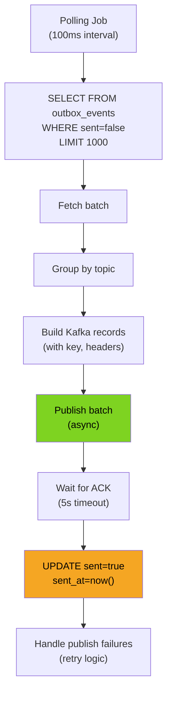
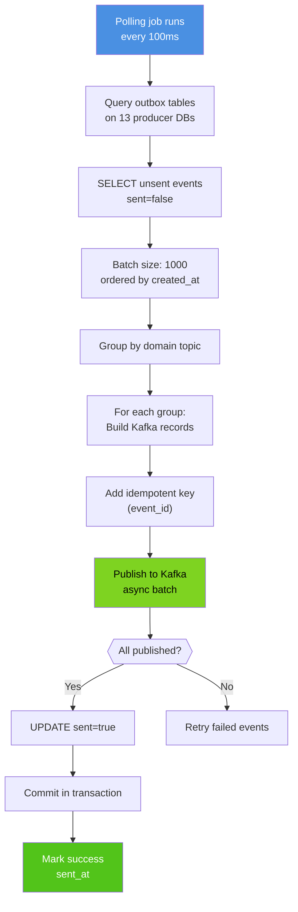
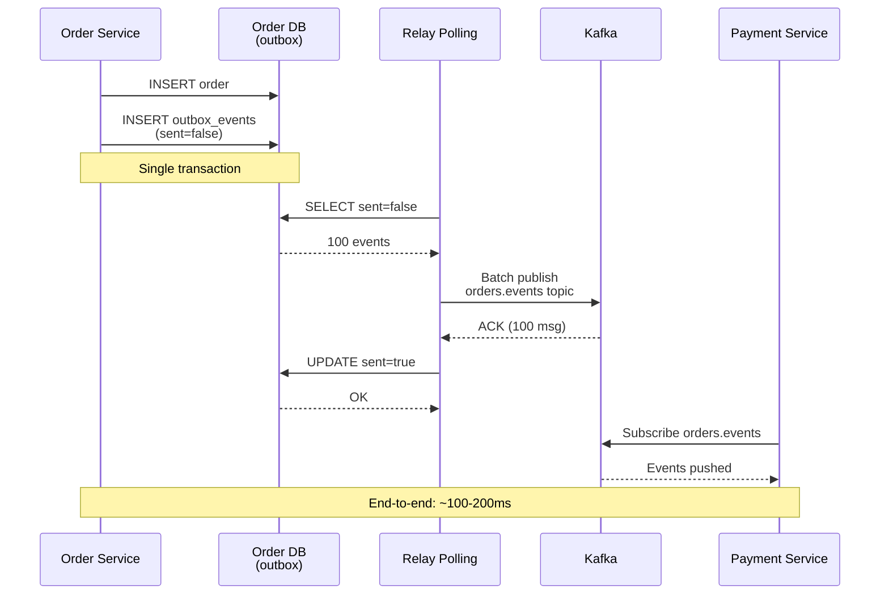
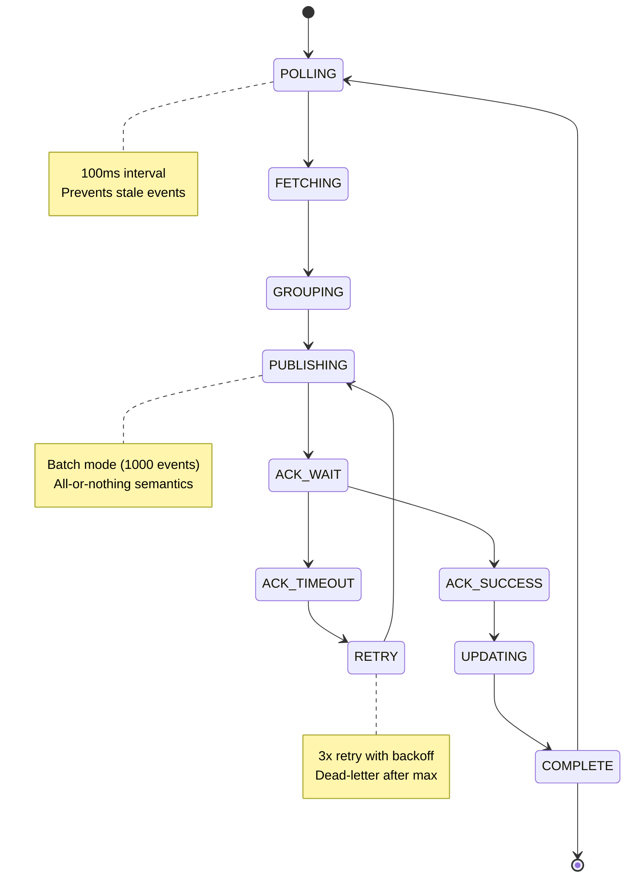
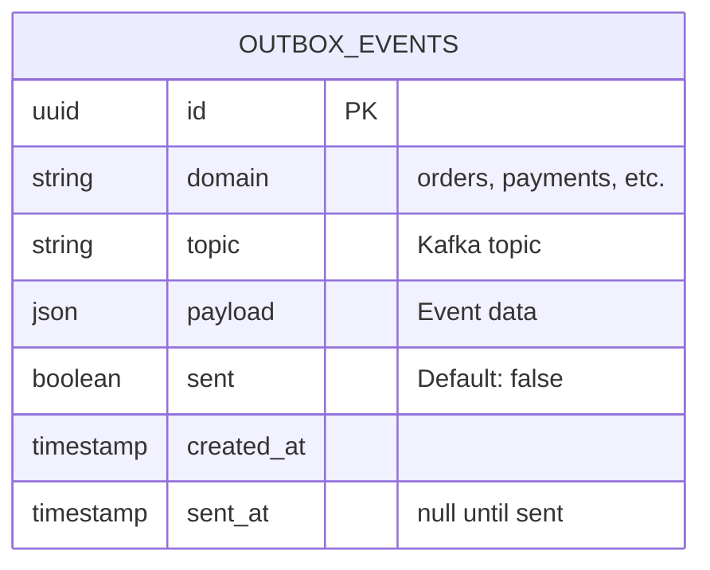

# Outbox Relay Service - All 7 Diagrams

## 1. High-Level Design

```mermaid
graph TB
    ProducerSvc["📦 13 Producer Services<br/>(with outbox tables)"]
    OutboxTbl["📤 Outbox Tables<br/>(transactional)"]
    RelayService["🚀 Outbox Relay Service<br/>(Go)"]
    Kafka["📬 Kafka<br/>(14 domain topics)"]
    Subscribers["📨 Event Subscribers"]

    ProducerSvc -->|Write events| OutboxTbl
    RelayService -->|Poll (100ms)| OutboxTbl
    RelayService -->|Batch publish| Kafka
    Kafka -->|Subscribe| Subscribers

    style RelayService fill:#4A90E2,color:#fff
    style Kafka fill:#50E3C2,color:#000
```

## 2. Low-Level Design



## 3. Flowchart - Event Relay



## 4. Sequence - Event Publishing



## 5. State Machine



## 6. ER - Outbox Schema



## 7. End-to-End

```mermaid
graph TB
    OrderService["📦 Order Service"]
    OrderDB["🗄️ Order DB<br/>(PostgreSQL)"]
    OutboxTable["📤 Outbox Table<br/>(sent=false index)"]
    RelayService["🚀 Relay Service<br/>(3 pods)"]
    KafkaOrderTopic["📬 Kafka<br/>orders.events"]
    PaymentService["💳 Payment Service<br/>(subscriber)"]
    Monitoring["📊 Relay Metrics<br/>(lag, throughput)"]

    OrderService -->|1. INSERT order| OrderDB
    OrderService -->|2. INSERT event<br/>sent=false| OutboxTable
    Note over OrderService,OutboxTable: Single transaction<br/>guaranteed delivery

    RelayService -->|3. Poll 100ms| OutboxTable
    OutboxTable -->|4. unsent events| RelayService
    RelayService -->|5. Batch publish| KafkaOrderTopic
    KafkaOrderTopic -->|6. ACK| RelayService
    RelayService -->|7. UPDATE sent=true| OutboxTable
    OutboxTable -->|8. OK| RelayService
    RelayService -->|9. Metrics| Monitoring

    PaymentService -->|Subscribe| KafkaOrderTopic
    KafkaOrderTopic -->|Events pushed| PaymentService

    style RelayService fill:#4A90E2,color:#fff
    style OutboxTable fill:#F5A623,color:#000
    style KafkaOrderTopic fill:#50E3C2,color:#000
```
