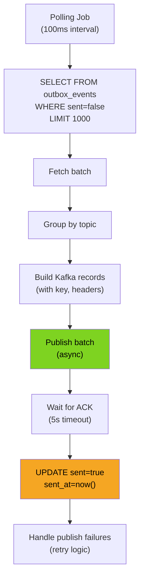

# Outbox Relay Service - Low-Level Design



## Detailed Processing Pipeline

### 1. Polling Job
- **Trigger**: Timer-based cron every 100ms
- **Thread Pool**: 1 dedicated thread for polling
- **Lock**: Distributed lock prevents concurrent polls (via Kubernetes leader election)
- **Metrics**: Poll count, last poll time, events processed per poll

### 2. Query Unsent Events
```sql
SELECT id, domain, topic, payload, created_at
FROM outbox_events
WHERE sent = false
ORDER BY created_at ASC
LIMIT 1000;
```

**Optimization**:
- Index on (sent, created_at) for fast retrieval
- Cursor-based pagination for large result sets
- Connection pooling (10 connections, 5-minute lifetime)

### 3. Fetch Batch
- **Batch Size**: 1000 events
- **Read Consistency**: Read-committed (prevent dirty reads)
- **Lock Time**: < 50ms (index scan is fast)
- **Network Round-trip**: 20-50ms (database → relay pod)

### 4. Group by Topic
**In-Memory Grouping**:
```
{
    "orders.events": [event1, event2, ...],
    "payments.events": [event3, event4, ...],
    ...
}
```

**Purpose**: Batch publish per topic for efficiency

### 5. Build Kafka Records
For each event, construct Kafka ProducerRecord:
```java
ProducerRecord {
    topic: "orders.events",
    key: event.id,           // Use event_id as key for idempotency
    value: event.payload,    // JSON serialized
    headers: [
        ("domain", "orders"),
        ("source", "order-service"),
        ("trace-id", correlationId),
        ("timestamp", event.created_at)
    ]
}
```

**Key Features**:
- Key = event_id (enables idempotent processing on subscriber side)
- Headers = metadata for downstream services
- Compression: Snappy (compresses typical event by 50%)

### 6. Publish Batch
**Async Kafka Batch Send**:
- Send all grouped records to Kafka topic
- Configure batch settings:
  - `batch.size`: 32KB
  - `linger.ms`: 10ms (wait up to 10ms for more records)
  - `acks`: "all" (wait for all replicas)
  - `compression.type`: "snappy"

**Thread**: Non-blocking async send

### 7. Wait for ACK
```
PublishFuture completionFuture = producer.send(batch)
completionFuture.get(5, TimeUnit.SECONDS)  // 5 second timeout
```

**Timeout Handling**:
- If ACK received: Mark sent_at = now()
- If timeout (5s): Retry up to 3 times with exponential backoff
- If all retries fail: Log error, move to next batch

**ACK Semantics**:
- `acks="all"`: Wait for leader + min replicas (default: 1 in-sync replica)
- Kafka broker default: 3 replicas, 2 in-sync
- Guarantee: Data persisted on ≥2 brokers before ACK

### 8. Update Sent Flag
**Transactional Update**:
```sql
BEGIN TRANSACTION;
UPDATE outbox_events
SET sent = true, sent_at = NOW()
WHERE id = ANY($1)  -- Array of event IDs
AND sent = false;
COMMIT;
```

**Lock Duration**: < 20ms (simple UPDATE)
**Atomicity**: All 1000 events updated atomically

### 9. Handle Failures
**Failure Scenarios**:

| Scenario | Action | Retry |
|----------|--------|-------|
| Kafka broker down | Backoff 5s, retry | 3x |
| Network timeout | Backoff 10s, retry | 3x |
| DB connection lost | Backoff 30s, circuit breaker | Manual |
| Update fails | Log, skip batch | No |

## Performance Characteristics

| Operation | Duration |
|-----------|----------|
| Poll database | 20-50ms |
| Group in-memory | 5ms |
| Build records | 10ms |
| Publish to Kafka | 100-200ms |
| Wait for ACK | 50-150ms |
| Update database | 20-50ms |
| **Total cycle** | 205-445ms |

**Throughput**:
- Batch size: 1000 events
- Cycle time: 300ms average
- Throughput: 1000 / 0.3s = **3,300 events/second per pod**
- With 3 pods: **10,000 events/second cluster capacity**

## Circuit Breaker Strategy

```
State: CLOSED (normal)
  ├─ On success: Stay CLOSED
  └─ On 5 failures: Transition to OPEN

State: OPEN (circuit broken)
  ├─ Duration: 30 seconds
  └─ After 30s: Transition to HALF_OPEN

State: HALF_OPEN (testing)
  ├─ On success: Transition to CLOSED
  └─ On failure: Transition to OPEN
```

**Impact**:
- OPEN state: Relay continues processing, caches events in memory (up to 10MB)
- HALF_OPEN: Single test request to Kafka broker
- Recovery: Gradual drain of cached events after recovery
