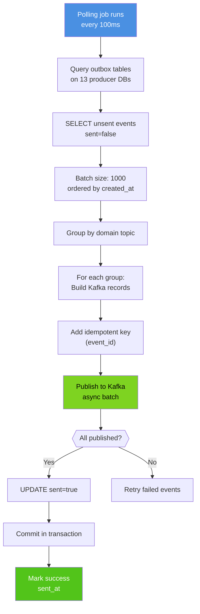

# Outbox Relay Service - Flowchart (Event Relay)



## Step-by-Step Execution

### Step 1: Polling Trigger
**Time**: 0ms
- Polling job wakes up (every 100ms via Spring @Scheduled or Go ticker)
- Acquire distributed lock (prevents concurrent runs on multiple pods)
- Log poll start (poll_id, pod_name, timestamp)

### Step 2: Query Outbox Tables
**Time**: 20-50ms
- Connect to each producer database (13 connections in parallel)
- Query outbox_events table with sent=false filter

### Step 3: Fetch Unsent Events
**Query**:
```sql
SELECT id, domain, topic, payload, created_at
FROM outbox_events
WHERE sent = false
ORDER BY created_at ASC
LIMIT 1000;
```

**Time**: 30-80ms (database round trip)
**Result**: 1000 events ordered by creation time (FIFO)

### Step 4: Order Events
- Sort by created_at (ascending) for FIFO guarantee
- Batch size: 1000 events (limit)
- If fewer than 1000 unsent events: Process all available

### Step 5: Group by Domain Topic
**In-Memory Grouping**:
```
orders.events → [event1, event2, event3, ...]
payments.events → [event4, event5, ...]
fulfillment.events → [event6, event7, ...]
```

**Time**: 5-10ms

**Purpose**: Publish all events of same topic in single Kafka batch

### Step 6: Build Kafka Records
For each event in each topic group:
```
{
    topic: "orders.events",
    key: "550e8400-e29b-41d4-a716-446655440000",  // event.id
    value: "{\"order_id\": \"ord_123\", ...}",     // event.payload
    headers: {
        "domain": "orders",
        "source": "order-service",
        "trace-id": "trace_12345",
        "timestamp": "2026-03-21T14:30:00Z"
    }
}
```

**Time**: 10-20ms

### Step 7: Add Idempotent Key
- Key = event.id (UUID)
- Purpose: Enable idempotent processing on subscriber side
- Kafka guarantee: Same key → same partition (event ordering)

### Step 8: Publish to Kafka
**Async Batch Send**:
- Send all grouped records to Kafka topics
- Kafka broker responds with partition/offset/timestamp
- Default: Wait for leader + 1 in-sync replica confirmation

**Time**: 100-200ms

**Timeout**: 5 seconds (fail if no ACK within 5s)

### Step 9: ACK Check
**Decision Point**: Did Kafka acknowledge all events?

**Yes Path** (expected):
- All events received by Kafka brokers
- Proceed to Step 10 (Update sent flag)

**No Path** (failure):
- Kafka timeout or connection error
- Retry logic: 3 attempts with exponential backoff
- Attempt 1: Wait 1s, retry
- Attempt 2: Wait 2s, retry
- Attempt 3: Wait 4s, retry
- If still failing: Step 11 (Retry failed events)

### Step 10: Update Sent Flag
**Transaction**:
```sql
BEGIN;
UPDATE outbox_events
SET sent = true, sent_at = NOW()
WHERE id = ANY($1)
AND sent = false;
COMMIT;
```

**Time**: 20-50ms (lock + write)

**Purpose**: Mark events as sent so next poll skips them

### Step 11: Commit Transaction
- Atomically commit all sent=true updates
- If commit fails: Retry entire batch next poll cycle
- Success: Events won't be reprocessed

### Step 12: Mark Success
- Log success (poll_id, events_published, batch_duration_ms)
- Update metrics (counter, latency, throughput)
- Release distributed lock
- Wait for next poll interval

## Performance & Throughput

### Per Poll Cycle
- **Events processed**: 1000
- **Total time**: 200-400ms (typical)
- **Throughput**: 2,500-5,000 events/sec per pod

### Cluster Level (3 pods)
- **Total throughput**: 7,500-15,000 events/sec
- **Polling frequency**: 10 polls/second per pod
- **Total batches/sec**: 30 batches/sec (across cluster)

### Latency Breakdown
| Component | Time |
|-----------|------|
| Database query | 30ms |
| In-memory grouping | 5ms |
| Kafka publish | 150ms |
| Database update | 30ms |
| **Total** | **215ms** |

## Failure Recovery

### Scenario 1: Kafka Down (5+ minutes)
**Behavior**:
- Poll succeeds (events fetched from outbox)
- Kafka publish times out after 5s
- Retry 3 times with backoff (total: ~7 seconds)
- All retries fail
- **Circuit breaker opens**: Stop publishing for 30 seconds
- Events remain in outbox table (sent=false)
- Next poll cycle retries

### Scenario 2: Database Connection Lost
**Behavior**:
- Database query fails immediately
- Retry logic: Exponential backoff (1s, 2s, 4s)
- After 3 failures: Skip this poll cycle
- Next poll cycle (100ms later): Retry
- **Circuit breaker opens** after 10 consecutive failures
- Recovery: Manual intervention or automatic after 30s

### Scenario 3: Relay Pod Crash
**Behavior**:
- Events remain in outbox (sent=false)
- New pod starts and acquires lock
- Republishes same events (at-least-once guarantee)
- Subscribers must be idempotent (duplicate handling)

## Monitoring & Alerts

| Metric | Alert Threshold |
|--------|-----------------|
| Events per poll < 100 | 50 (check if producers active) |
| Publish latency > 500ms | Warning (check Kafka health) |
| Database query timeout | Error (check DB connectivity) |
| Retry failures > 3 per cycle | Warning (circuit breaker opening) |
| Unsent event backlog > 100k | Critical (Kafka down?) |
