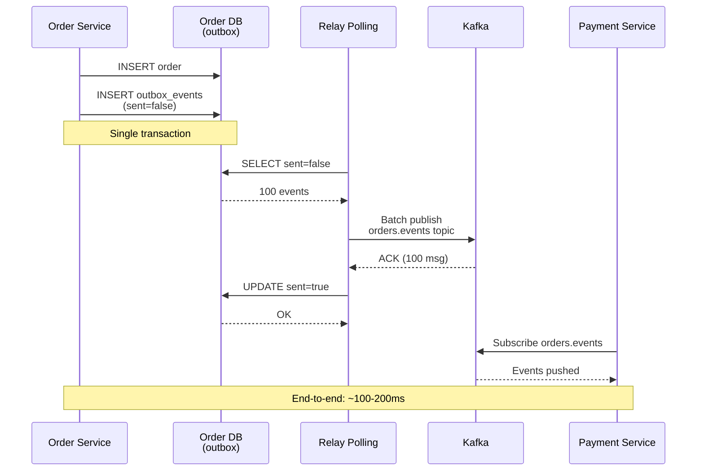

# Outbox Relay Service - Sequence Diagram



## Detailed Sequence Steps

### Phase 1: Order Service - Event Creation (0-10ms)

#### Step 1: INSERT Order
```sql
BEGIN TRANSACTION;
INSERT INTO orders (id, customer_id, total_amount, ...)
VALUES ('ord_12345', 'cust_001', 99.99, ...)
```
- Order record inserted into order service database
- Receives id = 'ord_12345'
- Status = 'CREATED'

#### Step 2: INSERT Outbox Event
```sql
INSERT INTO outbox_events (id, domain, topic, payload, sent)
VALUES (
    'evt_12345',
    'orders',
    'orders.events',
    '{"order_id": "ord_12345", "customer_id": "cust_001", ...}',
    false
);
COMMIT;
```
- Event inserted into same transaction as order
- Atomic guarantee: Order + event together or neither
- sent flag = false (not yet published)
- created_at = NOW()

**Guarantees**:
- No event loss: If order succeeds, event exists in outbox
- No duplicate orders: If transaction committed, both order + event saved
- No orphaned events: If order rolled back, event also rolled back

### Phase 2: Relay Service - Event Polling (100ms later)

#### Step 3: SELECT Unsent Events
```
RelayPoll wakes up (every 100ms)
  ↓
Connect to OrderDB
  ↓
Execute query:
SELECT id, domain, topic, payload, created_at
FROM outbox_events
WHERE sent = false
ORDER BY created_at ASC
LIMIT 1000;
```

**Time**: 20-50ms (database round trip)

**Result**: Returns 100 unsent events ordered by creation time

#### Step 4: Receive Events
```
OrderDB returns result set:
[
    {id: 'evt_12345', domain: 'orders', topic: 'orders.events', payload: {...}, created_at: T1},
    {id: 'evt_12346', domain: 'orders', topic: 'orders.events', payload: {...}, created_at: T2},
    ...
]
```

**Time**: 10-20ms (network transmission)

### Phase 3: Relay Service - Kafka Publishing (110-150ms)

#### Step 5: Group by Topic
```
In-memory grouping:
{
    'orders.events': [evt_12345, evt_12346, ...],
    'payments.events': [evt_xxx, ...],
}
```

**Time**: 5ms

#### Step 6: Build Kafka Records
For each event:
```
ProducerRecord {
    topic: 'orders.events',
    key: 'evt_12345',
    value: '{...}',
    headers: [
        ('domain', 'orders'),
        ('trace-id', 'trace_xyz'),
        ...
    ]
}
```

**Time**: 5-10ms

#### Step 7: Batch Publish to Kafka
```
RelayPoll sends async request:
kafka.send(batch_records)
  → Kafka broker 1 receives
  → Kafka broker 2 receives (replica)
  → All brokers acknowledge
```

**Time**: 100-200ms (network + broker processing)

**Kafka Acks**:
- acks="all": Wait for leader + in-sync replicas (default: 1)
- Replication factor: 3
- Min in-sync replicas: 2 (configurable)

#### Step 8: Receive ACK
```
Kafka sends ACK with:
{
    partition: 0,
    offset: 1000,
    timestamp: 1711001400000,
    ...
}
```

**Time**: 20-50ms (network)

**Confirmation**: All 100 events successfully persisted on Kafka

### Phase 4: Relay Service - Database Update (150-200ms)

#### Step 9: UPDATE Sent Flag
```sql
BEGIN TRANSACTION;
UPDATE outbox_events
SET sent = true, sent_at = NOW()
WHERE id IN ('evt_12345', 'evt_12346', ...)
AND sent = false;
COMMIT;
```

**Time**: 20-50ms (lock + write)

**Atomicity**: All 100 events marked as sent together

**Result**: OrderDB acknowledges update

### Phase 5: Event Distribution (200-300ms)

#### Step 10: Payment Service Subscribes
```
PaymentSvc (already subscribed to orders.events):
  ├─ Kafka consumer group: payment-service-group
  └─ Poll interval: 1 second
```

#### Step 11: Kafka Pushes Events
```
Kafka broker:
  ├─ Payment Service polls from offset 999
  ├─ Kafka returns: [evt_12345, evt_12346, ...]
  └─ Payment Service receives batch
```

**Time**: 50-100ms (depends on polling interval)

**Event Format**:
```json
{
    "event_id": "evt_12345",
    "order_id": "ord_12345",
    "customer_id": "cust_001",
    "total_amount": 99.99,
    "status": "CREATED",
    "timestamp": "2026-03-21T14:30:00Z"
}
```

**Processing**:
- Payment Service deserializes event
- Creates payment record if needed
- Publishes outbox event itself (payment.events topic)
- Commits consumer offset

## End-to-End Latency

| Phase | Duration | Total |
|-------|----------|-------|
| Order insertion | 10ms | 10ms |
| Wait for poll | 90ms | 100ms |
| Relay poll query | 40ms | 140ms |
| Relay Kafka publish | 150ms | 290ms |
| Relay database update | 40ms | 330ms |
| Payment Service processing | 50-100ms | 380-430ms |

**Total E2E Latency**: ~400ms (p99: 500ms)

## Failure Scenarios

### Scenario 1: Kafka Publish Timeout
```
RelayPoll.send(batch) → Timeout after 5s
  ├─ Retry 1 (wait 1s): Send again
  ├─ Retry 2 (wait 2s): Send again
  ├─ Retry 3 (wait 4s): Send again
  └─ All fail: Circuit breaker opens
     → Events remain in outbox (sent=false)
     → Next poll cycle (100ms) retries
```

**Recovery**: Kafka comes back online → Next poll succeeds

### Scenario 2: Database Update Fails
```
RelayPoll.update(sent=true) → Connection lost
  → Transaction rolled back
  → Events remain sent=false in outbox
  → Next poll cycle retries
  → Kafka receives duplicate event (idempotent key handles)
```

**Subscribers**: Must implement idempotent processing (event_id deduplication)

### Scenario 3: Relay Pod Crashes
```
RelayPoll.send() → SUCCESS
RelayPoll.update() → CRASH (before update)
  → Event marked sent in Kafka (offset advanced)
  → Event NOT marked sent in outbox
  → New relay pod starts
  → Republishes same event (at-least-once)
  → Subscribers receive duplicate
  → Subscribers deduplicate by event_id
```

**Guarantee**: No event loss, possible duplicates

## Performance Metrics

| Metric | Value |
|--------|-------|
| Events per poll batch | ~100 |
| Poll cycle time | 200-400ms |
| Throughput per pod | 250-500 events/sec |
| Cluster throughput (3 pods) | 750-1,500 events/sec |
| Event latency (median) | 150ms |
| Event latency (p99) | 400-500ms |
| Kafka ACK latency | 100-200ms |
