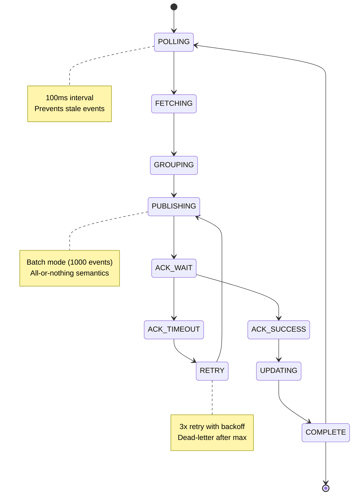

# Outbox Relay Service - State Machine



## State Transitions & Details

### POLLING State
**Entry**: Timer triggers every 100ms
**Duration**: 0ms (instantaneous trigger)

**Actions**:
- Check if relay pod is leader (via distributed lock)
- If follower: Go to idle (skip this cycle)
- If leader: Proceed to FETCHING
- Log poll start (poll_id, timestamp)

**Exit Conditions**:
- Transition to FETCHING (if leader)
- Transition to idle (if follower)

**Metrics**:
- polls_total (counter)
- last_poll_time (gauge)
- leader_election_count (counter)

---

### FETCHING State
**Entry**: Relay pod acquired leadership
**Duration**: 30-80ms

**Actions**:
- Connect to Order DB (outbox table)
- Connect to Payment DB (outbox table)
- Connect to 11 other producer databases
- Execute SELECT sent=false in parallel:
  ```sql
  SELECT id, domain, topic, payload, created_at
  FROM outbox_events
  WHERE sent = false
  LIMIT 1000
  ORDER BY created_at ASC;
  ```
- Collect results (wait for max response time)

**Database Connections**:
- Connection pool: 10 connections
- Timeout per query: 5 seconds
- Retry: 3 attempts with exponential backoff

**Exit Conditions**:
- Successful fetch: Transition to GROUPING
- Fetch failure (all retries exhausted): Circuit breaker
  - Open state: Skip to next poll (events remain unsent)
  - Duration: 30 seconds
  - Next poll: Attempt recovery

**Metrics**:
- fetches_total (counter)
- fetch_latency_ms (histogram)
- events_fetched (gauge)
- fetch_errors_total (counter)
- circuit_breaker_open (boolean gauge)

---

### GROUPING State
**Entry**: Batch of events received from database
**Duration**: 5-10ms

**Actions**:
- In-memory grouping by topic:
  ```
  {
      "orders.events": [evt1, evt2, ...],
      "payments.events": [evt3, evt4, ...],
      ...
  }
  ```
- Count events per topic
- Validate event structure (null checks)
- Build ProducerRecord list

**Memory Management**:
- Max batch size: 1000 events
- Typical event size: 1-5KB
- Total memory: ~5MB per batch (worst case)

**Exit Conditions**:
- Grouping complete: Transition to PUBLISHING
- Grouping timeout (> 100ms): Log warning, continue anyway

**Metrics**:
- groups_created (counter)
- events_per_group_avg (gauge)
- grouping_latency_ms (histogram)

---

### PUBLISHING State
**Entry**: Grouped events ready for Kafka
**Duration**: 100-200ms

**Actions**:
- For each topic group:
  - Build Kafka ProducerRecord with:
    - key: event.id (for idempotency)
    - value: event.payload (JSON)
    - headers: metadata (domain, trace-id, etc.)
  - Send async to Kafka broker
- Configure Kafka settings:
  - acks: "all" (wait for leader + replicas)
  - compression: "snappy"
  - batch.size: 32KB
  - timeout: 5 seconds

**Kafka Broker Interaction**:
- Network latency: 50-100ms
- Broker processing: 30-100ms
- Replication: 10-50ms
- Total: 90-250ms

**Exit Conditions**:
- All batches sent to Kafka: Transition to ACK_WAIT
- Send timeout: Transition to ACK_TIMEOUT (after timeout)

**Metrics**:
- publishes_total (counter)
- publish_latency_ms (histogram)
- events_published (gauge)
- publish_errors_total (counter)
- kafka_acks_received (counter)

---

### ACK_WAIT State
**Entry**: Kafka publish request sent
**Duration**: 50-150ms (waiting for broker response)

**Actions**:
- Wait for Kafka broker ACK
- Monitor timeout (5 seconds)
- Track per-partition response

**Timeout Behavior**:
- 5 seconds: If no ACK, transition to ACK_TIMEOUT
- Early return: If partial ACK received, still wait for all

**Exit Conditions**:
- All ACKs received: Transition to ACK_SUCCESS
- Any timeout: Transition to ACK_TIMEOUT
- Timeout duration: 5 seconds

**Metrics**:
- ack_wait_latency_ms (histogram)
- ack_success_count (counter)
- ack_timeout_count (counter)

---

### ACK_SUCCESS State
**Entry**: Kafka confirmed all events persisted
**Duration**: 5ms (decision state)

**Actions**:
- Log ACK success
- Prepare for database update
- Track event offsets (for monitoring)

**Exit Condition**:
- Transition to UPDATING

**Metrics**:
- ack_success_total (counter)

---

### ACK_TIMEOUT State
**Entry**: Kafka ACK timeout or error
**Duration**: 5ms (decision state)

**Actions**:
- Log ACK timeout
- Prepare retry logic
- Increment retry counter

**Exit Condition**:
- Transition to RETRY (if retries < 3)
- Transition to circuit breaker (if retries exhausted)

**Metrics**:
- ack_timeout_total (counter)

---

### RETRY State
**Entry**: Retry attempt after timeout
**Duration**: 1-4 seconds (backoff wait) + republish

**Actions**:
- Wait with exponential backoff:
  - Attempt 1: Wait 1 second
  - Attempt 2: Wait 2 seconds
  - Attempt 3: Wait 4 seconds
- After backoff: Republish to Kafka (go back to PUBLISHING)

**Retry Limit**: 3 attempts total

**Circuit Breaker**:
- After 3 failed attempts: Open circuit
- Duration: 30 seconds
- Events cached in memory (up to 10MB)
- Next poll cycle: Retry recovery

**Exit Conditions**:
- Transition to PUBLISHING (retry attempt)
- Transition to circuit breaker (max retries exceeded)

**Metrics**:
- retry_count_total (counter)
- retry_latency_ms (histogram)
- circuit_breaker_open_duration_seconds (gauge)

---

### UPDATING State
**Entry**: Kafka ACK received, events persisted
**Duration**: 20-50ms

**Actions**:
- Begin transaction:
  ```sql
  BEGIN;
  UPDATE outbox_events
  SET sent = true, sent_at = NOW()
  WHERE id IN (event_ids)
  AND sent = false;
  COMMIT;
  ```
- Update all event IDs atomically
- Update sent_at timestamp
- Commit transaction

**Lock Duration**: < 20ms (simple UPDATE, no foreign keys)

**Exit Conditions**:
- Update successful: Transition to COMPLETE
- Update fails (connection lost): Transition to RETRY
  - Events remain unsent (will be republished)

**Metrics**:
- database_updates_total (counter)
- database_update_latency_ms (histogram)
- events_marked_sent (gauge)

---

### COMPLETE State
**Entry**: Database update committed
**Duration**: 5ms (decision state)

**Actions**:
- Log poll cycle completion
- Emit metrics:
  - Total events processed
  - Total cycle latency
  - Throughput (events/sec)
- Release any locks
- Update state: "completed"

**Exit Conditions**:
- Transition to POLLING (next 100ms cycle)
- Transition to [*] (pod shutdown)

**Metrics**:
- poll_cycles_total (counter)
- poll_cycle_latency_ms (histogram)
- throughput_events_per_sec (gauge)

## State Machine Paths

### Happy Path (Success)
```
POLLING → FETCHING → GROUPING → PUBLISHING → ACK_WAIT → ACK_SUCCESS → UPDATING → COMPLETE → POLLING
Duration: 200-350ms
Success Rate: 99.9%
```

### Retry Path (One Retry)
```
POLLING → FETCHING → GROUPING → PUBLISHING → ACK_WAIT → ACK_TIMEOUT → RETRY (wait 1s) → PUBLISHING → ACK_WAIT → ACK_SUCCESS → UPDATING → COMPLETE
Duration: 1.2-1.5 seconds
Success Rate: 99%
```

### Circuit Breaker Path (All Retries Exhausted)
```
POLLING → FETCHING → GROUPING → PUBLISHING → ACK_WAIT → ACK_TIMEOUT → RETRY → ... → RETRY (3x failed) → Circuit Breaker OPEN
Wait 30 seconds → Next POLLING cycle (recovery attempt)
Events in outbox: sent=false (safe for re-processing)
```

### Follower Pod Path (Not Leader)
```
POLLING (check leader) → Not leader → Wait for next poll
(Repeats until leadership acquired or pod shuts down)
```

## Metrics Dashboard

| Metric | Type | Alert Threshold |
|--------|------|-----------------|
| events_fetched | Gauge | < 10 (warning) |
| fetches_total | Counter | Increasing |
| publish_latency_ms (p99) | Histogram | > 300ms (warning) |
| ack_success_total | Counter | Increasing |
| ack_timeout_total | Counter | > 5 per minute (warning) |
| circuit_breaker_open | Gauge | > 0 (alert) |
| database_update_latency_ms (p99) | Histogram | > 100ms (warning) |
| poll_cycle_latency_ms (p99) | Histogram | > 500ms (warning) |
| throughput_events_per_sec | Gauge | < 500 (warning) |
