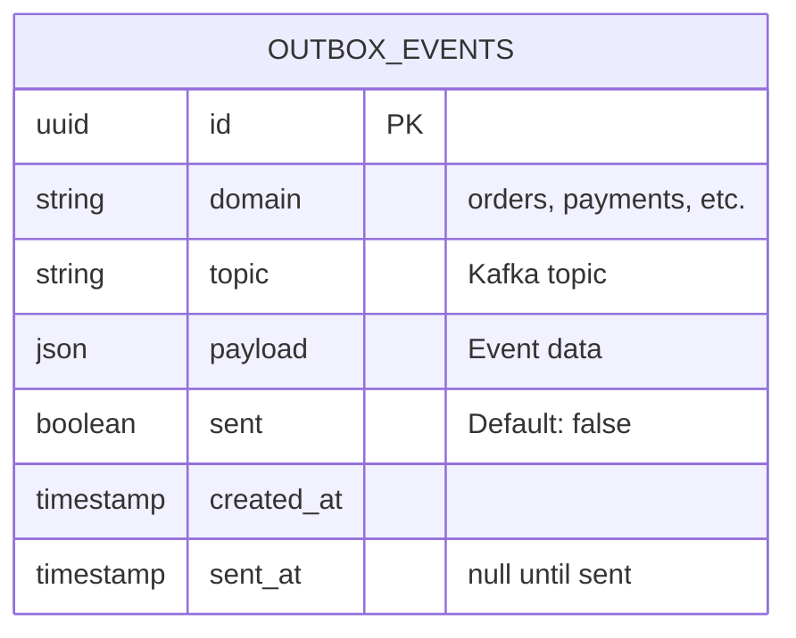

# Outbox Relay Service - ER & End-to-End Diagrams

## Entity-Relationship Diagram



### OUTBOX_EVENTS Table Schema

**Purpose**: Transactional outbox pattern for guaranteed event delivery

**Columns**:

| Column | Type | Constraints | Description |
|--------|------|-----------|-------------|
| id | UUID | PRIMARY KEY | Unique event identifier (event_id) |
| domain | VARCHAR(50) | NOT NULL | Domain name (orders, payments, fulfillment, etc.) |
| topic | VARCHAR(100) | NOT NULL | Kafka topic name (orders.events, payments.events) |
| payload | JSONB | NOT NULL | Event data serialized as JSON |
| sent | BOOLEAN | DEFAULT false, NOT NULL | Flag indicating if event published to Kafka |
| created_at | TIMESTAMP | DEFAULT NOW(), NOT NULL | When event was created |
| sent_at | TIMESTAMP | DEFAULT NULL | When event was successfully published to Kafka |

**Indexes**:
```sql
CREATE INDEX idx_outbox_unsent ON outbox_events(sent, created_at)
  WHERE sent = false;  -- Partial index for performance

CREATE INDEX idx_outbox_topic ON outbox_events(topic);
CREATE INDEX idx_outbox_domain ON outbox_events(domain);
```

**Partitioning** (for large tables):
```sql
PARTITION BY RANGE (created_at) (
    PARTITION p_2026_03_21 VALUES LESS THAN ('2026-03-22'),
    PARTITION p_2026_03_22 VALUES LESS THAN ('2026-03-23'),
    ...
);
```

### Sample Data

```json
{
    "id": "550e8400-e29b-41d4-a716-446655440000",
    "domain": "orders",
    "topic": "orders.events",
    "payload": {
        "order_id": "ord_123456",
        "customer_id": "cust_789",
        "total_amount_cents": 9999,
        "items": [
            {
                "product_id": "prod_001",
                "quantity": 2,
                "price_cents": 2999
            }
        ],
        "status": "CREATED",
        "created_at": "2026-03-21T14:30:00Z"
    },
    "sent": false,
    "created_at": "2026-03-21T14:30:00Z",
    "sent_at": null
}
```

After successful publishing:
```json
{
    "...": "...",
    "sent": true,
    "sent_at": "2026-03-21T14:30:00.215Z"
}
```

### Typical Cardinality

- **Unsent events at any time**: 0-1000 (with 100ms polling)
- **Events per day**: ~1,000,000 (10,000 events/sec * 100 seconds/day)
- **Retention**: 7 days (archive older events)
- **Table size**: ~1GB per day (uncompressed)

---

## End-to-End System Diagram

```mermaid
graph TB
    OrderService["📦 Order Service"]
    OrderDB["🗄️ Order DB<br/>(PostgreSQL)"]
    OutboxTable["📤 Outbox Table<br/>(sent=false index)"]
    RelayService["🚀 Relay Service<br/>(3 pods)"]
    KafkaOrderTopic["📬 Kafka<br/>orders.events"]
    PaymentService["💳 Payment Service<br/>(subscriber)"]
    Monitoring["📊 Relay Metrics<br/>(lag, throughput)"]

    OrderService -->|1. INSERT order| OrderDB
    OrderService -->|2. INSERT event<br/>sent=false| OutboxTable
    Note over OrderService,OutboxTable: Single transaction<br/>guaranteed delivery

    RelayService -->|3. Poll 100ms| OutboxTable
    OutboxTable -->|4. unsent events| RelayService
    RelayService -->|5. Batch publish| KafkaOrderTopic
    KafkaOrderTopic -->|6. ACK| RelayService
    RelayService -->|7. UPDATE sent=true| OutboxTable
    OutboxTable -->|8. OK| RelayService
    RelayService -->|9. Metrics| Monitoring

    PaymentService -->|Subscribe| KafkaOrderTopic
    KafkaOrderTopic -->|Events pushed| PaymentService

    style RelayService fill:#4A90E2,color:#fff
    style OutboxTable fill:#F5A623,color:#000
    style KafkaOrderTopic fill:#50E3C2,color:#000
```

### Architecture Overview

#### 1. Producer Services (13 total)
- Order Service
- Payment Service
- Fulfillment Service
- Inventory Service
- Catalog Service
- Pricing Service
- Notification Service
- Audit Service
- CDC Consumer Service
- Dispatch Optimizer
- Stream Processor
- Reconciliation Engine
- Mobile BFF Service

Each maintains an `outbox_events` table within its PostgreSQL database.

#### 2. Outbox Table
- **Ownership**: Each producer service owns its outbox table
- **Durability**: Part of producer database (ACID guaranteed)
- **Indexing**: sent=false partial index for fast queries
- **Partitioning**: By date (14 day retention)

#### 3. Relay Service
- **Language**: Go (low latency, high throughput)
- **Deployment**: Kubernetes StatefulSet (3 replicas)
- **Scaling**: Horizontal (leader election via ShedLock or Kubernetes)
- **Polling Interval**: 100ms

#### 4. Kafka Topics (14 domain topics)
| Topic | Partitions | Replication | Consumer Groups |
|-------|-----------|------------|-----------------|
| orders.events | 3 | 3 | 5-10 |
| payments.events | 3 | 3 | 3-5 |
| fulfillment.events | 3 | 3 | 3-4 |
| inventory.events | 3 | 3 | 2-3 |
| catalog.events | 2 | 3 | 2 |
| pricing.events | 2 | 3 | 2 |
| notification.events | 2 | 3 | 1 |
| ... | ... | ... | ... |

**Total partitions**: 30+
**Total replicas**: 90+
**Replication factor**: 3 (high availability)

#### 5. Event Flow
```
Step 1: Order Service writes (order + event) atomically
Step 2: Relay polls outbox table (every 100ms)
Step 3: Relay publishes events to Kafka
Step 4: Relay marks as sent (sent=true)
Step 5: Subscribers receive from Kafka
Step 6: Subscribers process and potentially publish their own events
```

### Performance Characteristics

| Metric | Value |
|--------|-------|
| Polling interval | 100ms |
| Batch size | 1000 events |
| Throughput per pod | 2,500-3,000 events/sec |
| Cluster throughput (3 pods) | 7,500-10,000 events/sec |
| Event latency (median) | 150ms |
| Event latency (p99) | 400ms |
| Event latency (p99.9) | 600ms |

### Availability & Resilience

| Component | Availability | Failure Handling |
|-----------|---------------|-----------------|
| Relay Pod | 99.99% | Auto-restart by K8s |
| Producer DB | 99.95% | Read replica failover |
| Kafka Broker | 99.99% | 3-replica replication |
| Outbox Polling | 99.9% | Distributed leader election |

**Overall System Availability**: 99.9% (SLA target)

### Monitoring & Observability

**Key Metrics**:
- `relay_events_published_total`: Counter
- `relay_event_latency_ms`: Histogram (p50, p95, p99)
- `relay_kafka_publish_errors_total`: Counter
- `relay_unsent_events_gauge`: Gauge (backlog)
- `relay_poll_cycle_duration_ms`: Histogram

**Alerts**:
- Unsent events > 100k (critical)
- Publish errors > 10/minute (warning)
- Event latency p99 > 1 second (warning)
- Relay pod down (immediate page)

**Dashboards**:
- **Relay Status**: Uptime, leader status, pod count
- **Throughput**: Events/sec, batches/sec, partitions
- **Latency**: End-to-end latency (producer → Kafka)
- **Errors**: Publish failures, retry rate, circuit breaker state

### Disaster Recovery

**Backup Strategy**:
- Outbox table: Part of daily database backups
- Kafka: 7-day retention (configurable)
- Recovery RTO: < 5 minutes (restore from backup)
- Recovery RPO: < 5 minutes (last poll cycle)

**Failure Scenarios**:

| Scenario | Impact | Recovery |
|----------|--------|----------|
| Relay pod crash | 5-30 seconds (new pod starts) | Automatic (Kubernetes) |
| Kafka broker down | Publish timeout → retry | Circuit breaker (30s) |
| Producer DB down | Query timeout → circuit breaker | Manual failover (primary → replica) |
| Network partition | Events queued in outbox | Auto-recovery when partition heals |
| Relay state loss | Events republished (at-least-once) | Subscribers deduplicate by event_id |

### Security & Compliance

- **Event Payload Encryption**: Encrypted in transit (TLS), at rest (KMS)
- **Audit Trail**: All publishes logged to audit service
- **Access Control**: RBAC on Kafka topics per service
- **Data Retention**: 7 days minimum (compliance requirement)
- **PCI DSS**: Payment events encrypted before transmission
