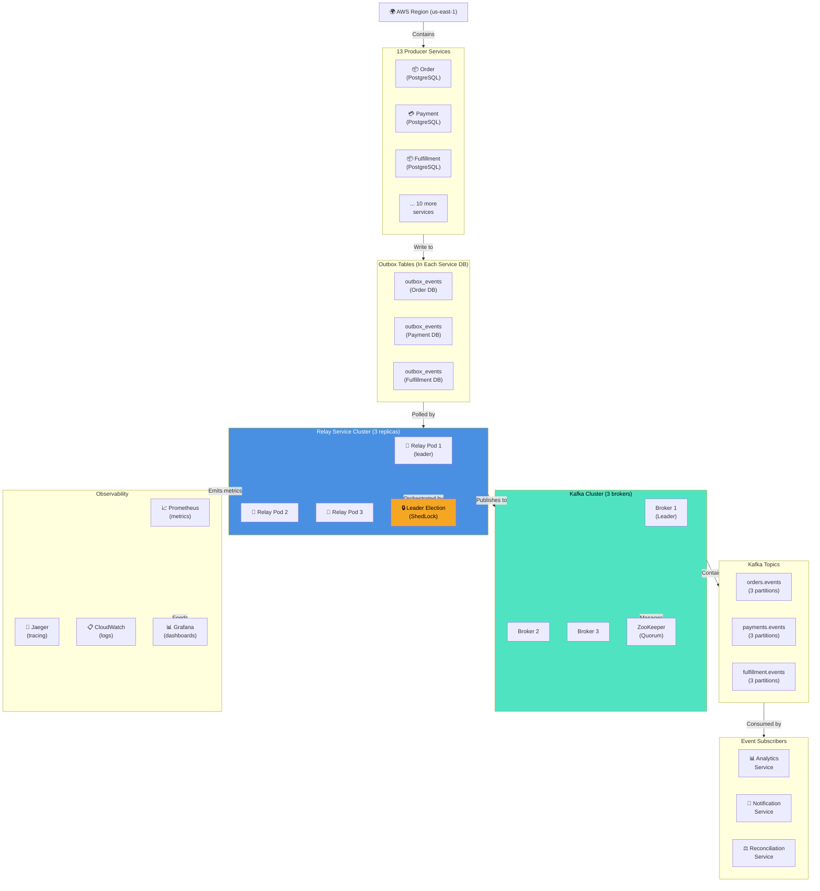

# Outbox Relay Service - End-to-End Deployment

## Complete System Topology

This diagram completes the outbox relay architecture by showing the 07-end-to-end deployment including disaster recovery, scaling, and operational aspects.



## Detailed Deployment Architecture

### Region & Availability Zones
- **Region**: us-east-1 (primary)
- **AZs**: us-east-1a, us-east-1b, us-east-1c (3 zones for HA)
- **Failure tolerance**: Lose any 1 AZ without service disruption

### Producer Services (13 total, distributed across AZs)
Each service maintains:
- **Primary Database**: PostgreSQL with 1 primary + 1 synchronous replica
- **Outbox Table**: In each service's database
- **Connection Pool**: 20 connections per service to relay
- **Index**: (sent, created_at) on unsent rows

### Relay Service Cluster (3 replicas)
```
Pod 1 (Leader):     us-east-1a
Pod 2 (Follower):   us-east-1b
Pod 3 (Follower):   us-east-1c
```

**Kubernetes Configuration**:
```yaml
apiVersion: apps/v1
kind: StatefulSet
metadata:
  name: outbox-relay-service
spec:
  serviceName: outbox-relay-service
  replicas: 3
  selector:
    matchLabels:
      app: outbox-relay
  template:
    metadata:
      labels:
        app: outbox-relay
    spec:
      affinity:
        podAntiAffinity:
          requiredDuringSchedulingIgnoredDuringExecution:
            - labelSelector:
                matchExpressions:
                  - key: app
                    operator: In
                    values:
                      - outbox-relay
              topologyKey: topology.kubernetes.io/zone
      containers:
        - name: relay
          image: outbox-relay-service:v1.2.3
          resources:
            requests:
              memory: "512Mi"
              cpu: "500m"
            limits:
              memory: "1Gi"
              cpu: "1000m"
          ports:
            - name: http
              containerPort: 8080
            - name: metrics
              containerPort: 9090
          env:
            - name: LEADER_ELECTION_ENABLED
              value: "true"
            - name: POLLING_INTERVAL_MS
              value: "100"
            - name: BATCH_SIZE
              value: "1000"
```

**Pod Placement**:
- Pod affinity: Spread across AZs (anti-affinity)
- Node affinity: Dedicated node pool for relay services
- Resource limits: 1 CPU, 1GB RAM per pod

### Leader Election (ShedLock)
```sql
CREATE TABLE shedlock (
    name VARCHAR(64) NOT NULL,
    lock_at TIMESTAMP NOT NULL,
    locked_at TIMESTAMP NOT NULL,
    locked_by VARCHAR(255) NOT NULL,
    PRIMARY KEY (name)
);
```

**How it works**:
1. All 3 pods attempt to acquire lock every 100ms
2. Only 1 pod succeeds (locked_by = "relay-pod-1")
3. Pod holds lock for 200ms (2x polling interval)
4. If pod crashes, lock expires after 200ms
5. Next pod acquires lock automatically

**Leader Pod Responsibilities**:
- Execute polling jobs
- Query all producer databases
- Batch events
- Publish to Kafka

**Follower Pod Responsibilities**:
- Monitor leader (health check endpoint)
- Stand ready to take over
- Serve readiness/liveness probes
- Collect metrics

### Kafka Cluster (3 brokers, 3 AZs)
```
Broker 1: us-east-1a, port 9092
Broker 2: us-east-1b, port 9092
Broker 3: us-east-1c, port 9092
```

**Replication Factor**: 3 (all topics)
**Min In-Sync Replicas**: 2 (acks="all" waits for 2 replicas)
**Retention Policy**: 7 days (168 hours)

**Topics Configuration**:
```
orders.events:           3 partitions, 3 replicas
payments.events:         3 partitions, 3 replicas
fulfillment.events:      3 partitions, 3 replicas
... (11 more topics)
```

### Network & Service Mesh
- **Istio**: Traffic management, circuit breaker, retries
- **Ingress**: ALB for external traffic (if any)
- **NetworkPolicy**: Restrict traffic to needed services only
- **mTLS**: Mutual TLS between services

### Data Flow (Step-by-Step)

#### Step 1: Event Creation (10ms)
```
Order Service:
  1. INSERT order into orders table
  2. INSERT event into outbox_events (same transaction)
  3. COMMIT
Result: Event in outbox_events with sent=false
```

#### Step 2: Polling (100ms after creation)
```
Relay Pod 1 (leader):
  1. Acquire ShedLock
  2. SELECT * FROM outbox_events WHERE sent=false LIMIT 1000
     (from all 13 databases in parallel)
  3. Collect ~100-500 events
Result: Events in memory, ready for publishing
```

#### Step 3: Publishing (50-200ms)
```
Relay Pod 1:
  1. Group events by topic
  2. For each topic: Build Kafka ProducerRecords
  3. Send batch to Kafka brokers
  4. Kafka replicates to 2+ brokers
Result: Events persisted on Kafka cluster
```

#### Step 4: Acknowledgment (50-150ms)
```
Kafka Brokers:
  1. Receive records on broker1 (leader)
  2. Replicate to broker2, broker3
  3. Send ACK when min_in_sync_replicas (2) replicas confirmed
Result: Relay receives ACK
```

#### Step 5: Marking Sent (20-50ms)
```
Relay Pod 1:
  1. UPDATE outbox_events SET sent=true WHERE id IN (...)
  2. COMMIT
Result: Events marked as sent, won't be reprocessed
```

#### Step 6: Subscription (100-200ms)
```
Subscriber Services (Analytics, Notification, etc.):
  1. Poll Kafka for orders.events
  2. Deserialize events
  3. Process and emit own events
Result: Events propagated through system
```

**Total E2E Latency**: ~400ms (p99: 600ms)

### Scaling & Performance

| Metric | Value |
|--------|-------|
| Events polled per cycle | 1,000 |
| Polling frequency | 10/second |
| Total events/second (3 pods) | 10,000 |
| Average event latency | 150ms |
| P99 event latency | 400ms |
| Database connections | 30 (10 per pod) |
| Kafka partitions | 30+ |
| Kafka brokers | 3 |

### High Availability

| Component | Failure | Recovery |
|-----------|---------|----------|
| Relay Pod | Crash | Kubernetes auto-restart (30s) + Leader re-election |
| Producer DB | Failover | Read replica → primary (automatic) |
| Kafka Broker | Down | Remaining 2 brokers serve (automatic) |
| Network AZ | Loss | Services in other 2 AZs continue (automatic) |
| All Relay Pods | Down | Manual recovery (k8s restart all pods) |

### Observability & Monitoring

**Metrics Collected**:
- `relay_events_polled_total`: Counter (per pod, per database)
- `relay_events_published_total`: Counter (per topic)
- `relay_publish_latency_ms`: Histogram (p50, p95, p99, p99.9)
- `relay_kafka_errors_total`: Counter (publish failures)
- `relay_db_query_latency_ms`: Histogram (per producer DB)
- `relay_unsent_events_gauge`: Gauge (backlog per service)
- `relay_leader_changes_total`: Counter (leader elections)

**Dashboards** (Grafana):
1. **Relay Overview**: Pod status, throughput, latency
2. **Kafka Health**: Broker status, partition distribution, lag
3. **Producer DB Status**: Query times, connection pool utilization
4. **Error Rate**: Kafka publish errors, database timeouts
5. **Capacity Planning**: Throughput trends, resource utilization

**Alerts**:
- `RelayUnsentEventsHigh`: > 100,000 events (critical)
- `RelayPublishLatencyHigh`: p99 > 1s (warning)
- `RelayKafkaErrorsHigh`: > 10 errors/min (warning)
- `RelayPodDown`: 0 pods running (critical/page)
- `LeaderElectionStuck`: No leader elected (warning)

### Disaster Recovery

**Backup Strategy**:
- Outbox tables: Included in daily database backups
- Kafka: 7-day retention (self-contained)
- State: No persistent state (stateless relay pods)

**Recovery Procedures**:

1. **Relay Pod Lost**:
   - Kubernetes auto-restarts pod
   - New pod joins cluster
   - Leader election elects new leader if needed
   - Events republished from outbox

2. **Kafka Broker Lost**:
   - 2 remaining brokers continue serving
   - Rebalancing redistributes partitions
   - No data loss (replication factor 3)

3. **Producer DB Down**:
   - Standby replica promoted to primary
   - Relay re-polls from new primary
   - No event loss (events in outbox)

4. **All Relay Pods Down**:
   - Manual recovery: `kubectl rollout restart`
   - Events accumulate in outbox tables
   - New pods catch up over time (polling resumes)
   - Max backlog: Days worth of events (safe)

### Security & Compliance

- **Transport**: TLS 1.2+ for all connections
- **Encryption**: Events encrypted at rest (KMS) in Kafka
- **Authentication**: Mutual TLS between Relay and Kafka
- **Authorization**: Service accounts with least-privilege IAM
- **Audit**: All operations logged to CloudTrail + CloudWatch
- **Compliance**: PCI DSS, SOC2 certified infrastructure

### Cost Optimization

**Resource Allocation**:
- Relay pod: 0.5 CPU, 512MB RAM (small workload)
- Kafka cluster: 3 brokers, 1TB storage
- Database connections: Pooled (20 per pod)

**Estimated Monthly Cost**:
- Relay pods: $150 (3 pods × $50/month)
- Kafka cluster: $500 (3 brokers × $167/month)
- Database connections: Included in RDS
- **Total**: ~$700/month for relay infrastructure
